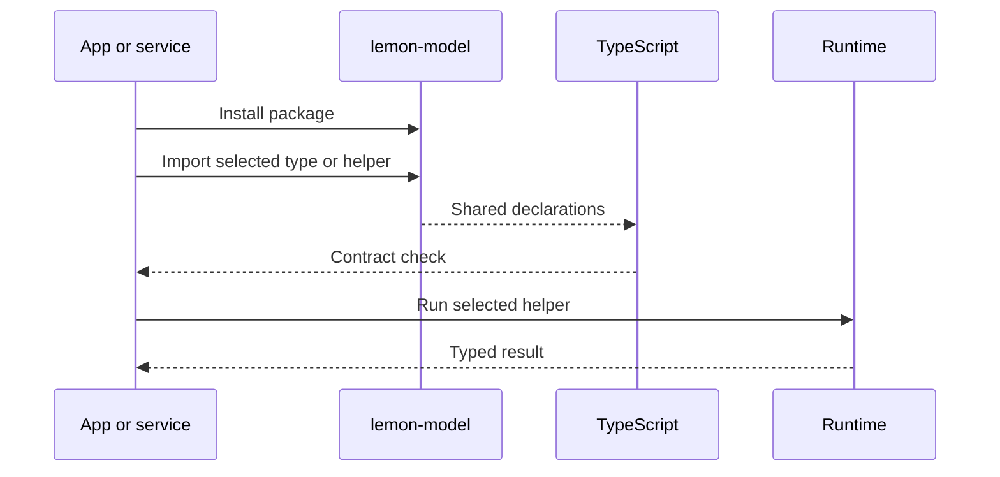
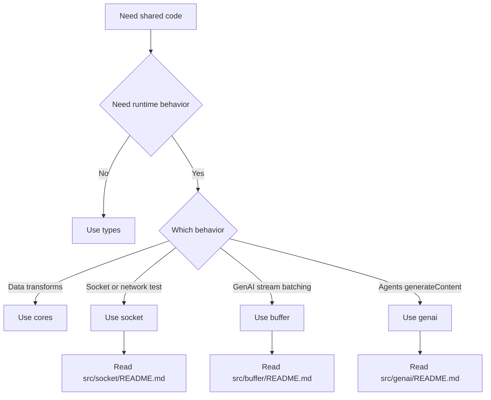

# lemon-model

Common shared model definitions for both `backend` and `frontend`.

## Usage

!TIP! to develop `backend` api, use [lemon-core](https://github.com/lemoncloud-io/lemon-core) instead of this.

```sh
# install with npm
npm install --save lemon-model
```

Backend API services that need the full Lemon runtime should use `lemon-core`.

## Import

```ts
import type { NextContext } from 'lemon-model';
```

```js
const { HttpAbstractGenAI } = require('lemon-model');
```

Frontend bundlers use the ESM build. Existing Node `require()` consumers use the CommonJS build.

## Package Map

| Area | Responsibility | Detail Doc |
| --- | --- | --- |
| `types` | Shared request, identity, storage, and service shapes | Source types |
| `cores` | Small shared transform helpers | Source tests |
| `socket` | Peer socket, network contract, WebSocket bridge, JSON chunk transport | `src/socket/README.md` |
| `buffer` | Provider-neutral GenAI stream buffering and network adapters | `src/buffer/README.md` |
| `genai` | Gemini-like `generateContent()` adapter over Lemon agents APIs | `src/genai/README.md` |
| `samples` | Real usage cases and PR-ready sample notes | `samples/README.md` |

## User Sequence



1. App installs `lemon-model`
2. App imports only the needed type or helper
3. TypeScript checks shared contracts
4. Runtime loads CJS or ESM build
5. Selected module handles its own job
6. Module README owns detailed behavior

## Choosing A Module



Main branch: type-only, transform helper, socket flow, GenAI stream buffer, or GenAI proxy.

## Buffer

`buffer` provides provider-neutral stream primitives for GenAI responses.

```ts
import { GenAIStreamBuffer, createGenAIStreamNetworkConsumer } from 'lemon-model';
```

Use it when a provider emits small stream fragments and the app needs consistent `start`, `chunk`, `progress`, `flush`, `eof`, and `error` events.

The network adapter can send `GenAIStreamEvent` over the shared socket/json-transport layer. Diagnostic helpers live under `lemon-model/buffer/testing`.

Provider probe tools are available under `tools/`, but provider SDKs are not part of the runtime package contract. Install the matching SDK in the workspace where you run a probe.

## Build Formats

- CommonJS entry: `dist/index.js`
- ESM entry: `dist/esm/index.js`
- Type declarations: `dist/index.d.ts`
- Package export: `import { ... } from 'lemon-model'`
- Test helper exports: `lemon-model/genai/testing`, `lemon-model/buffer/testing`, `lemon-model/socket/testing`

## Module Docs

- `src/socket/README.md`: peer socket and network contract
- `src/socket/JSON_TRANSPORT_SPEC.md`: JSON chunk transport protocol
- `src/buffer/README.md`: GenAI stream buffering and network adapter contract
- `src/genai/README.md`: GenAI adapter contract
- `samples/README.md`: sample case rules

## Contribution

Plz, request PR.

See [CODE_OF_CONDUCT](CODE_OF_CONDUCT.md)

## LICENSE

[MIT](LICENSE) - (C) 2019 LemonCloud Co Ltd. - All Rights Reserved.„

----------------

## VERSION INFO

| Version   | Description
|--         |--
| 1.0.6     | optimized `SearchBody` with `knn` support.
| 1.0.5     | optimized `NextIdentity` with `authorization`.
| 1.0.4     | optimized `NextIdentity` with `referer` and `origin`.
| 1.0.3     | optimized `NextIdentityCognito`
| 1.0.0     | initial types out of the original `lemon-core@3.1.1`
