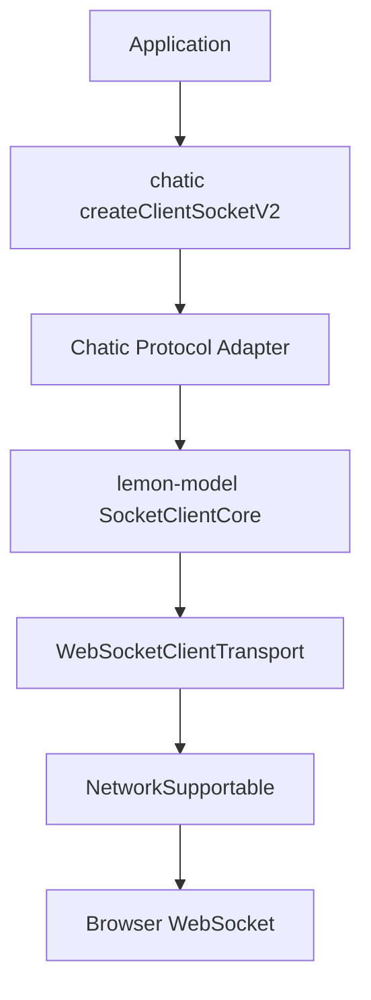
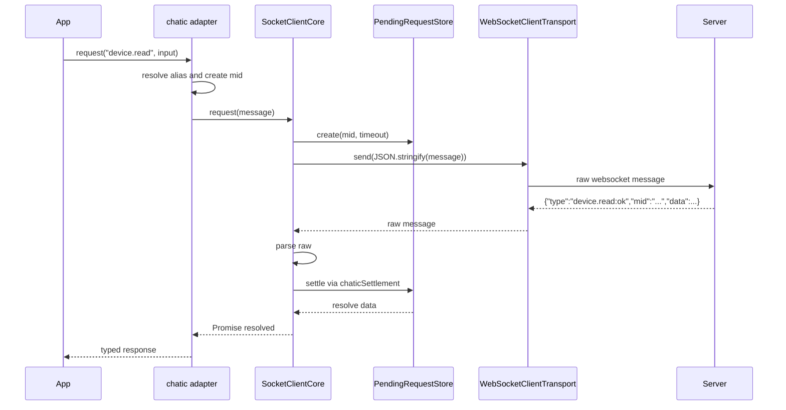
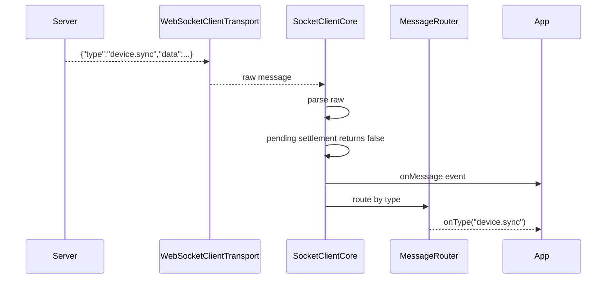
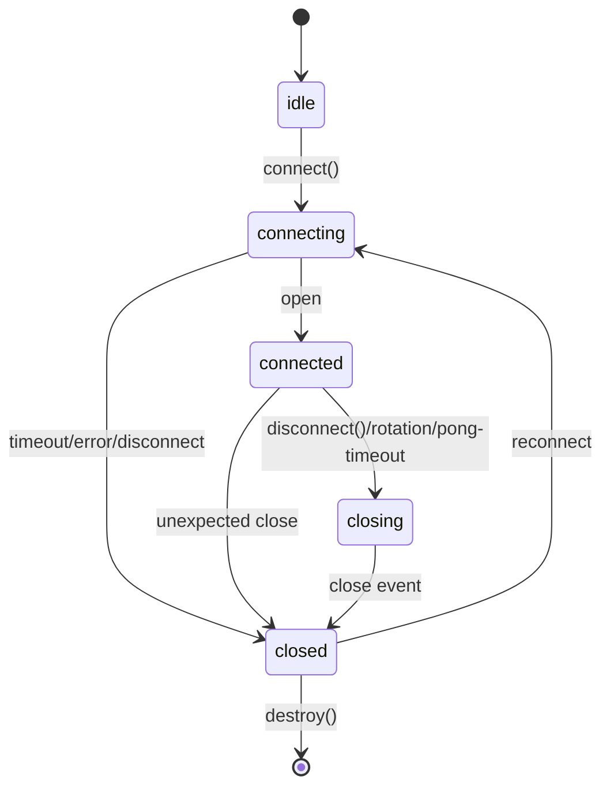
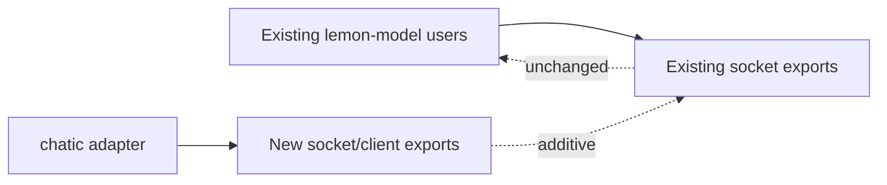

# Socket Client Core Migration Design

문서 순서: [00-requirement.md](./00-requirement.md) → [01-spec.md](./01-spec.md) → `02-design.md`

이 문서는 확정 모델링, 인터페이스, 책임 분리, 파일 구조, 시퀀스/플로우 다이어그램을 정의한다. 요구사항과 구현 정책은 앞선 문서를 기준으로 한다.

## 확정 모델

이 migration은 기존 `lemon-model/src/socket`을 수정해서 의미를 바꾸는 작업이 아니다. 새 `src/socket/client` 계층을 추가하고, `chatic-sockets-api`가 그 계층을 사용하는 구조로 바꾼다.



## 책임 분리

| 계층 | 책임 | 금지 |
| --- | --- | --- |
| `NetworkSupportable` | raw string send/receive | JSON 의미 해석 |
| `WebSocketClientTransport` | WebSocket 생성, connect timeout, actual close | request-response 판정 |
| `SocketClientCore` | serialize, parse, pending, queue, routing, state | chatic packet registry |
| `RequestSettlementStrategy` | response success/failure 판정 | transport lifecycle |
| runtime controllers | keep-alive, reconnect, rotation | domain sync |
| chatic adapter | packet type, alias, `:ok` / `:error`, typed facade | raw socket 구현 |
| chatic domain | device gateway, sync plan | generic socket policy |

## lemon-model public interfaces

### Socket state

```ts
export type SocketClientState = 'idle' | 'connecting' | 'connected' | 'closing' | 'closed';

export interface SocketClientStateEvent {
    prev: SocketClientState;
    next: SocketClientState;
}

export interface SocketClientErrorEvent {
    error: unknown;
    phase: 'connect' | 'disconnect' | 'message' | 'request' | 'transport';
    raw?: unknown;
}
```

### Message codec

```ts
export interface SocketMessageCodec<TMessage> {
    parse(raw: string): TMessage;
    serialize(message: TMessage): string;
}
```

### Request settlement

```ts
export interface RequestSettlementStrategy<TMessage> {
    getId(message: TMessage): string | undefined;
    isSuccess(message: TMessage): boolean;
    isFailure(message: TMessage): boolean;
    getSuccessData(message: TMessage): unknown;
    getFailureError(message: TMessage): unknown;
}
```

### Client transport

```ts
export interface SocketClientTransport {
    readonly state: SocketClientState;
    connect(): Promise<void>;
    disconnect(code?: number, reason?: string): Promise<void>;
    send(raw: string): void;
    on<TType extends keyof SocketClientTransportEventMap>(
        type: TType,
        listener: (event: SocketClientTransportEventMap[TType]) => void,
    ): SocketUnsubscribe;
}
```

### Socket client core

```ts
export interface SocketClientCore<TMessage> {
    readonly state: SocketClientState;

    connect(): Promise<void>;
    disconnect(code?: number, reason?: string): Promise<void>;
    send(message: TMessage): void;
    request<TResult = unknown>(
        message: TMessage,
        options?: { timeoutMs?: number },
    ): Promise<TResult>;

    onState(listener: (event: SocketClientStateEvent) => void): SocketUnsubscribe;
    onError(listener: (event: SocketClientErrorEvent) => void): SocketUnsubscribe;
    onMessage(listener: (event: { message: TMessage; raw: string }) => void): SocketUnsubscribe;
    onType(type: string, listener: (message: TMessage) => void): SocketUnsubscribe;
    destroy(): void;
}
```

### Core options

```ts
export interface SocketClientCoreOptions<TMessage> {
    transport: SocketClientTransport;
    codec: SocketMessageCodec<TMessage>;
    settlement: RequestSettlementStrategy<TMessage>;
    getMessageType(message: TMessage): string | undefined;
    requestTimeoutMs?: number;
    maxInflightRequests?: number;
    maxPendingRequests?: number;
    timerScheduler?: SharedTimerScheduler;
}
```

## chatic adapter model

chatic message shape는 chatic에 남긴다.

```ts
interface ChaticSocketMessage<T = any, TType extends string = string> {
    type: TType;
    data: T | null;
    mid?: string;
    meta?: Record<string, unknown>;
    error?: string;
}
```

chatic adapter가 제공하는 settlement:

```ts
const chaticSettlement: RequestSettlementStrategy<ChaticSocketMessage> = {
    getId: message => message.mid,
    isSuccess: message => message.type.endsWith(':ok'),
    isFailure: message => message.type.endsWith(':error'),
    getSuccessData: message => message.data,
    getFailureError: message => new Error(`${message.error || 'socket request failed'} - ${message.type}`),
};
```

chatic adapter가 제공하는 facade:

```ts
interface ClientSocketV2 {
    readonly state: SocketClientState;
    connect(): Promise<void>;
    disconnect(code?: number, reason?: string): Promise<void>;
    send(type: SocketPacketInputType, data?: unknown): void;
    send(message: ChaticSocketMessage): void;
    request(type: SocketPacketInputType, data?: unknown, options?: { timeoutMs?: number }): Promise<unknown>;
    onState(listener: (event: SocketClientStateEvent) => void): SocketUnsubscribe;
    onError(listener: (event: SocketClientErrorEvent) => void): SocketUnsubscribe;
    onMessage(listener: (event: { message: ChaticSocketMessage; raw: string }) => void): SocketUnsubscribe;
    onType(type: string, listener: (message: ChaticSocketMessage) => void): SocketUnsubscribe;
    destroy(): void;
}
```

## Request flow



## Push message flow



## Lifecycle flow



## Runtime controllers

Controllers depend on `SocketRuntimePort`, not on chatic.

```ts
export interface SocketRuntimePort {
    readonly state: SocketClientState;
    connect(): Promise<void>;
    disconnect(code?: number, reason?: string): Promise<void>;
    send(message: unknown): void;
    request(message: unknown, options?: { timeoutMs?: number }): Promise<unknown>;
    onState(listener: (event: SocketClientStateEvent) => void): SocketUnsubscribe;
}
```

### KeepAliveController

- starts only when connected
- supports `send` mode and `request` mode
- receives outbound ping message from `buildMessage()`
- request mode waits for pong response through the configured client request path
- on repeated timeout, calls supplied `onPongTimeout`
- default chatic adapter behavior closes transport with code `1001`, reason `pong-timeout`

### ReconnectController

- listens for unexpected `closed`
- supports min/max delay, factor, jitter, max attempts, stable reset
- manual stop prevents auto reconnect
- restart performs controlled disconnect then connect

### RotationController

- schedules proactive reconnect before max connection lifetime
- uses jitter to avoid reconnect bursts
- prefers supplied reconnect controller
- falls back to disconnect/connect

## WebSocket transport ownership

Existing `BrowserWebSocketNetwork` remains unchanged:

- accepts an externally owned WebSocket
- adapts it to `NetworkSupportable`
- `close()` detaches listeners

New `WebSocketClientTransport` owns socket lifecycle:

- creates socket from URL/protocols/factory
- waits for open with connect timeout
- maps open/close/error/message to transport events
- `disconnect()` calls actual socket close
- exposes `SocketClientState`

This avoids changing existing lemon-model behavior while satisfying chatic browser client needs.

## Backward compatibility design



Compatibility rules:

- No existing export removal.
- No existing public method signature change.
- No behavior change in `BrowserWebSocketNetwork.close()`.
- No `Peer` protocol change.
- No `JSONTransport` packet shape change.
- New client modules are additive.

## File-level design

lemon-model:

```txt
src/socket/client/index.ts
src/socket/client/types.ts
src/socket/client/socket-client.ts
src/socket/client/pending-request-store.ts
src/socket/client/message-router.ts
src/socket/client/shared-timer-scheduler.ts
src/socket/client/websocket-client-transport.ts
src/socket/client/keep-alive-controller.ts
src/socket/client/reconnect-controller.ts
src/socket/client/rotation-controller.ts
```

chatic:

```txt
src/client-socket-v2/create-client-socket-v2.ts
src/client-socket-v2/types.ts
src/client-socket-v2/socket-runtime.ts
src/client-socket-v2/gateways/*
src/client-socket-v2/plans/*
```

chatic files that become candidates for deletion or thin re-export after migration:

```txt
src/client-socket-v2/socket-transport.ts
src/client-socket-v2/pending-request-store.ts
src/client-socket-v2/message-router.ts
src/client-socket-v2/shared-timer-scheduler.ts
src/client-socket-v2/keep-alive-loop.ts
src/client-socket-v2/reconnect-controller.ts
src/client-socket-v2/connection-rotation-controller.ts
```

## Design verification points

The verification source of truth is [01-spec.md](./01-spec.md). The design-specific checks are:

- each public interface has one owning file under `src/socket/client`
- `SocketClientCore` depends on `SocketClientTransport`, `SocketMessageCodec`, and `RequestSettlementStrategy`, not on chatic types
- runtime controllers depend on `SocketRuntimePort`, not on `ClientSocketV2`
- `WebSocketClientTransport` owns actual socket close lifecycle
- existing `BrowserWebSocketNetwork`, `Peer`, and `JSONTransport` contracts remain unchanged
