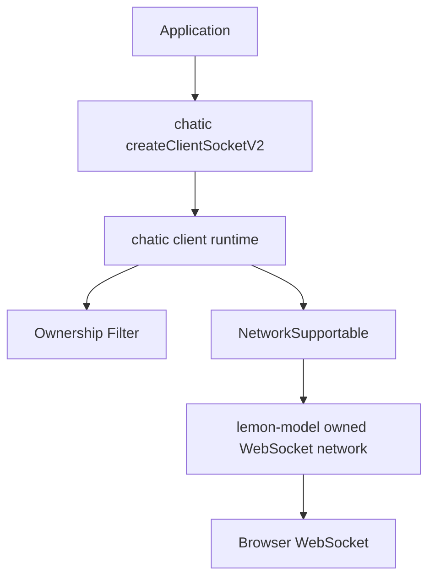
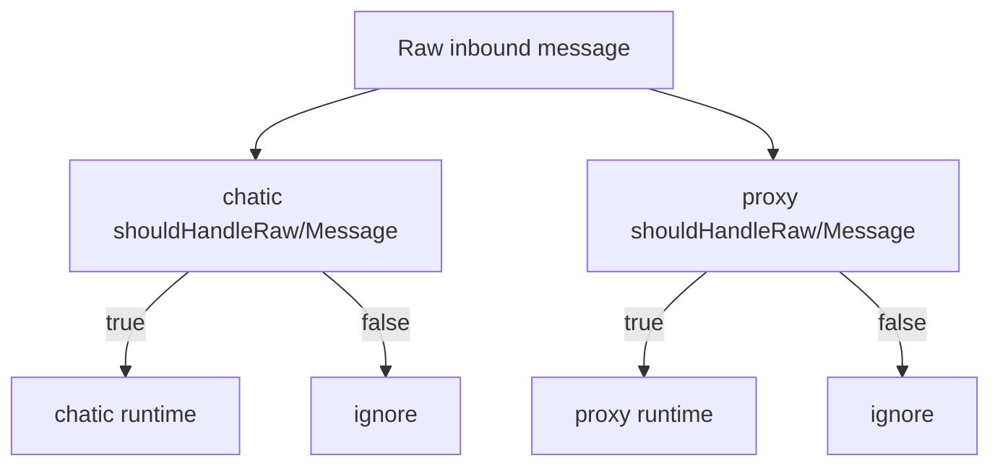
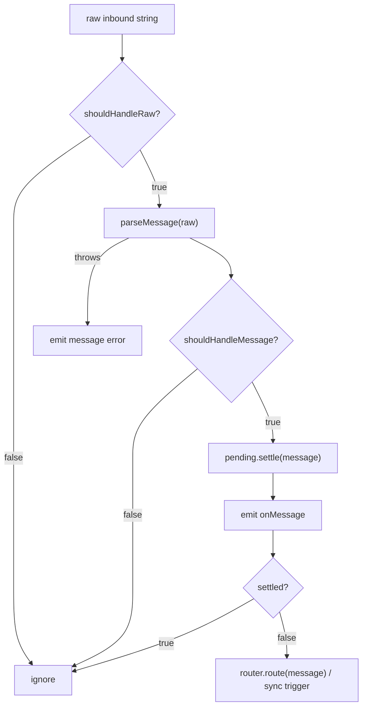
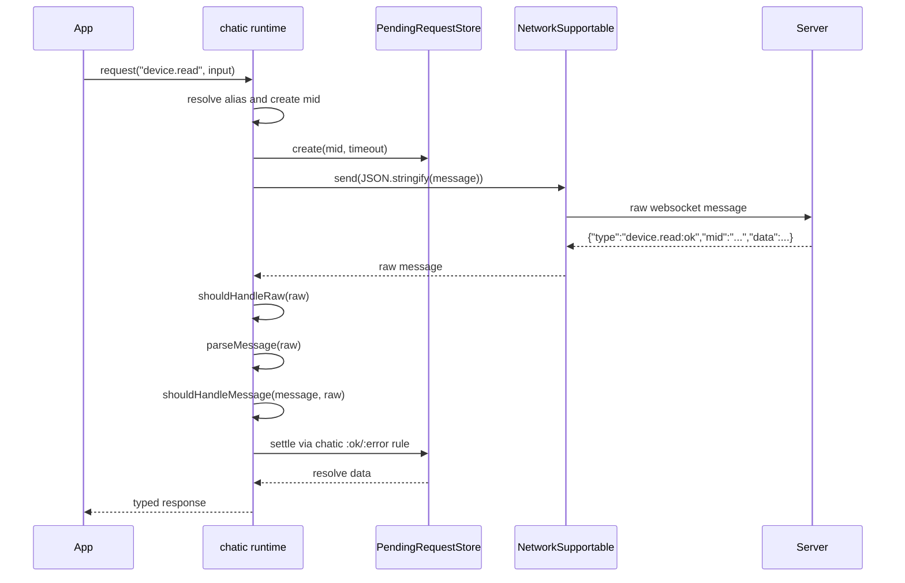
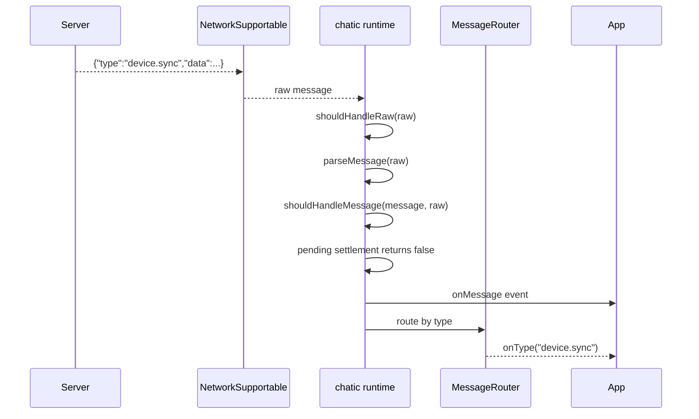
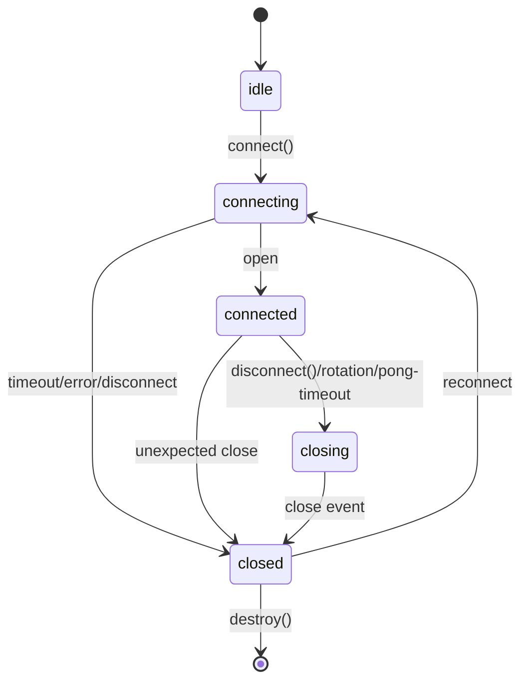
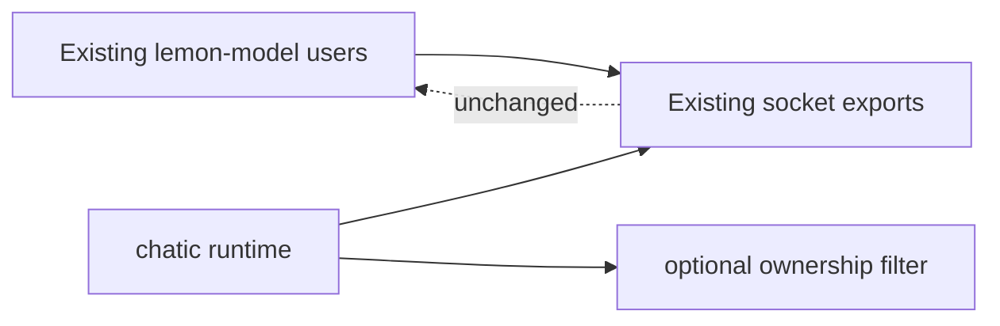

# Socket Network Boundary Migration Design

문서 순서: [00-requirement.md](./00-requirement.md) → [01-spec.md](./01-spec.md) → `02-design.md`

이 문서는 확정 모델링, 책임 분리, ownership filter, 파일 구조, 시퀀스/플로우를 정의한다. 요구사항과 구현 정책은 앞선 문서를 기준으로 한다.

## 확정 모델

이 migration은 `lemon-model`에 새 socket client core를 추가하는 작업이 아니다. `lemon-model`은 raw network boundary와 owned WebSocket network adapter를 제공하고, `chatic-sockets-api`는 자체 client runtime 정책을 유지한다.



proxy가 같은 raw stream을 관찰하거나 공유하는 경우에도 각 runtime은 filter로 처리 대상을 먼저 판정한다.



## 책임 분리

| 계층 | 책임 | 금지 |
| --- | --- | --- |
| `NetworkSupportable` | chatic이 `lemon-model`에서 신규로 공유하는 raw string send/receive 계약 | JSON 의미 해석, ownership 판단 |
| `BrowserWebSocketNetwork` | externally-owned WebSocket adapter, listener detach | actual close 의미로 `close()` 변경 |
| lemon-model owned WebSocket network | WebSocket 생성, connect timeout, raw event mapping, actual close | chatic message parse, pending settle, routing |
| chatic socket transport | chatic internal event shape에 맞춘 thin wrapper | WebSocket 생성/actual close 재구현 |
| chatic client runtime | pending, queue, routing, keep-alive, reconnect, rotation | `lemon-model` generic core에 강제 의존 |
| ownership filter | 처리 대상 메시지 판정 | pending settle 이후 실행 |
| raw filter decorator (`createFilteredNetwork`) | `NetworkSupportable` source의 `onMessage`를 raw predicate로 필터, chatic/proxy 공용 | message parse, chatic message shape 인지 |
| chatic domain | device gateway, sync plan | generic network adapter 책임 |
| proxy | proxy-specific id/payload rule, raw filter decorator 직접 사용 | chatic runtime 의존, chatic rule 하드코딩 |

## lemon-model public interfaces

이번 방향에서 `lemon-model`에 새 public client core interface를 추가하지 않는다. 추가되는 것은 `NetworkSupportable`을 구현하는 owned WebSocket network adapter다.

chatic migration이 `lemon-model`에서 신규로 의존하는 기준 boundary는 다음이다.

```ts
export interface NetworkSupportable {
    readonly readyState: SocketReadyState;
    ready?(): Promise<void>;
    send(data: string): void;
    onMessage(handler: NetworkMessageHandler): SocketUnsubscribe;
    configure?(options: SocketNetworkOptions): void;
    onError(handler: SocketErrorHandler): SocketUnsubscribe;
    close(): void;
}
```

`BrowserWebSocketNetwork`의 `close()`는 기존처럼 detach 의미를 유지한다. 이 export는 하위호환성을 위해 유지하지만, chatic migration의 신규 공유 runtime 범위로 확장하지 않는다.

owned WebSocket network adapter는 chatic `socket-transport.ts`의 네트워크 책임을 옮기는 대상이다. 구현 위치와 export 이름은 `src/socket/websocket.ts`의 `OwnedWebSocketNetwork`와 `createOwnedWebSocketNetwork`로 고정한다.

```ts
export interface OwnedWebSocketNetworkOptions {
    url: string;
    protocols?: string | string[];
    socketFactory?: (context: OwnedWebSocketNetworkFactoryContext) => WebSocketClosable;
    connectTimeoutMs?: number;
}

export interface OwnedWebSocketNetworkFactoryContext {
    url: string;
    protocols?: string | string[];
}

export interface WebSocketClosable extends WebSocketCompartible {
    close(code?: number, reason?: string): void;
}

export class OwnedWebSocketNetwork implements NetworkSupportable {
    constructor(options: OwnedWebSocketNetworkOptions);
}

export const createOwnedWebSocketNetwork = (options: OwnedWebSocketNetworkOptions): OwnedWebSocketNetwork;
```

구현체는 `NetworkSupportable`을 만족해야 한다.

```ts
const network: NetworkSupportable = createOwnedWebSocketNetwork({
    url,
    protocols,
    socketFactory,
    connectTimeoutMs,
});
```

### raw ownership filter decorator

raw 단계 ownership 판정은 chatic 전용 옵션이 아니라 `NetworkSupportable`을 감싸는 decorator로 제공한다. proxy는 `createClientSocketV2`를 쓰지 않으므로 이 decorator로 동일한 raw 필터를 얻는다. 이는 기존 `src/genai/transport.ts`의 private `TransportPacketNetwork` 패턴을 일반화한 것이다.

```ts
export type RawOwnershipPredicate = (raw: string) => boolean;

export const createFilteredNetwork = (
    source: NetworkSupportable,
    shouldHandleRaw: RawOwnershipPredicate,
): NetworkSupportable;
```

decorator는 `onMessage`만 가로채고 나머지는 source로 위임한다. 위임 규칙은 기존 `TransportPacketNetwork`과 동일하다.

- `send` / `close` / `onError` / `readyState`: source로 그대로 위임
- optional `ready` / `configure`: decorator에서 항상 정의하고 source로 위임. source에 없으면 `ready()`는 `Promise.resolve()`, `configure()`는 no-op
- predicate는 inbound `onMessage`에만 적용, outbound `send`에는 적용하지 않음

```ts
// chatic: createClientSocketV2 내부에서 옵션을 decorator로 적용
const network = createFilteredNetwork(owned, raw => shouldHandleRaw({ raw }));

// proxy: chatic runtime 없이 동일 decorator 직접 사용
const proxyNetwork = createFilteredNetwork(owned, raw => raw.startsWith('proxy:'));
```

predicate는 raw 문자열만 본다. parse 이후 message shape 판정(`shouldHandleMessage`)은 각 runtime에 남는다.

## chatic filter interfaces

chatic message shape는 chatic에 남긴다.

```ts
interface ChaticSocketMessage<T = any, TType extends string = string> {
    type: TType;
    data: T | null;
    mid?: string;
    meta?: Record<string, unknown>;
    error?: string;
}
```

`ClientSocketOptions`는 inbound filter를 optional로 받는다.

```ts
interface ClientSocketInboundFilterContext {
    raw: string;
}

interface ClientSocketMessageFilterContext<T = any> {
    raw: string;
    message: ChaticSocketMessage<T>;
}

interface ClientSocketOptions {
    shouldHandleRaw?: (context: ClientSocketInboundFilterContext) => boolean;
    shouldHandleMessage?: (context: ClientSocketMessageFilterContext) => boolean;
}
```

필터 미설정 시 기본값은 true다.

```ts
const shouldHandleRaw = options.shouldHandleRaw ?? (() => true);
const shouldHandleMessage = options.shouldHandleMessage ?? (() => true);
```

## inbound dispatch flow



필터는 pending settlement보다 앞에 있다. 이 순서를 바꾸면 다른 runtime이 소유한 response를 잘못 consume할 수 있다.

## Request flow



## Push message flow



## Filter examples

이 문서는 실제 ownership rule을 고정하지 않는다. 아래는 가능한 사용 예시다.

```ts
const client = createClientSocketV2({
    url,
    shouldHandleMessage: ({ message }) => message.meta?.owner === 'chatic',
});
```

```ts
const proxy = createProxyRuntime({
    shouldHandleMessage: ({ message }) => typeof message.mid === 'string' && message.mid.startsWith('proxy:'),
});
```

payload channel을 쓰는 경우도 chatic/proxy가 직접 판단한다.

```ts
shouldHandleMessage: ({ message }) => {
    const channel = (message.data as any)?.channel;
    return channel === 'device';
}
```

## Lifecycle flow

Lifecycle policy는 chatic runtime이 계속 소유한다. WebSocket 실제 생성, open 대기, actual close는 `lemon-model` owned network adapter가 수행한다.



## WebSocket ownership

Existing `BrowserWebSocketNetwork` remains unchanged:

- accepts an externally owned WebSocket
- adapts it to `NetworkSupportable`
- `close()` detaches listeners

New owned WebSocket network adapter handles the actual network ownership needed by chatic:

- creates socket from URL/protocols/factory
- waits for open with connect timeout
- maps open/close/error/message to runtime events
- `close()` calls actual socket close

chatic keeps runtime policy:

- decides when to connect/disconnect
- decides reconnect/backoff/rotation
- owns pending request and domain routing
- calls `NetworkSupportable.close()` when policy requires disconnect

This avoids changing existing lemon-model behavior while moving chatic network adapter code to the shared socket boundary.

## Backward compatibility design



Compatibility rules:

- No existing lemon-model export removal.
- No existing public method signature change.
- No behavior change in `BrowserWebSocketNetwork.close()`.
- No `Peer` protocol change.
- No `JSONTransport` packet shape change.
- chatic filter options are additive.
- filter 미설정 시 기존 chatic 동작 유지.

## File-level design

lemon-model:

```txt
src/socket/types.ts
src/socket/websocket.ts          # add OwnedWebSocketNetwork and createOwnedWebSocketNetwork
src/socket/transport.ts
src/socket/socket.ts
src/socket/testing.ts
```

No new `src/socket/client` files are required for this direction. Do not create `src/socket/websocket-owned-network.ts`; the owned adapter belongs in `src/socket/websocket.ts` next to the existing WebSocket boundary.

chatic:

```txt
src/client-socket-v2/types.ts
src/client-socket-v2/create-client-socket-v2.ts
src/client-socket-v2/socket-runtime.ts
src/client-socket-v2/socket-transport.ts        # shrink to createOwnedWebSocketNetwork wrapper
src/client-socket-v2/pending-request-store.ts
src/client-socket-v2/message-router.ts
src/client-socket-v2/shared-timer-scheduler.ts
src/client-socket-v2/keep-alive-loop.ts
src/client-socket-v2/reconnect-controller.ts
src/client-socket-v2/connection-rotation-controller.ts
src/client-socket-v2/gateways/*
src/client-socket-v2/plans/*
```

## Design verification points

The verification source of truth is [01-spec.md](./01-spec.md). The design-specific checks are:

- `lemon-model` does not add `src/socket/client`
- `lemon-model` existing socket contracts remain unchanged
- `lemon-model` adds only owned WebSocket `NetworkSupportable` adapter behavior
- chatic runtime does not depend on `SocketClientCore`
- chatic no longer owns WebSocket creation/connect timeout/actual close implementation directly
- ownership filter runs before pending settlement
- ownership filter false path does not emit `onMessage` or `onType`
- ownership filter false path does not trigger domain sync
- raw filter false path does not parse JSON
- actual WebSocket close remains outside `BrowserWebSocketNetwork.close()` and inside the new owned adapter
- `createFilteredNetwork` decorator forwards all non-`onMessage` members to the source network, including optional `ready`/`configure` (resolve/no-op when source lacks them)
- proxy can apply raw ownership filtering through `createFilteredNetwork` without depending on chatic runtime
