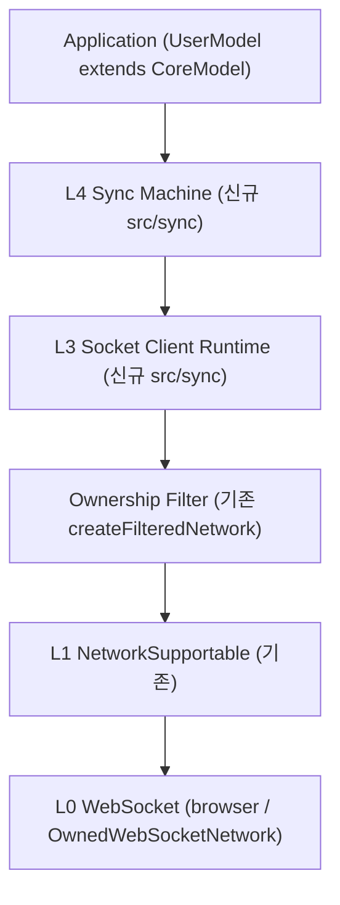
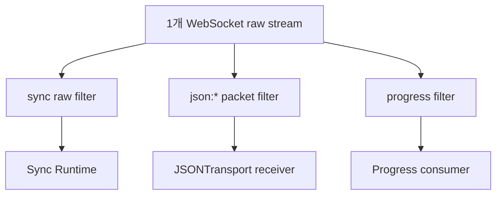
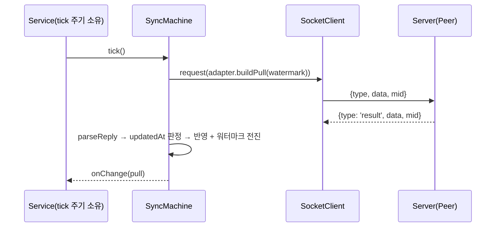
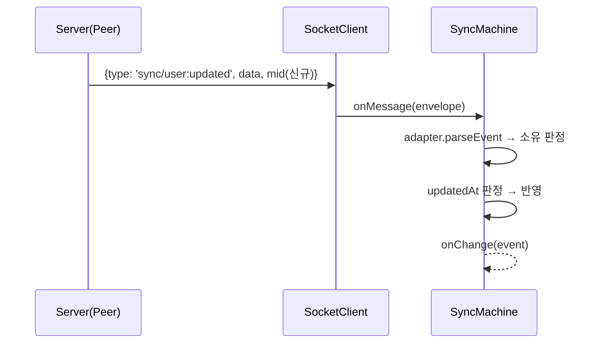

# Model Sync Client Design

문서 순서: [00-requirement](./00-requirement.md) → `01-design.md`

이 문서는 범용 모델 동기화 클라이언트의 확정 모델링, 레이어별 책임, public interface, 동기화 의미론, 검증 시나리오를 정의한다. 요구사항은 앞선 문서를 기준으로 한다. 이 문서는 설계만 다루며 구현 코드는 포함하지 않는다.

## 확정 모델

`lemon-model`에 두 개의 레이어를 새로 올린다. 기존 socket 계약(`NetworkSupportable`, `JSONTransport`)은 변경하지 않고 그 위에 쌓는다. 동기화는 서버→클라이언트 단방향(읽기 전용)이며, 수신 경로는 pull(요청)과 이벤트(서버 push) 둘이다. 용어는 [00-requirement](./00-requirement.md)의 용어 정리를 따른다.



같은 소켓 위에 JSON Transport, Progress가 공존한다. 각 모듈은 raw filter로 자기 메시지만 골라 받는다.



## 책임 분리

| 계층 | 책임 | 금지 |
| --- | --- | --- |
| `NetworkSupportable` (기존) | raw string send/receive, 연결 상태 | JSON 의미 해석, ownership 판단 |
| `createFilteredNetwork` (기존) | raw predicate로 수신 필터링 | message parse |
| Socket Client Runtime (신규) | envelope encode/decode, mid 기반 요청-응답 추적(timeout 포함), type 기반 라우팅 | 모델 의미 해석, 재연결, WebSocket 생성/close |
| Sync Machine (신규) | 모델 타입 등록, 로컬 상태 보관, updatedAt 최신 판정, pull/이벤트 반영 오케스트레이션 | wire 규약 인지(어댑터 소관), timer 소유(tick은 외부 주입), 로컬 변경의 서버 전파(단방향) |
| Protocol Adapter (서비스 주입) | 도메인 wire 규약 ↔ 모델 변환, pull 요청 구성, 이벤트 소유 판정 | 로컬 상태 보관, 최신 판정 |
| Application | 도메인 모델 정의(CoreModel 상속), 어댑터 구현, tick 호출 주기 결정 | — |

의존 방향은 `sync → socket` 단방향이다. `src/socket`은 `src/sync`를 모른다.

## Wire Envelope

runtime은 기존 `SocketMessage<Data>`를 봉투로 재사용한다. 새 wire 형식을 만들지 않는다.

```ts
/** 기존 src/socket/types.ts — 변경 없음 */
export interface SocketMessage<Data = any> {
    type: SocketMessageType; // 'message' | 'result' | 'error' | 'ping' | 'pong' | string
    data: Data;
    mid: string;
}
```

- 요청: `{ type, data, mid }` — type은 어댑터/서비스가 정한다(예: `sync/user:pull`).
- 정상 응답: `{ type: 'result', data, mid: 요청과 동일 }` → 해당 pending을 resolve한다.
- 오류 응답: `{ type: 'error', data, mid: 요청과 동일 }` → 해당 pending을 reject한다.
- 서버 발신 이벤트: mid가 pending에 없는 메시지 → 라우팅으로 전달한다.

이 봉투 형식과 settle 규칙은 기존 `Peer` simulator의 dispatch가 소비하는 형식과 같다(`result`/`error` + mid 매칭). 단, `Peer` 링크는 단방향 Network 2개(uplink/downlink)로 구성되고 `peer.network`는 uplink만 노출하므로, L3를 Peer에 직접 물릴 수는 없다. 검증은 `src/sync/testing.ts`의 브리지(아래 검증 시나리오 참고)로 Peer를 `NetworkSupportable` 하나로 감싸서 수행한다. 또한 `Peer`는 `error` 봉투를 스스로 만들지 않으므로, 오류 응답은 서버 대역 핸들러가 `post({ type: 'error', data, mid }, { clientId })`로 직접 생성한다.

## Public Interfaces — L3 Socket Client Runtime

```ts
/** mid 생성기 */
export interface SocketClientIdentityProvider {
    nextMid(): string;
}

export interface SocketClientOptions {
    /** 요청 응답 대기 한도 (기본 15_000ms) */
    timeoutMs?: number;
    /** 동시 pending 상한. 초과 request()는 즉시 reject (기본 무제한) */
    maxPending?: number;
    /** 이 runtime이 처리할 raw 문자열 판정. 내부에서 createFilteredNetwork로 감싼다 */
    filter?: RawOwnershipPredicate;
    /** mid 생성기 (기본 제공) */
    identity?: SocketClientIdentityProvider;
}

export interface SocketRequestOptions {
    /** 이 요청만의 timeout 재정의 */
    timeoutMs?: number;
}

export interface SocketClientSupportable {
    /** 하위 network (공유 소켓) */
    readonly network: NetworkSupportable;
    /** 응답 대기 중인 요청 수 */
    readonly pendingCount: number;
    /** network ready 위임 */
    ready(): Promise<void>;
    /** 요청을 보내고 같은 mid의 result/error를 기다린다 */
    request<T = any, R = any>(type: string, data: T, options?: SocketRequestOptions): Promise<R>;
    /** 응답을 기다리지 않는 단방향 발신 */
    post<T = any>(type: string, data: T): void;
    /** 특정 type의 이벤트 구독 */
    onType<T = any>(type: string, handler: (data: T, message: SocketMessage<T>) => void): SocketUnsubscribe;
    /** pending과 매칭되지 않은 모든 수신 envelope 구독 */
    onMessage(handler: (message: SocketMessage) => void): SocketUnsubscribe;
    /** 비동기 오류 관찰 (timeout, parse 실패, network 오류) */
    onError(handler: SocketErrorHandler): SocketUnsubscribe;
    /** pending 전부 reject + listener detach. network는 close하지 않는다(소켓 공유) */
    close(): void;
}

export const createSocketClient: (network: NetworkSupportable, options?: SocketClientOptions) => SocketClientSupportable;
```

설계 근거:

- `close()`가 소켓을 닫지 않는 것은 "1개 웹소켓 공유" 제약 때문이다. 소켓 수명은 network 소유자(`OwnedWebSocketNetwork` 또는 앱)가 관리한다. `BrowserWebSocketNetwork.close()`의 detach 의미 분리 원칙과 같은 계열이다.
- `filter` 미설정 시 envelope으로 parse되지 않는 raw 문자열은 조용히 무시한다. 같은 소켓의 `json:*` packet, progress 문자열이 오류를 만들지 않는다.
- 재연결·keep-alive는 이 레이어에 두지 않는다. network가 교체되는 후속 설계를 위해 runtime은 network 인스턴스 외 상태(연결 URL 등)를 보관하지 않는다.
- `network.send()`는 동기 throw할 수 있다(예: in-memory Network의 `1009: message too big`, 크기 제한 초과). L3는 이 throw를 잡아 `request()`는 해당 promise reject로, `post()`는 `onError`로 돌린다. 호출자에게 동기 예외가 새어 나가지 않는다.

## Public Interfaces — L4 Sync Machine

```ts
/** 변경 통지 */
export interface SyncChangeEvent<M extends CoreModel> {
    /** 변경 원인 */
    cause: 'pull' | 'event';
    /** 이번에 바뀐(반영·제거된) 모델들 */
    models: M[];
}

/** pull 응답에서 추출한 서버 확정 페이지 */
export interface SyncReplyPage<M extends CoreModel> {
    /** 서버 확정 모델들 */
    models: M[];
    /** 다음 페이지 커서. 없으면 pull 종료 */
    next?: any;
}

/**
 * 프로토콜 어댑터 — 서비스가 주입한다.
 * 머신은 wire 규약을 모르고, 어댑터는 로컬 상태를 모른다.
 */
export interface SyncProtocolAdapter<M extends CoreModel> {
    /** since(updatedAt 워터마크)와 커서로 pull 요청 구성. since 미지정은 전체 */
    buildPull(since?: number, cursor?: any): { type: string; data: any };
    /** pull 응답 data에서 서버 확정 모델과 다음 커서 추출 */
    parseReply(data: any): SyncReplyPage<M>;
    /** 서버 발신 이벤트에서 이 타입의 모델 추출. 소유 아니면 undefined. 순수 판정 함수여야 하며 부수효과 금지 */
    parseEvent(message: SocketMessage): M[] | undefined;
}

export interface ModelSyncOptions<M extends CoreModel> {
    adapter: SyncProtocolAdapter<M>;
    /** register 직후 초기 pull 수행 여부 (기본 true). 실패해도 register는 유효하며 다음 pull/tick이 처음부터 다시 당긴다. 실패 관찰이 필요하면 false로 두고 직접 pull()을 호출한다 */
    initialPull?: boolean;
}

/** 타입 1개에 대한 동기화 핸들 */
export interface ModelSyncSupportable<M extends CoreModel> {
    readonly type: string;
    /** 로컬 상태 조회 (읽기 전용 뷰) */
    get(id: string): M | undefined;
    list(): M[];
    /** 워터마크 이후 변경분을 당겨 반영. parseReply.next가 없어질 때까지 커서 루프를 돈다 */
    pull(): Promise<M[]>;
    /** 변경 통지 구독 */
    onChange(handler: (event: SyncChangeEvent<M>) => void): SocketUnsubscribe;
    /** 이 타입의 구독/리스너 해제 */
    close(): void;
}

export interface SyncMachineSupportable {
    /** 도메인 모델 타입 등록. 같은 type 재등록은 기존 핸들을 반환하고 새 options는 무시한다 */
    register<M extends CoreModel>(type: string, options: ModelSyncOptions<M>): ModelSyncSupportable<M>;
    /** 등록된 모든 타입 pull 1회. 서비스가 원하는 주기로 호출한다. 이미 pull이 진행 중인 타입은 중첩 실행하지 않고 스킵한다 */
    tick(): Promise<void>;
    /** 전체 해제 */
    close(): void;
}

export const createSyncMachine: (client: SocketClientSupportable) => SyncMachineSupportable;
```

설계 근거:

- 머신에 timer가 없다. `tick()`은 호출 가능한 메서드일 뿐이고, 주기는 서비스가 정한다(setInterval, visibility 이벤트, 사용자 액션 등). "tick은 서비스마다 달라질 수 있다"는 요구를 코드가 아니라 구조로 보장한다.
- 어댑터 3개 메서드가 프로토콜 주입의 전부다. 서버 wire가 어떤 모양이든 이 세 가지 변환만 제공하면 동기화가 붙는다.
- 핸들은 읽기 전용이다. 동기화 대상 모델을 고치는 API를 두지 않아, "서버가 유일한 원천"이라는 요구를 인터페이스 수준에서 강제한다.
- `parseEvent`가 ownership filter의 모델 레벨 판정을 겸한다. raw 레벨 판정은 L3의 `filter`가 담당하므로 migrate-socket에서 정한 2단(raw/parsed) 필터 구조와 정합한다.
- 이벤트 디스패치 규칙: 머신은 L3 `onMessage`로 받은 envelope 중 `type`이 `result`/`error`/`ping`/`pong`인 것을 이벤트로 취급하지 않는다(늦게 도착한 응답이 이벤트로 새는 것 방지). 나머지 envelope은 등록된 모든 핸들의 `parseEvent`에 전달하고, `undefined`가 아닌 핸들만 각자 자기 스토어에 반영한다. 타입별 스토어가 분리되어 있으므로 복수 핸들이 같은 이벤트를 소유해도 충돌하지 않는다.

## 동기화 의미론

### updatedAt 최신 판정

| 상황 | 규칙 |
| --- | --- |
| 로컬에 없는 모델 수신 | 반영한다(신규 추가). 단 deletedAt이 있으면 무시한다(이미 없는 것의 삭제) |
| pull/event로 수신한 모델 | `incoming.updatedAt > local.updatedAt`이면 반영, 아니면 무시 |
| pull 워터마크 | 타입별 저장식 단조 증가 값. 수신 모델을 반영할 때만 `max(현재 워터마크, incoming.updatedAt)`로 전진하고, 어떤 경우에도 후진하지 않는다 |
| 수신 모델에 updatedAt 없음 | 반영하지 않고 무시한다 |
| 로컬 모델에 updatedAt 없음 | stale로 취급하여 서버 수신본으로 덮는다 |
| 수신 모델에 deletedAt 있음 | 최신 판정을 통과하면 스토어에서 제거하고 변경 통지에 포함한다 |

- 동기화가 단방향(읽기 전용)이므로 로컬 상태는 항상 서버 확정본이다. 잠정 상태, 충돌 해소, 응답 순서 역전 보정 같은 쓰기 경합 규칙이 필요 없다 — pull과 이벤트가 어떤 순서로 도착해도 updatedAt 판정 하나로 수렴한다.
- pull 진행 중 도착한 이벤트도 같은 판정을 통과할 뿐 별도 보류가 없다.

서버 계약 전제: 서버는 같은 모델의 연속 변경에 대해 updatedAt이 단조 증가함을 보장해야 한다. 같은 ms에 서로 다른 변경이 같은 updatedAt을 가지면 나중 변경이 무시될 수 있다 — 이는 updatedAt 기준 판정의 알려진 한계이며, 이 보장이 어려운 서버는 후속에서 `lock`/`next` 같은 시퀀스 필드 판정으로 확장한다.

## 공존과 패킷 제약

- 하나의 `NetworkSupportable` 위에서 sync runtime, `JSONTransport` receiver, progress consumer(`src/buffer`의 `GenAIStreamEvent` 소비자)가 각자 `createFilteredNetwork`로 갈라 받는다. sync envelope과 `json:*` packet은 type 체계가 겹치지 않는다.
- 발신 envelope 크기는 network의 `maxPacketBytes`(기본 64kb — `DEFAULT_MAX_PACKET_BYTES`, `configure()`로 설정) 안에 들어야 한다. 단 크기 강제 주체는 network 구현에 따라 다르다: in-memory `Network`는 초과 시 `send()`가 동기 throw하고, 브라우저 계열 어댑터는 `configure()`가 no-op이라 강제하지 않으므로 실서비스 제한은 서버/인프라 정책이다. L3는 send throw를 request reject로 변환한다(위 L3 설계 근거 참고).
- 큰 변경분 pull은 어댑터의 커서 페이지네이션(`buildPull(since, cursor)` / `parseReply().next` 루프)으로 대응하고, envelope 자체의 chunking은 1차 범위가 아니다.
- 이벤트 type 이름은 서비스 네임스페이스를 권장한다(예: `sync/user:*`). runtime `filter`를 이 prefix 검사로 주면 raw 단계에서 저렴하게 거를 수 있다.

## 파일 구조와 export

```
src/sync/
├── index.ts        # public re-export
├── types.ts        # 위 interface 계약 전부
├── client.ts       # createSocketClient (L3)
├── machine.ts      # createSyncMachine (L4)
├── testing.ts      # Peer ↔ NetworkSupportable 브리지 (테스트 전용, index에서 미노출)
├── client.spec.ts
└── machine.spec.ts
```

- 루트 `src/index.ts`에 `export * from './sync';`를 추가한다. socket/genai/buffer와 같은 정책이다.
- 기존 socket export는 건드리지 않는다. 변경은 전부 additive다.
- simulator 격리 정책(`socket/testing`)은 그대로 유지하고, sync spec은 그 entry의 `Peer`를 사용한다.
- `sync/testing.ts`의 브리지는 `Peer`(단방향 링크 2개)를 L3가 요구하는 양방향 `NetworkSupportable` 하나로 감싼다: `send(raw)`는 parse 후 `clientPeer.post(message)`로, 수신은 `clientPeer.onMessage`를 raw 문자열로 되돌려 전달한다. `socket/testing`과 같은 격리 정책으로 production 번들에 포함하지 않는다.

## 시퀀스

### tick (pull)



### 서버 발신 이벤트



## chatic client-socket-v2 대비

체계는 참고하되 설계는 새로 한다는 요구에 따라, 계승과 의도적 차이를 명시한다.

계승한 패턴:

- mid 기반 요청-응답 매칭과 timeout (chatic `PendingRequestStore`)
- type별 pub-sub 라우팅과 unsubscribe 반환 (chatic `MessageRouter`)
- polling(tick) + event-driven 병행 동기화 (chatic `DomainSyncScheduler`의 run/onTrigger 구조를 pull/parseEvent로 단순화)
- updatedAt 비교로 변경 감지 (chatic sync plan도 `snapshot.updatedAt` 비교로 무변경 skip을 한다 — 이 설계의 최신 판정 기준과 같은 계열로, 실전에서 검증된 방식이다)

의도적 차이:

| 항목 | chatic | 이 설계 | 이유 |
| --- | --- | --- | --- |
| 응답 규약 | type suffix `:ok` / `:error` | `type: 'result'` / `'error'` + 동일 mid | 기존 `SocketMessage`/`Peer` dispatch 규약과 일치시켜, testing 브리지만으로 `Peer`를 검증 서버로 쓴다 |
| 봉투 필드 | `meta`, `error`, `errorCode` 추가 필드 | `data` 안에서 어댑터가 해석 | 봉투를 기존 계약 그대로 유지(additive 원칙) |
| 요청 상한 | maxInflight(32) + maxPending(256) 2단 | maxPending 1개 | 이 runtime은 대기열 없이 즉시 발신하므로 상한 1개로 충분 |
| tick 소유 | scheduler가 interval/backoff 소유 | 머신은 `tick()` 메서드만 제공, 주기는 서비스 소유 | "tick은 서비스마다 다르다" 요구 |

chatic의 범용화 장벽 4가지가 이 설계에서 해소되는 방식:

| chatic 장벽 | 해소 |
| --- | --- |
| gateway가 도메인 타입을 직접 import | gateway 계층 자체를 두지 않는다. 도메인 지식은 어댑터 주입으로만 들어온다 |
| 액션 문자열 하드코딩 | type 문자열은 어댑터 `buildPull`이 생성하고 머신은 모른다 |
| packet registry augmentation 강제 | 타입 레지스트리 없음. `CoreModel` 제네릭과 어댑터 반환 타입으로 해결 |
| plan 사전 등록(코드 수정) 필요 | `register()`가 런타임 호출이라 새 타입 추가에 lemon-model 수정이 없다 |

## 검증 시나리오 (Peer simulator)

검증 배선: L3는 `sync/testing.ts` 브리지로 `Peer` 클라이언트에 물리고, 서버 대역은 상대 `Peer`의 `onMessage` 핸들러로 구현한다. 정상 응답은 listener 반환값(자동 `result` reply)으로, 오류 응답은 핸들러가 `post({ type: 'error', data, mid }, { clientId })`로 직접 만든다. `Peer`의 기본 전달은 `unordered: true`이므로 pull과 이벤트의 도착 순서 뒤섞임이 별도 장치 없이 재현된다.

1. **단방향 동기화 e2e**: `Peer` 서버에 UserModel 어댑터 규약을 구현하고 ① tick → pull 반영 ② 서버 이벤트 → 로컬 반영 ③ 재tick → 워터마크 이후 변경분만 반영 ④ 커서 2페이지 pull이 전량 반영 ⑤ `deletedAt` 수신 시 스토어 제거를 확인한다.
2. **updatedAt 판정**: 오래된 updatedAt 이벤트 수신 시 무시, 같은 값 수신 시 무시(서버 단조 증가 전제의 한계로 명시), pull과 이벤트가 뒤섞여 도착해도 최종 상태가 수렴하고 워터마크가 후진하지 않음을 확인한다.
3. **pull 오류**: pull 요청에 error 응답 시 `pull()`이 reject되고 스토어와 워터마크가 변하지 않음을 확인한다. tick 재진입(진행 중 pull 스킵)도 함께 검증한다.
4. **공존**: 한 network 위에 sync runtime + `JSONTransport` receiver + progress 문자열 스트림을 함께 올리고 상호 오수신·pending 오염이 없음을 확인한다 — 요구사항의 "JSON Transport, Progress와 간섭 없는 공존" 조건 그대로.
5. **패킷 제약**: `maxPacketBytes` 초과 발신 시 `send()` 동기 throw가 해당 `request()` reject로 변환되는지 확인한다.
6. **runtime 단독**: request timeout, maxPending 초과, error settlement, close()의 pending 일괄 reject, 늦은 응답(timeout 후 도착)이 이벤트로 새지 않음을 sync 없이 검증한다 — 레이어 독립 교체성의 증거.

## 비범위와 확장 지점

- 재연결·keep-alive: 1차 제외. 확장 지점은 "runtime이 network 외 상태를 갖지 않는다"는 제약으로 남긴다. 후속에서 network 교체형 reconnect decorator를 L1에 추가하면 L3 이상은 무변경이다.
- 오프라인 영속화: 로컬 상태는 메모리 전용이다. `list()/get()` 계약 뒤의 저장소 교체는 후속 설계로 미룬다.
- 서버 구현: `Peer` simulator가 유일한 서버 대역이다.
- pull 실패 분류와 backoff: chatic scheduler의 gone/transient 분류, 기하 backoff는 1차 제외. `pull()` reject를 관찰하는 tick 소유자(서비스)가 주기를 조절하는 것으로 갈음하고, 필요해지면 tick 소유 지점에 backoff decorator를 더한다.
- 인증 게이트: chatic의 auth-controller/`requiresAuth` 같은 인증 상태 연동은 1차 제외. 인증은 network 생성 시(연결 URL/토큰) 서비스가 해결하고, 인증 후에만 `register()`/`tick()`을 시작하는 것도 서비스 소관이다.
- envelope 레벨 chunking: 큰 payload는 어댑터 페이지네이션 또는 기존 `JSONTransport` 병행 사용으로 대응한다.
- 쓰기 동기화: 로컬 변경을 서버로 push하는 경로는 범위 밖이다. 필요해지면 어댑터에 push 메서드와 잠정 상태 의미론을 additive로 더하는 후속 설계로 다룬다. 읽기 전용 v1의 스토어·판정 규칙은 그대로 재사용된다.
