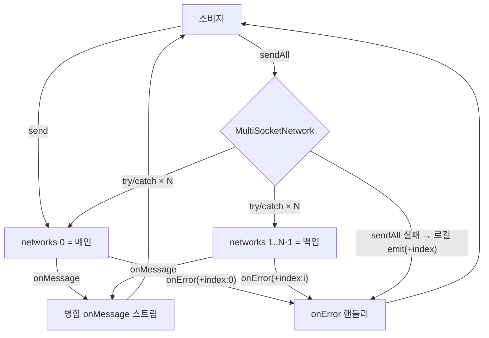

# Design: dual-socket-network

**Status:** Confirmed
**Date:** 2026-07-13 (dual 고정 초판 → N개 일반화 개정)
**Slug:** dual-socket-network
**Spec:** [01-spec.md](./01-spec.md)

## 범위
데이터 모델링·시스템 흐름을 다룬다. 외부 계약은 [01-spec.md](./01-spec.md)가 source of truth. use-case lib 구조는 예외 조항 적용(라이브러리 저수준 모듈 — `src/socket` 기존 모듈 관례를 따른다).

## 데이터 모델링

### 공개 타입 (`src/socket/multi.ts` 신규)

| 심볼 | 타입 | 설명 |
|---|---|---|
| `MULTI_NETWORK_SCOPE.send` | `'network.multi.send'` | 전체 전송 확장 호출에서 삼킨 동기 throw를 에러로 재방출할 때의 scope |
| `MultiSocketErrorContext` | `SocketErrorContext & { index: number }` | 기존 context 확장 — `types.ts` 무수정. 합성체가 전파하는 모든 에러에 소켓 index(0=메인)를 부여 |
| `MultiNetworkSupportable` | `NetworkSupportable & { sendAll(data: string): void }` | 합성체의 공개 인터페이스. 표준 8멤버 + 확장 호출 1개 |
| `MultiSocketNetworkFactory` | `(index: number) => NetworkSupportable` | 편의 생성용 per-index 팩토리 — 기존 `PeerNetworkFactory`(socket.ts:61) 관용구와 동형 |
| `createMultiSocketNetwork(networks[])` | `(NetworkSupportable[]) => MultiNetworkSupportable` | 기본 생성. 2개 미만이면 즉시 throw |
| `createMultiSocketNetwork({ count, networkFactory })` | `({ count: number, networkFactory: MultiSocketNetworkFactory }) => MultiNetworkSupportable` | 편의 생성 오버로드. 팩토리를 count만큼 호출해 배열을 만들 뿐, 소켓 생성을 소유하지 않는다. count < 2면 즉시 throw |

### 멤버별 위임 설계 (계약 → 구현 매핑)

| 멤버 | 구현 | 근거 |
|---|---|---|
| `send(data)` | `networks[0].send(data)` 그대로 — throw 통과 | 표준 경로는 단일 소켓과 동일(01 무파손) |
| `sendAll(data)` | 전 소켓 순회, 각각 독립 `try { n.send(data) } catch (e) { emitLocal(e, index) }` — 절대 던지지 않음 | 01 확장 호출 실패 채널 |
| `onMessage(handler)` | 전 소켓 `onMessage` 구독, unsubscribe들을 합성해 반환 | 병합 스트림·재정렬 없음 |
| `onError(handler)` | ① 전 소켓의 `onError`를 구독 시점 index로 태깅해 위임: `networks[i].onError((e, ctx) => handler(e, { ...ctx, network: 합성체, index: i }))` — `network`는 기존 데코레이터 관례(decorators.ts:160)대로 합성체로 통일 ② 로컬 emitter에도 등록(sendAll 실패 채널). unsubscribe 전부 합성 | 01 — context 참조 동일성 비의존, 구독 시점 판별. 출처별 `ctx.network` 불일치 차단 |
| `close(code, reason)` | 전 소켓을 각각 try/catch로 close. 재호출 무해(멱등). onError 구독·로컬 emitter는 유지한다 — close 후 sendAll 실패("닫힘 포함")도 계약대로 관측돼야 함 | 한 소켓의 close 예외가 다른 소켓 종료를 막으면 격리 위반 |
| `readyState` | `networks[0].readyState` | 메인 기준 |
| `ready()` | `networks[0].ready?.() ?? Promise.resolve()` | 메인 기준. optional 부재 시 즉시 resolve |
| `onOpen(handler)` | `networks[0].onOpen?.(handler) ?? noop-unsubscribe` | 메인 기준 |
| `configure(options)` | 전 소켓에 `n.configure?.(options)` | 공통 옵션 편의 전파 |

- 로컬 emitter: `sendAll`이 삼킨 동기 throw의 유일한 전파 통로. `handler(error, { scope: MULTI_NETWORK_SCOPE.send, network: 합성체, index })`로 방출한다. 저장은 중복 허용(구독 단위 배열)으로 하위 위임 경로와 발화 횟수를 일치시키고, unsubscribe는 해당 1건만 제거한다. 핸들러 호출은 개별 try/catch로 감싼다 — 소비자 핸들러의 throw가 무-throw 보장과 다음 소켓 전송을 깨지 못하게. 방출이 동기이므로 실패를 관측하려면 `sendAll` 이전에 `onError`를 구독해야 한다.
- 생성 검증: 배열 길이(또는 count) < 2면 즉시 throw — 다중화가 성립하지 않는 구성의 실수 방지. count 검증은 `networkFactory` 호출 **전에** 수행한다(팩토리가 실소켓을 여는 부작용형이어도 throw 전에 고아 리소스가 생기지 않도록).
- 합성체는 내부 상태를 갖지 않는다(구독 목록 제외). 소켓들의 수명은 전적으로 주입자 소유.

## ID / 참조 포맷

| 맥락 | 포맷 | 예 |
|---|---|---|
| 에러 scope | `network.multi.<동작>` | `network.multi.send` |
| 출처 태그 | `index` 필드(0=메인) | `{ scope: 'ownedWebSocket.close', index: 1 }` (기존 scope는 `network.` 접두 없음 — websocket.ts:66) |
| 중복 판별 키 | 소비자가 페이로드에 실은 필드 (합성체 무관여) | `{"mid":"m-1","data":...}` 사본 N개 |

## 구조

```
src/socket/
├── multi.ts        # MultiSocketNetwork 클래스 + createMultiSocketNetwork(오버로드) + 타입 (신규)
├── multi.spec.ts   # 계약 회귀 가드 (신규, 루트 jest가 수집하는 정식 위치)
└── index.ts        # export * from './multi' 한 줄 (기존 export 무수정)
```

- 클래스 이름 `MultiSocketNetwork`, 파일은 기존 관례대로 도메인 단위 `multi.ts`.
- `FilteredNetwork`(websocket.ts:483)의 전체 멤버 위임 패턴을 그대로 따른다 — 데코레이터가 아닌 N-입력 합성이라는 점만 다름.

## 시스템 흐름



- 전체 전송의 왕복: `sendAll(frame)` → 서버가 각 연결에 에코 → 각 소켓이 자기 사본 수신 → 병합 스트림에 같은 페이로드 N건 도착 → 소비자가 페이로드 키로 판별.
- 한 소켓 강제 종료: 소비자가 주입한 인스턴스를 직접 `close()` → 명시적 close는 무음(01 — 기존 관례). 나머지 소켓 송수신 무영향. 이후 `sendAll`은 죽은 쪽 실패를 `network.multi.send`(+index)로 방출하며 산 쪽 전송·수신은 계속. 원격·비정상 단절은 그쪽 `onError`(`ownedClose` 등, +index)로 식별된다.

## demo/socket-verifier 확장 (00 목표 — 육안 검증, 기본 ws 모드 확장·N개 소켓, 2026-07-13 UX 개정)

- 별도 모드를 두지 않는다. **기본 ws(Mode B) 패널에 Sockets 섹션**을 둔다: 메인 소켓(S0, 기존 스택)은 고정 행이고, "+ Add Socket" 버튼(URL 입력, 기본은 메인과 동일)으로 백업 소켓(S1, S2, …)을 추가한다. 각 소켓 행 = 인덱스 칩(S*k*)·URL·상태 배지·**Send(이 소켓만)**·Close 버튼. 백업이 1개 이상이면 **Send All** 버튼이 활성된다. 백업 스택 자체는 기존과 동일(raw ws + `waitWebSocketConnectionId` + `createOwnedWebSocketNetwork`).
- **이중 스택 병행 구조 유지**: 기존 Mode B 스택(owned₀ → filtered → conditioned → transport)은 그대로 메인 소켓 위에 유지한다. multi 합성체는 raw 전체 전송 전용 렌즈로 병행하며 transport 아래에 끼우지 않는다(근거 동일 — 무태깅 병합 스트림에 transport를 얹으면 중계 청크의 동일 tid로 `json.manifest.duplicate`).
- **구성 변경 = 합성체 재생성**: 소켓 추가/제거 때마다 `createMultiSocketNetwork([S0, ...백업들])`을 재생성한다 — 01 Out of Scope("런타임 추가/제거 없음, 구성은 생성 시 고정 — 바꾸려면 재생성")의 공식 패턴 시연. 재생성·attach는 세대(generation) 가드 안에서 수행하고, pending 중 수명주기 버튼(Close·Reconnect·Add/Remove)을 비활성한다(기존 방어 확장).
- 전송 경로 3개: 기존 Send = transport 경유(청킹·조건 적용, 메인 단독 — 무파손 시연). **Send All** = mid 프레임을 합성체 `sendAll`로(transport·조건 미경유). **소켓 행 Send** = 세션이 주입 인스턴스 `networks[k].send(mid 프레임)`를 직접 호출 — 합성체는 소켓을 소유하지 않으므로 특정 소켓 단독 송신은 계약이 의도한 직접 소비자 패턴이다.
- **수신 출처 표시**: 합성체 병합 스트림은 메시지 태깅이 없으므로(01 계약), 세션이 **각 인스턴스의 `onMessage`를 직접 구독**해 소켓 index를 태깅한다 — 출처가 필요한 소비자는 주입 인스턴스를 직접 구독한다는 계약 철학의 시연. mid 중복 판별(첫 도착=`receive`, 재도착=`duplicate`)은 태깅된 통합 스트림 위에서 동일하게 파생. `"type":"json:` 프레임은 무시(transport 몫).
- **타임라인 소켓 칩**: 소켓과 관련된 모든 이벤트(send@S*k*·sendAll·receive·duplicate·에러·close)에 S*k* 칩을 표기 — 발신은 어느 소켓으로 나갔는지, 수신은 어느 소켓으로 들어왔는지 한눈에 구분. `sendAll` 실패의 `network.multi.send` index 태그도 칩으로 변환. transport 경로 이벤트(chunk/assemble 등)는 메인 소유이므로 S0 칩(또는 무칩) 유지.
- close: 소켓 행 Close는 해당 인스턴스 직접 close(무음 → 세션이 close 이벤트+칩 직접 push). 메인(S0) close 시 transport 경로 동반 사망은 기존대로 정직 표시. 백업 제거(Remove)는 close 후 구성에서 빼고 합성체 재생성.
- 주의: mock 서버는 전역 브로드캐스트 중계이므로 패널 단독·소켓 N개 기준 `sendAll` 1회 = mid 수신 정확히 N²건(에코 N + 상호 중계 N(N−1)), 특정 소켓 단독 send 1회 = N건(에코 1 + 중계 N−1). README 시나리오 표에 기대 건수와 조건을 명시한다.

## 검증 설계 (multi.spec.ts)

- 최소 fake 네트워크로 입력을 구성해 계약 항목별 it()를 작성한다. in-memory `Network`(socket.ts:133)는 delay 기반 비동기 전달·closed 시 throw라 결정론이 깨지므로 쓰지 않는다.
- 항목(기존 dual 14항목의 N-일반화 + 3): send=메인 단독 / sendAll 동일 바이트 전 소켓 / sendAll 무-throw(일부 throw 시 나머지 전송 계속 + `network.multi.send` index 태그 방출) / 소비자 onError 핸들러가 throw해도 sendAll 무-throw·나머지 시도 지속 / 병합 수신 / onError index 태깅·`ctx.network`=합성체 통일 / 격리 교차(메인 직접 close 후 백업 수신 지속 + sendAll의 산 쪽 전송 계속 + readyState closed여도 수신 지속) / close 멱등·전 소켓·close 후 sendAll 실패 관측(구독 유지) / 한 소켓 close throw에도 나머지 종료 진행 / 동일 handler 이중 구독 시 두 경로 모두 2회 발화 / onMessage unsubscribe 전 소켓 해지 / onError unsubscribe 위임·로컬 emit 경로 모두 해지 / 이중 구독 중 1건만 unsubscribe 시 정확히 1건 잔존 / readyState·ready·onOpen 메인 기준 + configure 전 소켓 전파 / **생성 제약: 배열 1개·count 1이면 throw** / **count+networkFactory 생성: index 순서로 count회 호출·동작 동일** / **N=3 구성: sendAll 3건 전송·병합 수신·중간 소켓 close 격리**.
- 실-ws 경합은 demo 육안 + 기존 socket-verifier 방식(Playwright 재현 가능)에 위임 — 라이브러리 spec은 결정론 유지.

## 설계 대안

### 폐기 — dual 전용 API 유지(파사드)
초판은 `createDualSocketNetwork(primary, secondary)`·`'primary'/'secondary'` role로 2개 고정이었다. N 일반화 시 파사드로 남기는 안을 검토했으나, 미커밋 상태라 하위호환 부담이 없어 multi로 단일화(사용자 결정 2026-07-13). 표면 1개가 단순성 원칙에 부합.

### 폐기 — count 옵션으로 합성체가 소켓을 직접 생성
URL 배열을 받아 내부에서 owned 소켓을 만들면 재연결·필터 조합을 다시 소유해야 한다. 소비자 팩토리 호출(`networkFactory(index)`) 방식이 기존 데코레이터 생태계를 공짜로 재사용한다 — `PeerNetworkFactory` 관용구와도 일치.

### 폐기 — `SocketErrorContext`에 index 필드 추가
`types.ts` 수정은 01 무파손 결정 위반. 교차 타입 확장(`MultiSocketErrorContext`)으로 기존 핸들러 시그니처를 깨지 않고 전달한다.

### 폐기 — sendAll 실패를 반환값으로 보고
소켓별 성공/실패 객체 반환은 신규 반환 타입을 만들고 onError와 이중 채널이 된다. 무-throw + 에러 전파로 확정.

### 폐기 — 런타임 소켓 추가/제거
구독 재배선·index 재부여의 복잡도 대비 수요 미확인. 구성 고정 + 재생성으로 충분(01 Out of Scope·재검토 조건).

## 변경 파일

- `src/socket/multi.ts` — 신규: 타입·scope 상수·MultiSocketNetwork·createMultiSocketNetwork(배열/count 오버로드). 구 `dual.ts` 대체
- `src/socket/multi.spec.ts` — 신규: 계약 회귀 가드 17항목. 구 `dual.spec.ts` 대체
- `src/socket/index.ts` — `export * from './multi'` 한 줄(구 dual export 제거)
- `demo/socket-verifier/src/multi-session.ts` — 구 dual-session.ts 개명·확장: 백업 소켓 목록 관리(add/remove·합성체 재생성)·소켓별 단독 send·인스턴스별 onMessage 구독 태깅
- `demo/socket-verifier/src/{ws-session.ts,types,App,ConnectionPanel,TimelineLog,styles}` — Sockets 섹션 UI(소켓 행·Add/Remove·행별 Send/Close)·타임라인 소켓 칩·상태 배지 배열화
- `demo/socket-verifier/tests/multi-session.spec.ts` — 구 dual-session.spec.ts 개명·확장(N=3 추가·단독 send·출처 태깅 검증)
- `demo/socket-verifier/README.md` — Sockets 섹션 기준 시나리오 표 재작성(N²·N건 공식 포함)
