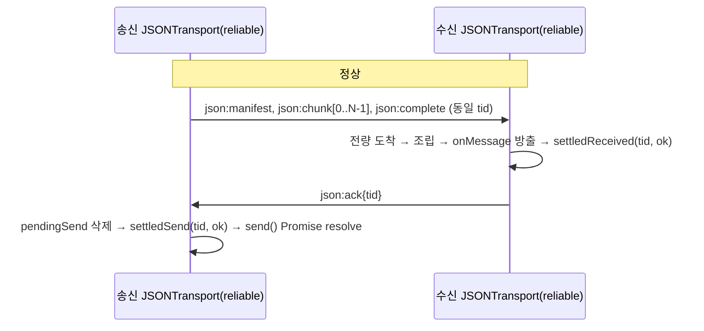
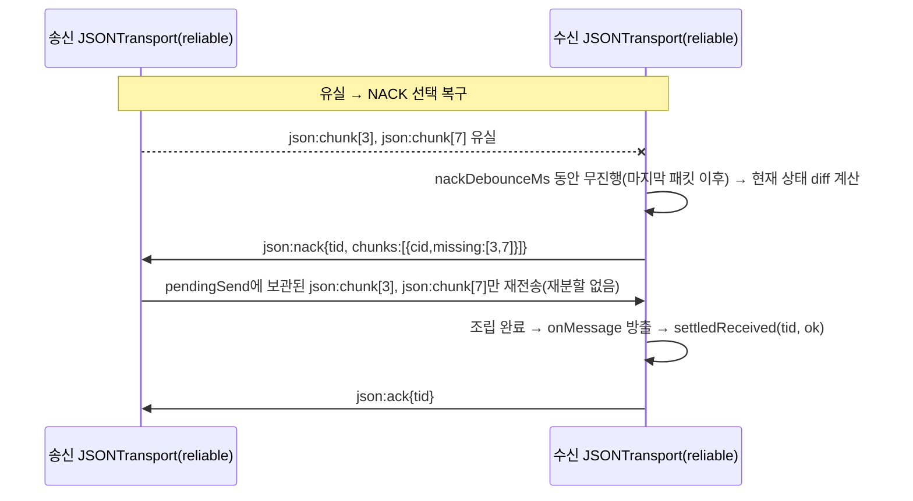
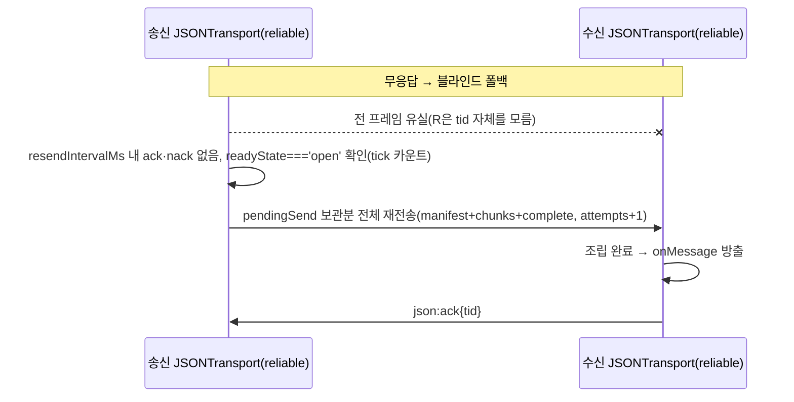
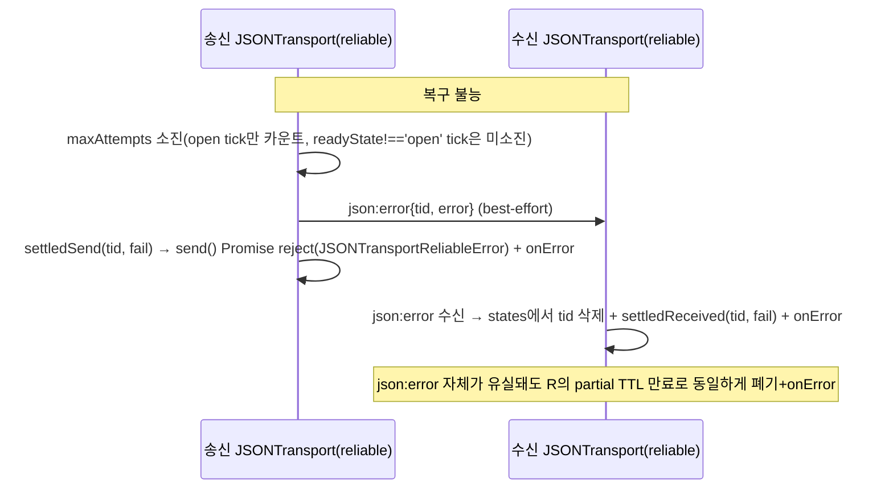
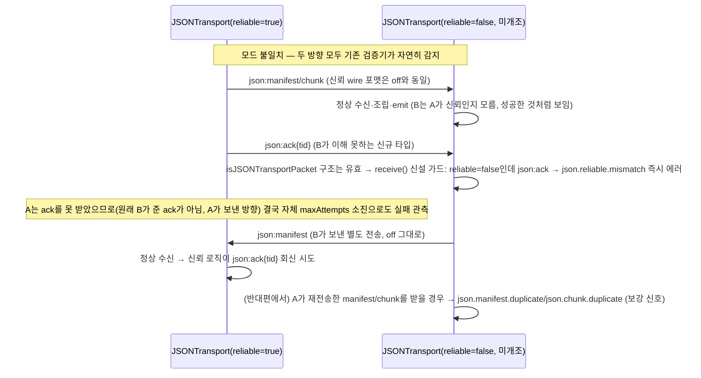
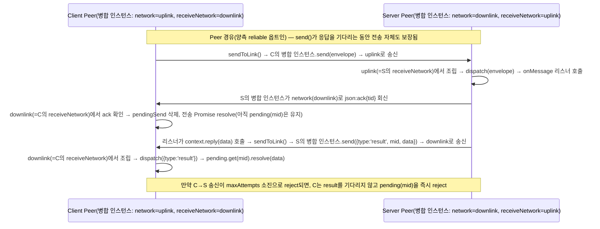

# Design: reliable-chunk-transport

**Status:** Confirmed
**Date:** 2026-07-13
**Slug:** reliable-chunk-transport
**Spec:** [01-spec.md](./01-spec.md)

## 범위
데이터 모델링·시스템 흐름을 다룬다. 외부 계약은 [01-spec.md](./01-spec.md)가 source of truth.

01의 개정("제공 형태: 기존 JSONTransport에 신뢰 모드를 내장한다")에 따라 이 문서는 기존 독립 데코레이터안을 **전면 대체**한다. 이전 안·리뷰 성과의 승계 범위는 [설계 대안](#설계-대안-폐기안-기록) 절에 명시한다.

## 결정 요약 (팀리드 위임 쟁점 1~7 + Peer 통합 확장 8~9)

| # | 쟁점 | 결정 | 근거 |
|---|---|---|---|
| 1 | 옵션 형태 | `JSONTransportOptions.reliable?: boolean \| ReliableOptions` 추가. `this.reliable`가 falsy면 새로 추가되는 모든 분기가 **도달 불가능한 코드**가 되도록 구현한다(조건 수정이 아니라 새 분기 삽입) | off 경로는 "테스트해서 통과"가 아니라 "구조적으로 옛 코드와 동일 경로"라는 더 강한 회귀 보장을 얻는다 — 01 "off 경로 동작 불변" 요구. 구현 확인: 예외 2곳(생성자 구독 대상의 `receiveNetwork ?? network` 파라미터화, identityProvider 기본값 셀렉터)은 라인을 수정하되 off에서 값이 100% 동일 — 전체 회귀 green으로 확인 |
| 2 | 패킷 확장 | 기존 4종(`json:manifest/chunk/complete/error`)에 `json:ack`·`json:nack` 2종만 추가. `json:error`를 실패 통지로 **재사용**(신규 `json:fail` 불필요) | 신뢰 모드는 기존 청킹을 그대로 쓰므로(결정 ③ 참조) 패킷도 최소 확장으로 충분 |
| 3 | 상태기계 변경 | 완성 즉시 `states.delete`(468행)는 신뢰 모드에서 **별도 settled 기억**으로 대체(off는 그대로 delete만). `acceptManifest`(478행)·`acceptChunk`(505행)의 duplicate 에러는 신뢰 모드에서 **무시(idempotent no-op)**로 분기 — 재전송이 정상 동작이므로 에러로 취급하면 안 됨. 송신측에 `pendingSend` 맵(청크 보관)·재전송 타이머 신설 | 재전송 기반 복구가 기존 "중복=에러" 가드와 정면 충돌 — 신뢰 모드에서만 그 가드를 무력화해야 exactly-once 조립이 성립 |
| 4 | send 시그니처 | `send(data: T): void` → `send(data: T): void \| Promise<void>`(단일 메서드 확장, 별도 메서드 신설 안 함) | TS void-반환 호환 규칙상 소스 호환 유지. 내장 결정의 취지("진입점 하나 유지")를 send()에도 적용 — `sendReliable()` 같은 병렬 메서드는 다시 "두 가지 방법" 혼동을 재도입 |
| 5 | 모드 불일치 처리 | 신규 코드 없이 **기존 검증기의 자연스러운 부작용 2가지**로 감지: (a) 비신뢰측이 신뢰측의 재전송 manifest/chunk를 받으면 기존 `json.manifest.duplicate`/`json.chunk.duplicate`. (b) 비신뢰측이 신뢰측의 `json:ack`/`json:nack`을 받으면 신설 가드가 `json.reliable.mismatch`로 명시적 에러화(우연이 아니라 의도적 가드) | 01 "감지 가능한 에러로 드러나야 한다" 요구. (b)는 최초 1회 교환만에 즉시 발화하는 가장 빠른 신호 |
| 6 | Peer와의 관계(1차 결론 — 개정됨) | 1차 조사에서 확인한 사실은 여전히 유효하다: `Peer.sendToLink`(`socket.ts:874-878`)는 `splitJSON(message, link.transportOptions).send(link.network)`를 직접 호출해 `JSONTransport.send()`를 거치지 않는다. **그러나 01 개정으로 "영향 없음" 결론은 무효화됐다** — Peer 경로도 이제 보장 대상이며, 이 갭을 메우는 것이 [Peer 통합](#peer-통합) 절의 목적이다 | 01 "보장 대상"·"모드 전제" 행 개정(Peer 경로 포함, 링크 양단 Peer가 모두 옵트인) |
| 7 | 회귀 전략 | `this.reliable` 가드로 새 분기를 원본 로직 **삽입**(치환 아님) 형태로 넣어 off 경로가 라인 단위로 기존과 동일함을 보장. `transport.spec.ts`에 `describe('reliable mode', ...)`로 신규 시나리오 추가(신규 파일 없음 — 내장 결정과 동형) | 기존 `transport.spec.ts` 전체가 `reliable` 미지정 생성 경로만 쓰므로 신규 분기가 원천적으로 실행되지 않음 |
| 8 | Peer 송신 경로 통합 | 링크당 **병합 인스턴스 2개**(각 Peer 쪽 1개) — 쓰기망(자기 outbound)과 읽기망(`ReliableOptions.receiveNetwork`)을 분리한 단일 JSONTransport가 송신·수신을 겸한다(`senderTransport`와 `receiverTransport`가 같은 인스턴스). "같은 망에 send+구독" 형태의 단순 재사용은 자기에코·오배선으로 불가하나, 쓰기≠읽기 병합은 자기 outbound를 구독한 적이 없어 자기에코가 원천 부재 | 4-인스턴스(sendOnly+controlNetwork)안은 집중 검증에서 과잉으로 판정·폐기(설계 대안 절 참조) — 병합안이 sendOnly 플래그·좁은 필터·ack 이중배달 문제를 동시에 소멸시킴. [Peer 통합](#peer-통합) 절이 상세 |
| 9 | Peer API별 관측 표면 | `send()`(mid 응답 대기)는 신뢰 전송 자체가 실패하면 응답을 기다리지 않고 즉시 해당 `pending`을 reject(fail-fast). `post()`는 시그니처 `void`를 유지하고, 신뢰 전송 실패도 기존 `onError` 채널로만 통지(신규 Promise 반환 API는 만들지 않음) | 01 하한선("실패가 조용히 삼켜지지 않을 것")을 만족하면서, "진입점 하나 유지" 원칙(결정 ④)을 Peer API에도 동일하게 적용 |

## 데이터 모델링

### 패킷

기존 4종 + 신규 2종. 신규 패킷도 기존 `isJSONTransportPacket` 관례(필수 필드 presence 검사, 미지 필드 무시)를 따른다. `v` 필드를 향후 프로토콜 진화용으로 예약(현재 미전송, 수신 시 무시) — 이전 라운드 forward-compat 결정 승계.

| 패킷 | 필드 | 방향 | 설명 |
|---|---|---|---|
| `json:manifest`/`json:chunk`/`json:complete`/`json:error` | (기존과 동일) | 기존과 동일 | **와이어 포맷 무변경.** 신뢰 모드도 동일 프레이밍을 그대로 재사용(결정 ②) |
| `json:ack` | `tid` | 수신측 → 송신측 | 완성본 방출 직후 또는 settled tid 재도착 시 회신 |
| `json:nack` | `tid, manifest?: boolean, chunks?: {cid, missing: number[]}[], complete?: boolean` | 수신측 → 송신측 | `nackDebounceMs` 무진행 시, 그 순간 수신 상태의 스냅샷 diff(누적 아님, 매번 재계산) |

`json:error`는 신뢰 모드에서 추가 의미를 얻는다: 수신측이 이를 받으면 (기존과 동일하게) `onError`를 emit하고, **신뢰 모드일 때만** 해당 tid의 부분 버퍼(`this.states`)를 폐기하고 settled(fail)로 기록한다. off 모드는 오늘과 동일하게 버퍼를 방치한다(기존 동작 — 이번 범위에서 손대지 않음).

### 옵션

```typescript
export interface JSONTransportOptions {
    // ...기존 필드 전부 무변경...
    /** opt-in reliable delivery: exactly-once completion + NACK/blind-resend recovery */
    reliable?: boolean | ReliableOptions;
}

export interface ReliableOptions {
    /** debounce window before receiver emits json:nack after detecting an incomplete tid */
    nackDebounceMs?: number;
    /** blind full-resend interval when neither ack nor nack arrives */
    resendIntervalMs?: number;
    /** retry budget before a send() rejects; ticks while readyState !== 'open' don't count */
    maxAttempts?: number;
    /** absolute wall-clock deadline for one send() unit; keeps counting while readyState !== 'open' */
    deadlineMs?: number;
    /** settled (send/receive) tid memory TTL — absorbs late duplicate retransmits */
    settledTtlMs?: number;
    /** hard cap on settled map size (bounds memory when timers stall) */
    settledMaxEntries?: number;
    /**
     * subscribe onMessage on this network instead of `network`, while all outbound traffic
     * (data + ack/nack/error) still goes out over `network`. for split unidirectional-pipe
     * topologies (e.g. Peer's uplink/downlink) — write≠read on one merged instance means it
     * never subscribes to its own outbound pipe, so self-echo cannot occur by construction.
     * unused (undefined) for the common single bidirectional network case (Peer 통합 절 참조).
     */
    receiveNetwork?: NetworkSupportable;
}
```

`chunkBytes`는 신설하지 않는다 — 신뢰 모드도 기존 `splitJSON`/`chunkBytes`를 그대로 재사용한다(결정 ②의 근거, 청킹 구현 1벌 유지). `identityProvider`도 신설 필드 없이 기존 `JSONTransportOptions.identityProvider`를 그대로 쓰되, **미지정 시 기본값만** 신뢰 여부에 따라 갈린다(ID/참조 포맷 절 참조) — 명시적으로 넘긴 provider는 신뢰 모드에서도 그대로 신뢰.

`receiveNetwork`는 일반적인 단일 양방향 네트워크(예: 실제 WebSocket 1개를 감싼 경우)에서는 전혀 쓰이지 않는다(`undefined`) — Peer처럼 한 링크가 두 개의 단방향 네트워크(uplink/downlink)로 쪼개져 있는 특수 토폴로지를 위한 확장이다. 상세는 [Peer 통합](#peer-통합) 절 참조.

기본값:

| 옵션 | 기본값 | 의미 |
|---|---|---|
| `nackDebounceMs` | 150ms | 마지막 패킷 도착 후 이 시간만큼 조용하면 nack 발송(표준 debounce — 매 패킷마다 리셋) |
| `resendIntervalMs` | 2,000ms | ack·nack 무응답 시 블라인드 전체 재전송 간격 |
| `maxAttempts` | 6 | 실패 판정까지의 재시도 상한. `readyState !== 'open'` tick은 카운트하지 않음 |
| `deadlineMs` | 60,000ms | `send()` 시작 시각 기준 절대 벽시계 시한. `maxAttempts`와 달리 `readyState !== 'open'`인 동안에도 계속 카운트되므로, 영구 미개방 네트워크에서도 유한 시간 안에 실패 종결된다 |
| `settledTtlMs` | 5분 | 종결(성공/실패) tid 기억 시한 |
| `settledMaxEntries` | 10,000 | settled map 삽입 순서 기준 하드 바운드(오래된 항목부터 제거) |

### 내부 상태(비공개, 신뢰 모드에서만 할당 — off는 이 필드들이 전부 `undefined`)

| 상태 | 구조 | 소유 |
|---|---|---|
| `this.states`(기존) | `Map<tid, JSONReceiveState>` | 양쪽 — 변경 없음, 신뢰 모드도 그대로 partial 버퍼로 재사용 |
| `pendingSend` | `Map<tid, { manifest, chunks, complete, attempts, resendTimer, resolve, reject }>` | 송신측. **`manifest`/`chunks`/`complete`는 `send()` 최초 1회의 `splitJSON()` 결과를 그대로 보관** — 재전송 시 재분할(re-split) 절대 금지(아래 상세) |
| `settledSend` | `Map<tid, { outcome: 'ok' \| 'fail', expiresAt }>` | 송신측. TTL+maxEntries 이중 바운드 |
| `settledReceived` | `Map<tid, { outcome: 'ok' \| 'fail', expiresAt }>` | 수신측. TTL+maxEntries 이중 바운드 |
| `nackTimers` | `Map<tid, ReturnType<typeof setTimeout>>` | 수신측. 패킷 도착마다 리셋되는 debounce 타이머 |

송신 종결(`settledSend`)과 수신 완성(`settledReceived`)은 **별개 맵**이다 — 대칭 링크(양쪽이 서로 송수신)에서 같은 tid가 한쪽에서는 송신 종결, 다른 쪽 인스턴스에서는(또는 같은 인스턴스가 반대 방향 tid를 다룰 때) 수신 완성으로 동시에 존재할 수 있으므로 혼재 시 충돌 위험을 없앤다(이전 라운드 리뷰 반영 승계).

`cleanup(now)`(기존 메서드, `transport.ts:394`)를 확장해 신뢰 모드일 때만 `settledSend`/`settledReceived`도 함께 스윕한다(TTL 만료 삭제 + `settledMaxEntries` 초과 시 삽입 순서상 가장 오래된 항목 제거). 새 타이머는 신설하지 않고 기존 `cleanupTimer`/lazy-sweep 관례를 그대로 재사용한다 — off 모드는 이 추가 스윕 코드 자체가 `if (this.reliable)` 안에 있어 실행되지 않는다.

### 무결성 검증 수단 (01 "무결성" 계약의 이행)

전체 값의 무결성은 두 겹으로 성립한다: ① 청크별 FNV-1a 해시(기존 `json:chunk.hash` — 재사용, 신설 없음)가 각 조각의 내용 동일성을 검증하고, ② manifest의 개수·크기 대조(기존 조립 검증)가 조각의 전량 도착을 검증한다 — 둘을 모두 통과해야만 `assembleJSON()` 결과가 상위로 방출된다. **해시 불일치 청크는 신뢰 모드에서 "도착하지 않은 것"과 동일하게 취급**되어 nack의 결측 목록에 포함된다(off 모드의 기존 에러 동작은 무변경). 별도의 전체-값 해시는 두지 않는다 — 조각 전량+각 해시 통과가 곧 전체 동일성이며, 조립 자체는 결정적이다.

## ID / 참조 포맷

| 맥락 | 포맷 | 비고 |
|---|---|---|
| tid(신뢰 모드, `identityProvider` 미지정 시 기본값) | `crypto.randomUUID()` 가용 시 UUID, 미지원 환경 폴백 `json-{36진 타임스탬프}-{36진 랜덤}` | `typeof globalThis.crypto?.randomUUID === 'function'` 가드. 기존 `json-${++transportNo}` 모듈 전역 카운터는 인스턴스 재생성·재연결 경계에서 재사용되므로 신뢰 모드 기본값으로 쓰지 않는다 |
| tid(off 모드, 또는 신뢰 모드에서 `identityProvider`를 명시적으로 넘긴 경우) | 기존과 동일(`json-${++transportNo}` 또는 사용자 provider) | 명시적 provider는 신뢰 모드에서도 사용자 책임으로 신뢰(테스트용 결정적 provider 허용 유지) |
| 패킷 `type` | 기존 `json:` 접두 재사용(`json:ack`, `json:nack`) | 별도 네임스페이스(`rel:` 등) 불필요 — 이미 같은 클래스·같은 검증기 안이므로 |

`nextChunkId()`도 동일한 기본 provider 선택 로직을 따른다(안전 측 통일, cid 유일성에 대한 별도 계약 요구는 없지만 UUID 쪽이 항상 더 안전).

## use-case 분해

| 흐름 | 트리거 | 책임 |
|---|---|---|
| 송신 | `send(data)` 호출(신뢰 on) | `splitJSON()` **1회만** 호출 → 결과를 `pendingSend`에 보관 → 초기 전송(manifest+chunks+complete) → `resendIntervalMs` 타이머 등록 → Promise 반환(내부 self-catch 포함) |
| 수신 조립 | `json:manifest`/`chunk`/`complete` 도착 | settled 여부 우선 확인(아래 "중복 흡수") → 아니면 기존 조립 로직(무변경) 그대로 진행, 단 duplicate 판정은 idempotent 무시로 완화 → 완성 시 `emitted=true`+`states.delete`(기존)+**settled(ok) 기록**+`json:ack` 회신 → debounce 무진행 시 `json:nack`(현재 상태 diff) 발송 |
| 중복 흡수 | settled tid에 데이터 패킷 재도착 | `getState()` 호출 전에 조기 반환. outcome이 `ok`면 재조립 없이 `json:ack`만 재회신(ack 유실 수렴 지점). outcome이 `fail`이면 조용히 폐기(이미 포기한 전송이므로 재-ack 불필요) |
| 실패 종결(송신측) | `maxAttempts` 소진(open tick만 카운트) 또는 `deadlineMs` 경과(readyState 무관, `send()` 시작 시각 기준) | `pendingSend` 제거 → `json:error{tid,error}` best-effort 통지 → settled(fail) 기록 → Promise reject(`JSONTransportReliableError`, `.tid` 보유) + `onError` |
| 실패 종결(수신측) | `json:error` 수신 또는 partial 버퍼 TTL 만료 | `this.states`에서 해당 tid 삭제 + settled(fail) 기록 + `onError` |
| 재연결 공존 | 재전송 타이머 tick 시 `network.readyState !== 'open'` | 시도 자체를 skip, `maxAttempts` 미소진. 최초 `send()` 시점에 이미 닫혀 있어 동기 전송이 실패해도(off 모드와 달리) **재-throw하지 않고** 같은 skip 경로로 흡수 — 아래 별도 결정 참조 |
| 모드 불일치 | 비신뢰 인스턴스가 `json:ack`/`json:nack` 수신 | `isJSONTransportPacket`으로 구조는 유효 판정되지만, `receive()`의 신설 가드가 `!this.reliable`이면 `acceptPacket` 진입 전에 `json.reliable.mismatch`로 에러화. 의미론은 비대칭이다 — off측은 데이터 자체는 정상 수신·방출하고(성공처럼 보임) mismatch 에러만 별도 통지, 실패(ack 부재→maxAttempts 소진)는 reliable측에서 관측된다. 혼용 구성의 동작 보장은 01 Out of Scope |
| 제어 패킷 격리 | `json:ack`/`json:nack` 도착(신뢰 on) | `acceptPacket` 최상단에서 분기 처리 후 즉시 `return` — `this.states`/`getState()`/`this.listeners`에 전혀 닿지 않음(phantom state 방지) |
| Peer 송신(`send`/`post`/`reply`) | `sendToLink(link, message)` 호출 | `link.senderTransport`(reliable on일 때만 존재)로 위임 → 전송 단위 하나의 Promise 반환. `publish()`가 이 Promise의 reject를 기존 sync-throw catch와 동일한 실패 라우팅(`pending.reject`/`emitError`)으로 흡수 |
| Peer 수신 완성 → 응답 대기 단축 | `senderTransport.send()`의 Promise가 reject(maxAttempts 소진) | `send()`가 만들어둔 `pending.get(mid)`를 응답(`result`/`error`) 도착을 기다리지 않고 즉시 reject(fail-fast) — 그대로 두면 응답이 영원히 오지 않을 자리를 조기에 정리 |
| Peer 링크 재연결 | `reconnectPair()` | `closeLink()`가 병합 인스턴스를 detach(멱등 — senderTransport/receiverTransport가 같은 인스턴스를 가리킴, 진행 중 pendingSend는 실패로 종결) → 양측 병합 인스턴스 2개를 새 네트워크 쌍 위에 매핑표대로 재생성 |

### 재전송은 재분할하지 않는다 (정합성 핵심)

`splitJSON()`은 호출마다 새 `tid`(및 각 청크의 `cid`)를 생성한다. 재전송에서 이를 다시 호출하면 수신측 입장에서는 "완전히 다른 전송 단위"가 되어 exactly-once·중복 흡수가 전부 무너진다. 따라서 `send()`는 **`splitJSON()`을 정확히 1회**만 호출하고, 그 결과(`manifest`, `chunks[]`, `complete`)를 `pendingSend`에 원본 그대로 보관한다. NACK 기반 부분 재전송과 블라인드 전체 재전송 모두 이 보관된 원본 패킷 객체를 그대로 재사용한다(재직렬화는 하되 재분할은 하지 않음).

### 초기 전송 실패는 동기 throw하지 않는다 (off 모드와의 의도된 차이)

off 모드의 `send()`는 `network.send()`가 동기적으로 던지면 그대로 재throw한다(`transport.ts:340-348`, 기존 동작 무변경). 신뢰 모드에서는 이 경로도 "일시적 전송 실패"로 취급해 **동기 throw하지 않고** tick-skip과 동일하게 처리한다 — 초기 전송이 실패해도 `maxAttempts`를 소진하지 않고 재전송 타이머가 이어서 시도하며, 결과는 오직 반환된 Promise의 resolve/reject로만 관측된다. 01의 "성공은 수신측이 완성본을 상위로 방출했음을 확인한 시점" 계약상 Promise가 유일한 진실이어야 하므로, try/catch 기반의 동기 실패 관측 경로를 신뢰 모드에서는 열어두지 않는다. 이는 신뢰 모드의 명시적 동작 차이이며 JSDoc에 기록한다.

## 구조

```
JSON 소비자(신뢰 on)         JSON 소비자(신뢰 off, 기존)      Peer 병합 인스턴스(reliable on, 신설 — network에 쓰기+ack, receiveNetwork에서 읽기)
        │ send(data): Promise           │ send(data): void          │ .send(data): Promise + .onMessage()/.onError() 모두(Peer 통합 절)
        ▼                                ▼                            ▼
                    JSONTransport<T> (단일 클래스, this.reliable로 분기)
                    ├─ off: 기존 경로 그대로(라인 단위 불변)
                    └─ on : pendingSend/settledSend/settledReceived/nackTimers 추가 상태 +
                            json:ack/json:nack 처리 + duplicate idempotent 처리
        │
        ▼
   NetworkSupportable (Browser/Owned WebSocket, Reconnecting, …) — 무변경
        ▼
   서버 (opaque 중계, 무변경 — 유니캐스트 전제, 에코백·브로드캐스트 미지원)
```

### Peer 관계 — 1차 조사(사실 확인, 여전히 유효)

`Peer.sendToLink`(`src/socket/socket.ts:874-878`)는 매 전송마다 `splitJSON(message, link.transportOptions).send(link.network)`를 호출한다 — `JSONTransportSupportable.send()`를 구현한 클래스 인스턴스가 아니라, 상태 없는 순수 헬퍼 `splitJSON()`을 직접 쓴다. Peer 송신 경로는 애초에 `JSONTransport` 인스턴스를 소유하지 않으므로, `JSONTransport.send()`에 신뢰 로직을 넣는 것만으로는 **Peer 송신에 닿지 않는다** — 이 사실 자체는 여전히 유효하다.

Peer 수신 경로(`Peer.attachReceiver`, `socket.ts:611-625`)는 링크마다 `createJSONTransport<SocketMessage<any>>(network, transportOptions)` 인스턴스를 만들어 `.onMessage()`/`.onError()`만 구독한다.

01 개정으로 Peer 경로가 보장 대상에 포함되면서, 이 갭(송신 경로가 인스턴스를 안 씀)을 실제로 메워야 한다 — 상세 설계는 아래 [Peer 통합](#peer-통합) 절 참조.

## Peer 통합

01 개정("보장 대상"·"모드 전제"·"Peer 경로의 관측 표면"·"수정 범위" 행)에 따라 Peer 경로도 이번 스코프에 포함된다. `socket.ts` 수정이 명시적으로 허용되지만 "그 외 기존 파일 무수정"·"신뢰 모드를 켜지 않은 경로의 동작 불변" 원칙은 그대로 유지된다.

### 문제 — 왜 기존 수신 인스턴스를 송신에 그냥 재사용할 수 없는가

Peer의 링크 하나는 물리적으로 **두 개의 단방향 `Network`**로 구성된다(`uplink`: 클라이언트→서버, `downlink`: 서버→클라이언트, `Peer.createNetworkPair`). 클라이언트가 `uplink`에 데이터를 실어 보내면 오직 서버만 그 네트워크의 리스너다(`Peer.attachReceiver`가 `uplink.onMessage(...)`를 구독). "기존 수신 인스턴스를 송신에도 그냥 재사용"하면 두 가지가 동시에 깨진다.

1. **자기에코.** 클라이언트가 `uplink`를 감싸는 `JSONTransport` 인스턴스를 만들어 `.send()`를 호출하려면, 그 인스턴스의 생성자가 (기존 클래스 그대로라면) `uplink.onMessage(...)`도 구독한다. `Network.send()`는 호출 시점의 `messageListeners` 전원에게 배달하며 발신자를 구분하지 않으므로(`socket.ts:184-202`), 클라이언트 자신이 방금 보낸 패킷이 자기 자신에게 그대로 되돌아온다.
2. **오배선.** 서버가 클라이언트의 데이터를 완성해 `json:ack`를 회신하려면 그 패킷이 **클라이언트가 리스닝하는 네트워크**(즉 `downlink`)를 통해서만 도달할 수 있다 — `uplink`에는 클라이언트가 리스너로 붙어있지 않으므로 `uplink`로 ack를 흘려보내면 (자기 자신 외에는) 아무도 못 받는다.

### 해법 — 인스턴스 병합, `receiveNetwork` 하나로 수렴

1차 검토에서는 이 두 문제를 "링크당 4개 인스턴스(송신 전용 2개 + 수신 전용 2개, `controlNetwork`+`sendOnly`로 상호 연결)"로 풀었다. 그런데 역할표를 다시 보면 **클라이언트 송신 역할(network=uplink, controlNetwork=downlink)과 클라이언트 수신 역할(network=downlink, controlNetwork=uplink)은 둘 다 "uplink에 쓰고 downlink에서 읽는다"는 같은 이야기다** — 방향이 다른 두 개의 별도 개념이 아니라, "쓰기망 하나 + 읽기망 하나"라는 한 개념의 양면이었다. 마찬가지로 서버 쪽도 "downlink에 쓰고 uplink에서 읽는" 하나의 개념이다.

그래서 4개가 아니라 **링크당 2개(클라이언트 1개, 서버 1개)**로 병합한다. `ReliableOptions`도 `controlNetwork`/`sendOnly` 두 필드 대신 **`receiveNetwork?: NetworkSupportable` 하나**로 수렴시킨다 — 지정 시 `onMessage` 구독은 이 네트워크에서 하고, 송신(애플리케이션 데이터 `send()`뿐 아니라 신뢰 모드가 내보내는 ack/nack/error 전부)은 그대로 기존 `network`로 나간다. 미지정(`undefined`) 시 라운드 1 설계 그대로(단일 양방향 네트워크에서 송수신 모두 `network` 하나) — Peer 전용 확장이 일반 경로에 아무 영향을 주지 않는다.

```typescript
export interface ReliableOptions {
    nackDebounceMs?: number;
    resendIntervalMs?: number;
    maxAttempts?: number;
    settledTtlMs?: number;
    settledMaxEntries?: number;
    /**
     * network to subscribe onMessage on, when different from the primary `network` (e.g.
     * Peer's split uplink/downlink pair, where writes and reads happen on different
     * unidirectional pipes). all outbound traffic — send()'s application data AND this
     * instance's own ack/nack/error emission — still goes out via the primary `network`;
     * only the onMessage subscription moves to `receiveNetwork`. defaults to the primary
     * `network` (the common single bidirectional network case — unaffected).
     */
    receiveNetwork?: NetworkSupportable;
}
```

병합 효과(1차 4-인스턴스안과 비교):

| 문제 | 4-인스턴스안(1차) | 병합안(이번 개정) |
|---|---|---|
| 자기에코 | 발생 안 함(송신 인스턴스가 `sendOnly`로 자기 network 구독을 원천 차단) | **원천 부재** — 병합 인스턴스는 처음부터 자기 network(`network`)를 구독한 적이 없다(`receiveNetwork`만 구독). `sendOnly` 같은 별도 모드 플래그도 필요 없다 |
| ack 라우팅 | `controlNetwork`에 **좁은 필터**(자기 tid의 ack/nack만 반응, 그 외 전부 조용히 무시)를 별도로 둬야 함 | **불필요** — ack/nack이 도착하는 `receiveNetwork`가 이미 이 인스턴스의 기존 `receive()`/`acceptPacket()` 파이프라인으로 들어오므로, 라운드 1의 `pendingSend` 조회 로직이 그대로 처리한다 |
| ack 이중배달 | 같은 네트워크(예: downlink)에 "진짜 수신 인스턴스"와 "송신 인스턴스의 control 리스너"가 **동시에 리스너로 붙어** 모든 패킷을 이중으로 받는다 — 수신 인스턴스가 reliable off라면 이게 오히려 `json.reliable.mismatch` 거짓양성을 유발할 수 있음(위험 요소였음) | **소멸** — 각 네트워크(uplink, downlink)에는 리스너가 정확히 1개(반대편의 병합 인스턴스)뿐이다 |
| 인스턴스/타이머 수(reliable on 링크당) | 4개 | **2개** |

Peer 링크 하나(uplink/downlink)에 필요한 인스턴스는 이제 다음 표로 완결된다.

| 인스턴스 | 표현하는 쪽 | `network`(쓰기, `send()`+ack/nack/error 발신) | `receiveNetwork`(읽기, 구독) | transportOptions |
|---|---|---|---|---|
| 클라이언트 측 병합 인스턴스 | 이 Peer(client) | `uplink` | `downlink` | `clientTransportOptions`(= `this.jsonTransportOptions`, **자기 자신의 설정**) |
| 서버 측 병합 인스턴스 | 이 Peer(server) | `downlink` | `uplink` | `serverTransportOptions`(= `server.jsonTransportOptions`, **자기 자신의 설정**) |

각 인스턴스는 **자기 자신의 `jsonTransportOptions`**로 구성된다(기존 receiver-only 경로의 "수신자가 상대(발신자)의 옵션으로 구성된다"는 관례와 다름 — 그 관례는 receiver-only일 때만 성립했고, 병합 인스턴스는 이제 자기 자신의 송신도 겸하므로 자기 설정이 자기 송신을 지배해야 한다). `chunkBytes`/`largeValueBytes`는 송신측에만 영향을 주고 수신 조립은 패킷 자체가 자기서술적(index/total/hash)이라 수신측 설정과 무관하다 — 그래서 이 재배정이 조립 정합성에 영향을 주지 않는다. `nackDebounceMs`/`resendIntervalMs`/`maxAttempts`/`settledTtlMs`/`settledMaxEntries`도 전부 "내가 보낼 때 내가 얼마나 기다릴지", "내가 받을 때 내가 얼마나 기다릴지"의 자기 정책이라 양측이 값을 맞출 필요가 없다(모드 on/off만 양측이 일치해야 함, 01 "모드 전제").

**주의(off-reliable 경로 무변경)**: 이 "자기 자신의 옵션 사용" 재배정은 **`reliable`이 켜진 경우에만** 적용된다. `jsonTransport`는 켰지만 `reliable`은 끈(청킹만 쓰는) 기존 경로는 오늘 그대로 receiver-only 인스턴스 + "상대(발신자)의 옵션으로 구성" 관례를 **한 글자도 바꾸지 않는다** — 그 경로는 애초에 송신을 겸하지 않으므로 재배정할 이유가 없고, 바꾸면 오히려 회귀다.

### `PeerLink`·socket.ts 변경 — 실제 네트워크 변수 매핑

- `PeerLink`에 `senderTransport?: JSONTransportSupportable<any>` 필드 추가(기존 `receiverTransport`와 나란히 유지). **reliable on인 링크에서는 두 필드가 같은 인스턴스를 가리킨다**(병합됐으므로) — 필드 이름 자체는 호환을 위해 남기고, `closeLink()`가 그중 하나만으로도 `detach()`를 호출하면 전체가 정리되므로 중복 `detach()` 호출은 안전(멱등)해야 한다는 요구만 신설.
- 기존 `Peer.attachReceiver(network, receiver, sender, clientId, transportOptions?)`를 `Peer.attachTransport(readNetwork, writeNetwork, receiver, sender, clientId, localTransportOptions?, remoteTransportOptions?, logger?)`로 확장(이름 변경 포함):
  - `localTransportOptions?.reliable`이 truthy → **병합 인스턴스**: `createJSONTransport(writeNetwork, {...localTransportOptions, reliable: {...resolved, receiveNetwork: readNetwork}, logger})`. `.onMessage()`(기존 `dispatch()` 위임)와 `.onError()`(기존 `emitError` 포워딩) 구독은 그대로.
  - 그 외(`localTransportOptions` 없음 또는 `reliable` off)이고 `remoteTransportOptions` 있음 → **기존 receiver-only 경로, 완전 무변경**: `createJSONTransport(readNetwork, {...remoteTransportOptions, logger})`.
  - 둘 다 없음 → 기존 raw 경로 무변경: `readNetwork.onMessage(data => receiver.receiveNetworkData(data, sender, clientId))`.
- `connect()` 배선표(뒤집히면 에러 없이 hang하는 지점이므로 명시):

  | 호출 | readNetwork | writeNetwork | receiver | sender | clientId | localTransportOptions | remoteTransportOptions |
  |---|---|---|---|---|---|---|---|
  | 서버 측 인스턴스 | `uplink` | `downlink` | `server` | `this`(client) | `clientId` | `serverTransportOptions` | `clientTransportOptions` |
  | 클라이언트 측 인스턴스 | `downlink` | `uplink` | `this`(client) | `server` | `undefined` | `clientTransportOptions` | `serverTransportOptions` |

  `server.attachClientTransport(clientId, serverInstance)`(기존 `attachClientReceiverTransport`를 대체 — `link.receiverTransport`·`link.senderTransport`를 `link.transportOptions?.reliable` 여부에 따라 같은 인스턴스로 채움)로 서버 쪽 `PeerLink`에 저장하고, 클라이언트 쪽은 `this.server = {..., receiverTransport: clientInstance, senderTransport: clientTransportOptions?.reliable ? clientInstance : undefined}`로 저장한다.
- `Peer.reconnectPair(client, server, clientId)`도 새 `uplink`/`downlink` 쌍에 대해 위와 동일한 매핑으로 `attachTransport`를 다시 호출하고, `clientLink`/`serverLink`의 `receiverTransport`/`senderTransport`를 갱신한다. **선행 링크의 `senderTransport`(있다면)는 `closeLink()`에서 detach되어 진행 중 `pendingSend`가 실패로 종결**된다 — 재연결 후 이어받기(resume)는 하지 않는다(01 재검토 조건에 해당 요구 없음).
- `sendToLink()`: `link.senderTransport`가 있으면 위임(신뢰 경로, `Promise<void>` 반환), 없으면 기존 두 분기를 **그대로 유지**(off 경로 무변경):

```typescript
private sendToLink<Data = any>(link: PeerLink, message: SocketMessage<Data>): void | Promise<void> {
    if (link.senderTransport) return link.senderTransport.send(message);
    if (link.transportOptions) { splitJSON(message, link.transportOptions).send(link.network); return; }
    link.network.send(JSON.stringify(message));
}
```

### 자기 것 아닌 tid의 `json:ack`/`json:nack` 규칙

병합으로 발생 경로는 줄었지만(더 이상 무관한 리스너가 이중으로 받는 경로가 없음), 늦게 도착한 ack(이미 `settledSend`로 정리된 이후)나 다른 문제로 낯선 tid가 도착하는 경우는 여전히 있을 수 있다. 규칙: **`pendingSend`에 없는 tid의 `json:ack`/`json:nack`은 조용히 무시한다(에러 없음)** — 라운드 1의 `handleAck`/`handleNack`이 이미 `if (!pendingSend.has(tid)) return;`으로 이 규칙을 구현한다(에러화하면 정상적인 "늦은 ack 흡수"와 구분이 안 되므로 무시가 맞다). 이 규칙은 reliable 인스턴스라면 병합 여부와 무관하게 항상 적용된다.

### `publish()`·`reply()` 비동기 실패 라우팅

`publish()`(`socket.ts:697-739`)와 `reply()`(`socket.ts:846-872`)는 **둘 다 이미** `async () => { try { this.sendToLink(...) } catch (e) { ... } }` 형태의 IIFE로 감싸여 있다 — 동기 throw는 이미 잡힌다. 부족한 건 `senderTransport.send()`가 반환하는 **Promise의 reject**뿐이다. 고치는 방법은 구조 변경이 아니라 **`await` 키워드 하나 추가**다: `this.sendToLink(...)` → `await this.sendToLink(...)`. `await`는 동기 throw의 캐치 시점을 바꾸지 않고(표준 JS 동작 — 표현식 평가 중 동기 throw는 즉시 같은 턴에 전파), Promise reject만 추가로 잡아낸다. `handleFailure` 로직(있으면 `pending`/`target.rejectPending` 리젝트, 없으면 `emitError`) 자체는 **한 글자도 바꾸지 않는다**.

- `publish()`: `this.sendToLink(target, message);` → `await this.sendToLink(target, message);`
- `reply()`: `this.sendToLink(link, { type, data, mid });` → `await this.sendToLink(link, { type, data, mid });` — 서버→클라이언트 `result`/`pong` 전송이 신뢰 모드에서 조용히 hang하던 구멍을 막는다.

이 지점은 off 경로도 지나가는 공유 코드이므로 `socket.spec.ts`의 기존 동기 실패 시나리오(네트워크 미연결·용량 초과 등)가 회귀 기준선이다.

### Peer API별 관측 표면

- **`send()`**(mid 기반 응답 대기): `senderTransport.send(envelope)`의 Promise가 reject되면(재시도 상한 소진) `pending.get(mid)`을 응답 도착을 기다리지 않고 **즉시 reject**한다 — 상대가 봉투 자체를 못 받았으니 `result`/`error` 응답이 영원히 오지 않을 자리이므로, 신뢰 모드가 주는 조기 신호로 그 대기를 앞당겨 끊는다. resolve(ack 확인)는 `pending`을 건드리지 않는다 — 그건 여전히 실제 애플리케이션 응답(`result`/`error`)의 몫이다.
- **`post()`**(fire-and-forget): 시그니처를 `void`로 **유지**한다(신규 Promise 반환 API 신설 안 함). 신뢰 전송 실패도 기존 `onError`("observe fire-and-forget transport errors", `socket.ts:487`) 채널로만 통지 — 이미 존재하는 관측 표면을 재사용해 "진입점 하나 유지" 원칙을 Peer API 레벨에도 일관되게 적용한다.
- **`reply()`**: 위 `await` 수정 후 `sendToLink()`를 그대로 재사용하므로 자동으로 동일 혜택을 받는다.

### 한쪽 옵트인의 실제 거동 (구현 확인 사항)

receiver-only 분기는 기존 관례대로 상대(발신자)의 transportOptions를 통째로 상속한다. 그 결과 connect() 배선에서는 한쪽 Peer만 `reliable`을 켜도 상대의 수신 인스턴스가 그 설정을 상속해 ack를 회신한다 — 사실상 **송신자 단위 자동 협상**이며, 한쪽 옵트인 구성도 그 방향의 전송은 보장을 받는다. 따라서 `json.reliable.mismatch`는 같은 connect()로 배선되는 인메모리 Peer에서는 자연 발화하지 않고, 양단이 독립적으로 구성되는 분리 배포 환경에서 의미를 가진다(spec ⑰은 생 패킷 주입으로 전파 경로를 검증). 어느 구성이든 전송 실패는 reliable측 `maxAttempts` 소진(reject+onError)으로 관측된다 — 01 "감지 가능한 에러" 하한 충족.

### connect 핸드셰이크·제어 메시지

`Peer.connect()`는 와이어 레벨 핸드셰이크 패킷을 전혀 만들지 않는다 — `createNetworkPair`(네트워크 객체 생성)·`accept`(순수 로컬 `Map.set`)·`attachTransport`(리스너 구독)만 수행하는 **완전한 로컬 부트스트랩**이다. 따라서 신뢰 모드와 무관하다.

`ping`/`pong`(`dispatch()`의 `message.type === 'ping'` 분기, `socket.ts:816-825`)은 Peer 자체의 제어 메시지이지만, `reply()`→`sendToLink()`를 그대로 타므로 다른 애플리케이션 메시지와 동일하게 신뢰 모드의 보장(및 비용 — ack 왕복 1회 추가)을 받는다. JSONTransport의 `json:ack`/`json:nack`(전송 계층 제어)과 Peer의 `ping`/`pong`(애플리케이션 계층 제어)은 서로 다른 레이어라 특별한 상호작용이 없다.

## 시스템 흐름













## 설계 대안 (폐기안 기록)

### 독립 데코레이터 + 값 래퍼안(이전 라운드 채택) — 작성자 결정으로 전환
이전 라운드에서 3안 수렴으로 확정했던 `createReliableNetwork` 데코레이터 + `createReliableJSONTransport` 값 래퍼 구조는, 01-spec.md 개정("제공 형태" 행)에 따라 **채택되지 않는다**. 전환 근거: 사용처 진입점을 하나로 유지(별도 `reliable.ts`·`rel:` 네임스페이스가 만드는 "두 transport 공존" 혼동 제거)하고 청킹 구현 1벌을 유지하기 위해 `transport.ts` 직접 수정을 허용하는 것으로 전제가 바뀌었다(01 "수정 범위" 행). 이전 안이 스스로 폐기했던 "JSONTransport 내부에 신뢰성 내장 — 폐기" 사유(무파손 계약과의 충돌, tid/state 관련 결함까지 레거시 안에서 수리해야 함)는 이번 라운드에서 **그 계약 자체가 개정**되어 해소됐다 — `transport.ts` 수정이 명시적으로 허용됐고, tid 카운터·완성 즉시 state 삭제 문제도 이번 설계가 정면으로 다룬다(결정 ①③, ID/참조 포맷 절).

**승계 항목(내장 구조에도 그대로 유효 — 재도출하지 않고 계승):**
- NACK 선택 재요청 우선 + 무응답 시 전체 재전송 폴백 하이브리드(복구 방식)
- 송신 종결/수신 완성 별개 맵 + TTL·maxEntries 이중 바운드(종결 기억)
- tid `randomUUID()` typeof 가드 + 폴백(로컬 카운터 금지)
- send Promise self-catch(반환값을 버리는 호출자 밑 unhandled rejection 차단) — clone에 `.catch()`를 붙이고 원본 Promise를 반환하는 패턴
- 재연결 구간 `readyState!=='open'` tick은 재시도 상한 미소진
- forward-compat: presence 검사만, 미지 필드 무시, `v` 필드 예약
- 유니캐스트 전제, stateless 서버 종단 불가(서버 보장은 01에서 계약으로 고정, 이번 설계 범위 밖)
- 타이머 핸들 `ReturnType<typeof setTimeout>` 관례(Node·브라우저 겸용)

**전환에 따라 재해석이 필요했던 항목:**
- "합성 제약(최외곽 전용, `dual(reliable)` 금지 등)"은 데코레이터 합성 슬롯 개념 자체가 없어지므로 무의미해졌다 — 대신 신뢰 모드는 `JSONTransport` 단일 인스턴스의 on/off 플래그이므로 합성 순서 문제가 원천적으로 존재하지 않는다.
- "강한 계약 경로는 직접 send() 호출에만 성립, JSONTransport 합성은 best-effort"라는 이전 구분은 소멸했다 — 이제 `JSONTransport.send()` 자체가 강한 계약 경로다. Peer가 그 경로를 아예 쓰지 않는다는 사실이 처음 드러난 것도 이 라운드다(1차 결론은 "무관"이었으나 01 재개정으로 [Peer 통합](#peer-통합) 절이 그 갭을 메운다).

### 동급 신규 transport (`ReliableTransport`, JSONTransport sibling) — 폐기(승계, 여전히 유효)
Peer가 이미 내부 `JSONTransport` 리시버를 raw network에 붙여두므로 sibling이 같은 network를 이중 구독하면 서로 모르는 패킷마다 `json.packet` 에러가 샌다. 내장안에서는 이 문제 자체가 애초에 발생하지 않는다(같은 클래스, 같은 구독).

### 전송 단위 전체 재전송 단독 (w/ ACK) — 폐기(승계, 여전히 유효)
빅파일(수백 청크)에서 청크 1개 유실에도 전체 재전송 — 산란 유실 시 최대 10배 비용. 내장 구조에서도 동일하게 유효해 NACK 하이브리드를 그대로 채택했다.

### 서버 종단을 기본 경로로 — 폐기(승계, 여전히 유효)
stateless Lambda가 부분 상태를 외부 저장소에 유지해야 해 00 무파손·옵트인 요구와 충돌. 내장 여부와 무관한 서버 아키텍처 결정이라 그대로 유효.

### `rel:` 별도 네임스페이스 / 자기서술적 `rel:data`(manifest 없음) — 폐기
이전 안은 "manifest 유실"이라는 특수 케이스를 없애려고 모든 데이터 프레임에 total·hash를 싣는 자기서술적 패킷을 설계했다. 내장안은 기존 manifest/chunk/complete 프레이밍을 그대로 재사용하므로 이 특수 케이스가 여전히 존재하지만, **NACK 패킷이 `manifest: boolean` 필드로 그 경우를 명시적으로 표현**해 해결한다(별도 프레이밍 재설계 없이 흡수). 데이터 프레임 자체를 다시 설계하지 않는 편이 "청킹 구현 1벌 유지"라는 이번 라운드의 핵심 결정과 더 부합한다.

### Peer 링크당 4-인스턴스안(`controlNetwork`+`sendOnly`) — 폐기
Peer 통합 1차 검토안. 링크의 각 방향(uplink/downlink)마다 수신 전용·송신 전용 인스턴스를 따로 두고 `controlNetwork`(반대편 네트워크로 ack/nack 발신)·`sendOnly`(자기 network는 구독 안 함, controlNetwork만 좁게 청취)로 상호 연결했다. 배선 논리 자체는 맞았지만 리뷰에서 CONCERNS로 개정 요구: 클라이언트 "송신" 역할(network=uplink, controlNetwork=downlink)과 클라이언트 "수신" 역할(network=downlink, controlNetwork=uplink)이 실은 같은 개념("uplink에 쓰고 downlink에서 읽는다")의 양면이었다 — 인스턴스를 굳이 4개로 쪼갤 근거가 없었다. 병합안(`receiveNetwork` 하나로 수렴, 링크당 2개)이 자기에코 방지·ack 라우팅·이중배달 문제를 전부 더 적은 코드로 해소하므로 폐기하고 전환한다.

## 변경 파일

| File | Action | Description |
|---|---|---|
| `src/socket/transport.ts` | 수정 | `ReliableOptions` 타입, `JSONTransportOptions.reliable` 필드, `JSONAckPacket`/`JSONNackPacket` 타입 및 `JSONTransportPacket` 유니온 확장, `isJSONTransportPacket` 확장(presence 검사), `JSONTransportReliableError` 신설(`.tid` 보유), `defaultReliableJSONTransportIdentityProvider`(randomUUID 가드+폴백) 신설, `ReliableOptions.receiveNetwork`(Peer 통합용 — network와 다른 경우 이 네트워크에서 onMessage 구독) 필드 추가, `JSONTransport` 클래스에 `pendingSend`/`settledSend`/`settledReceived`/`nackTimers` 필드 + `send()`/`receive()`/`acceptPacket()`/`acceptManifest()`/`acceptChunk()`/`cleanup()`/`detach()`에 `this.reliable` 분기 삽입(기존 라인 치환 없이 신규 분기만 추가) |
| `src/socket/transport.spec.ts` | 수정 | 기존 파일에 `describe('reliable mode', ...)` 블록 추가: 정상/NACK 복구/블라인드 폴백/복구 불능(양측)/ack 유실→settled 재-ack/재연결 tick-skip/settled TTL·maxEntries/모드 불일치(양방향)/fire-and-forget unhandled rejection 부재/재분할 없음(동일 tid·cid 유지) 검증. 신규 파일은 만들지 않음(내장 결정과 동형) |
| `src/socket/socket.ts` | 수정 | `PeerLink.senderTransport` 필드 신설(reliable on 링크에서는 `receiverTransport`와 같은 인스턴스를 가리킴), 기존 `Peer.attachReceiver()`를 `Peer.attachTransport(readNetwork, writeNetwork, receiver, sender, clientId, localTransportOptions?, remoteTransportOptions?, logger?)`로 확장(`localTransportOptions.reliable` truthy면 `writeNetwork` 위에 병합 인스턴스 생성+`reliable.receiveNetwork=readNetwork`, 아니면 기존 receiver-only 경로 무변경), `attachClientReceiverTransport()`를 `attachClientTransport()`로 확장, `connect()`·`Peer.reconnectPair()`의 배선을 위 매핑표대로 갱신, `closeLink()`에 `senderTransport.detach()`(멱등) 추가, `sendToLink()`에 `link.senderTransport` 우선 분기 추가(기존 두 분기 무변경), `publish()`·`reply()`의 `this.sendToLink(...)` 호출에 `await` 추가(기존 async/try-catch 구조는 무변경, catch 로직 재사용) |
| `src/socket/socket.spec.ts` | 수정 | 기존 파일에 신뢰 모드 Peer 시나리오 추가: `send()` 조기 실패(fail-fast reject)/`post()` onError 통지/정상 왕복(전송 ack + 응답 result)/링크 재연결 시 진행 중 송신 폐기/한쪽만 reliable 옵트인 시 모드 불일치 전파(`peer.transport.json.reliable.mismatch`) |
| `src/socket/index.ts` | 무수정 | 이미 `export * from './transport'`로 전체 재노출 중 — 추가 export 불필요 |
| `demo/socket-verifier/src/*` | 수정 | 기존 JSONTransport 사용 세션에 `reliable: true` 토글 추가(신규 데코레이터/신규 진입점 없음), 유실 주입 후 복구·복구 불능 시 실패 통지 가시화 |
