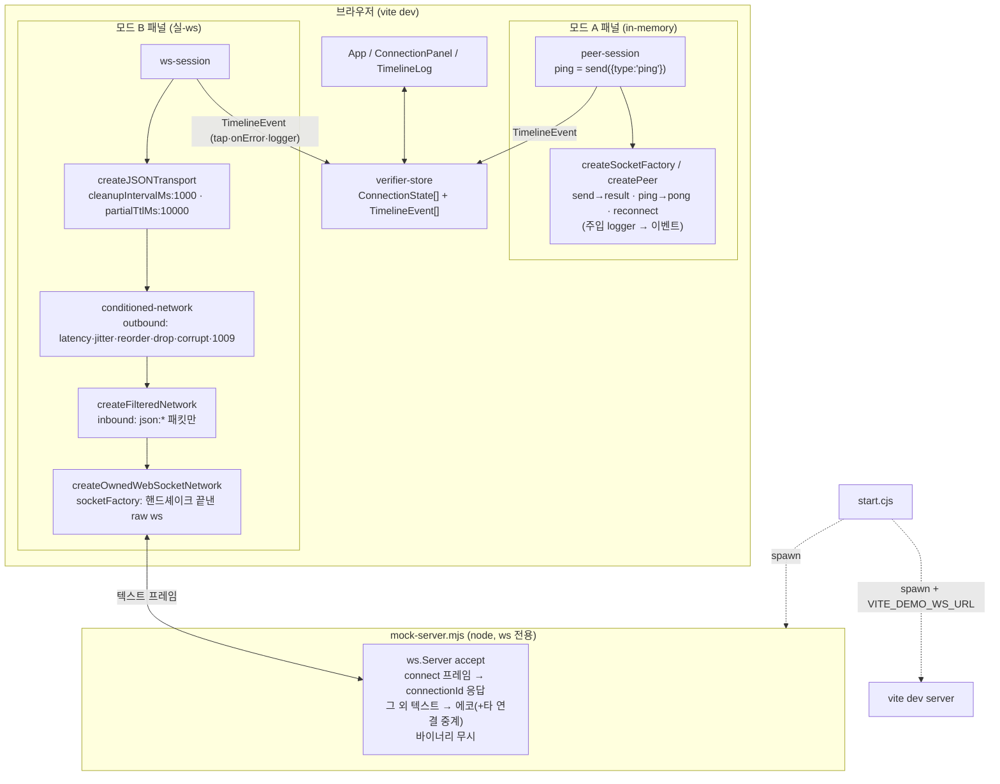

# Design: socket-visual-verifier

**Status:** Confirmed
**Date:** 2026-07-10
**Slug:** socket-visual-verifier
**Spec:** [01-spec.md](./01-spec.md)

## 범위
데이터 모델링·시스템 흐름을 다룬다. 외부 계약은 [01-spec.md](./01-spec.md)가 source of truth.

## 데이터 모델링

### TimelineEvent (공유 타임라인의 단위)

| 필드 | 타입 | 설명 |
|---|---|---|
| `seq` | `number` | 단조 증가 시퀀스 — 타임라인 정렬 키 |
| `at` | `number` | epoch ms |
| `connectionId` | `string` | 이벤트가 속한 연결(패널) 식별자 |
| `direction` | `'in' \| 'out' \| 'sys'` | 수신/송신/시스템(수명주기·에러) |
| `kind` | `TimelineKind` | 아래 종류 enum |
| `severity` | `'normal' \| 'error'` | 정상 흐름과 계약 위반의 시각 구분(01 클라이언트 계약) |
| `detail` | `string` | 사람이 읽는 요약(페이로드 미리보기·scope·tid 등) |
| `meta?` | `object` | 원본 참조(mid, tid, scope, code 등). 상관 완료 이벤트(`result`/`pong`은 mid, `assemble`은 tid 기준)에는 실측 왕복 지연 `elapsedMs`가 담기고 detail 끝에 ` (+Nms)`로 표기된다 |

`TimelineKind`: `open` · `handshake`(connectionId 수신) · `close` · `reconnect` · `configure`(조건 변경) · `send` · `post` · `receive` · `result`(mid 상관 완료) · `ping` · `pong` · `chunk-out`(분할 송신 tap) · `assemble`(재조립 완료) · `pending`(재조립 대기) · `expired`(타임아웃, `json.partial.expired`) · `drop`(주입 tap) · `corrupt`(주입 tap) · `error`(transport/network 에러)

이벤트 소스별 파생 방식:

| kind | 소스 | 방식 |
|---|---|---|
| `send`/`post`/`ping`/`result`/`pong` (모드 A) | `VerifierSession` 호출 지점 + `Peer` 주입 logger | `Peer`는 이벤트 스트림이 없어 커스텀 `SocketLogger`(`socket.ts:41,915`)를 주입하고 log `location`(`peer.publish`/`peer.dispatch.result`/`peer.reply`) + `mid`로 상관한다. **내부 location 문자열 결합은 깨지기 쉬우므로 변환기를 한 파일에 모으고 unknown location은 통과시킨다** |
| `chunk-out`/`drop`/`corrupt` | conditioned-network tap | 데코레이터가 outbound 프레임을 JSON 파싱해 `type==='json:chunk'`를 식별(변조·tap 공용) |
| `receive`/`assemble` | transport 주입 logger | `JSONTransport`도 tid가 담긴 log(`transport.ts:437,469`)만 제공 — 모드 A와 같은 방식으로 변환 |
| `pending` | `pendingCount` diff | 이산 이벤트가 없어(`transport.ts:325-328`) send/receive 처리 후 `pendingCount` 변화로 파생한다 |
| `expired` | transport `onError` | scope `json.partial.expired` (`transport.ts:402`) |
| `error`/`close` | network·transport `onError` | transport 경유 구독 시 close scope는 `json.network.ownedWebSocket.close`로 **프리픽스됨**(`transport.ts:319`) — 매칭 문자열 주의 |

### VerifierCondition (조건 모델 — 01 모델 계약의 구현형)

| 필드 | 타입 | 기본값 | 적용 |
|---|---|---|---|
| `latencyMs` | `number` | 0 | A: `configureNetwork` / B: 데코레이터 outbound 지연 |
| `jitterMs` | `number` | 0 | A: `configureNetwork` / B: 데코레이터 outbound 무작위 가산 |
| `unordered` | `boolean` | false | A: `configureNetwork` — **`jitterMs>0`일 때만 재정렬 발생**(`socket.ts:245-251`), UI는 unordered 켜면 jitter 최소 1을 강제 / B: 데코레이터 지연 차등으로 재정렬 |
| `maxPacketBytes` | `number` | 65536 (라이브러리 기본, `socket.ts:119`) | A: `configureNetwork`(1009 throw, `socket.ts:182`) / B: 데코레이터 가드(1009 throw → `json.send`로 표면화) |
| `dropRate` | `number` (0~1) | 0 | B 전용: outbound 패킷 폐기 + `drop` tap |
| `corruptRate` | `number` (0~1) | 0 | B 전용: outbound **chunk data 페이로드만** 손상 + `corrupt` tap (01 핵심 결정 4) |

변조의 탐지 경로 보장: 데코레이터는 프레임을 파싱해 `type==='json:chunk'`일 때만 `data`를 변조하고 **`hash`는 재계산하지 않고 그대로 둔다** — 수신 측 `acceptChunk`의 `packet.hash !== hashString(packet.data)` 검사(`transport.ts:491`)가 발화해 `json.chunk.hash`로 수렴한다.

### ConnectionState (패널 상태)

| 필드 | 타입 | 설명 |
|---|---|---|
| `id` | `string` | 패널 식별자(타임라인 `connectionId`와 동일) |
| `mode` | `'peer' \| 'ws'` | 검증 경로(01 핵심 결정 1) — UI 컨트롤 분기 기준(ping·drop·corrupt는 모드별 표시) |
| `status` | `'connecting' \| 'open' \| 'closing' \| 'closed'` | `readyState` 반영 |
| `remoteConnectionId?` | `string` | 모드 B: 서버가 발급한 connectionId |
| `condition` | `VerifierCondition` | 현재 조건 |
| `pendingCount` | `number` | 재조립 대기 수(`transport.pendingCount`) |

클라이언트 상태는 `client → connections[]` 구조로 두되 v1은 길이 1로 고정한다(01 Out of Scope: 듀얼소켓 — v2에서 배열만 늘리도록 상태 분리).

## ID / 참조 포맷

| 맥락 | 포맷 | 예 |
|---|---|---|
| 패널/연결 식별자 | 알파벳 순번 | `A`, `B` |
| 서버 발급 connectionId | `conn-<epoch36>-<seq>`, `{"connectionId":"..."}` JSON 프레임 — `extractWebSocketConnectionId()`의 1순위 키(`websocket.ts:86-98`) | `conn-mcqk3x-1` |
| connect 핸드셰이크 프레임 | `{"action":"connect"}` — `waitWebSocketConnectionId`의 `options.connectMessage`로 **명시 전달**(기본값 없음, `websocket.ts:157`). 서버는 이 프레임에만 connectionId로 응답하고 에코·중계에서 제외(01 서버 보장) | — |
| 타임라인 참조 | `seq` 단조 증가 | `#42` |

## 모듈 분해

> `USE-CASE.md` 규약의 예외 조항 적용: 이 도구는 use-case lib 구조가 없는 브라우저 도구이므로 백엔드 use-case 분해 대신 저장소 내 demo 전례(`demo/sync-playground/`)와 chatic demo 토폴로지를 따른 모듈 분해로 대체한다.

| 모듈 | 파일 | 책임 |
|---|---|---|
| orchestrator | `demo/socket-verifier/start.cjs` | 포트 자동탐색 → mock/vite 2-프로세스 spawn → 시그널 shutdown (chatic `start.cjs:8-85` 복제). **자동탐색한 ws 포트를 `VITE_DEMO_WS_URL` env로 vite에 주입**(chatic `start.cjs:54-69` 방식) — 브라우저는 `import.meta.env.VITE_DEMO_WS_URL`로 접속 |
| mock 서버 | `demo/socket-verifier/mock-server.mjs` | `ws.Server` accept → connect 프레임 수신 시 connectionId 응답 → 그 외 텍스트 프레임 에코+중계(바이너리 무시). connect 프레임 식별만 최소 해석(01 서버 보장). **`src/socket`을 import하지 않는다** — 의존성은 `ws`뿐 |
| 조건 데코레이터 | `demo/socket-verifier/src/conditioned-network.ts` | `NetworkSupportable`을 감싸 outbound에 지연·지터·재정렬·유실·변조·1009 가드 적용. `FilteredNetwork`(`websocket.ts:483-523`)의 전체 멤버 위임 패턴을 따르고, 주입 사실을 tap 콜백(`onTap(event)`)으로 노출 |
| 세션: 모드 A | `demo/socket-verifier/src/peer-session.ts` | `createSocketFactory`/`createPeer`(jsonTransport 미사용 — 청킹 검증은 모드 B 몫, 01 핵심 결정 1)로 server/client peer 생성·connect. send→result·reconnect·`configureNetwork` 수행. **ping은 `peer.send({type:'ping', data})`로 전송** — 수신 peer 런타임이 자동 pong(`socket.ts:816-825`), 송신 측은 pending의 pong 분기로 resolve(`socket.ts:785-797`). 주입 logger로 TimelineEvent 변환 |
| 세션: 모드 B | `demo/socket-verifier/src/ws-session.ts` | 네트워크 스택 조립(아래 배선 순서)·`waitWebSocketConnectionId` 핸드셰이크·재연결=스택 전체 재생성(01 핵심 결정 5)·`cleanupIntervalMs: 1000`/`partialTtlMs: 10000` 설정(01 재조립 상태 모델)·transport `onError`+logger를 TimelineEvent로 변환 |
| 상태 스토어 | `demo/socket-verifier/src/verifier-store.ts` | `ConnectionState[]`+`TimelineEvent[]` 보관, 구독(subscribe) 제공 — React 비의존 |
| UI | `demo/socket-verifier/src/{App,ConnectionPanel,TimelineLog}.tsx`, `styles.css` | 모드 토글·패널 추가/제거·조건 슬라이더·send/post/ping·close/reconnect 버튼·공유 타임라인(severity 색 구분) |
| 데모 테스트 | `demo/socket-verifier/tests/*.spec.ts` | vitest. **`src/`·`test/` 세그먼트를 경로에 쓰지 않는다** — 루트 jest testMatch는 `**/src/**/*.spec.*`와 `**/test/**/*.+(ts\|tsx\|js\|jsx)` 두 패턴(`jest.config.json`)이라 둘 다 depth 무관 매칭됨. `tests/`는 어느 글롭에도 걸리지 않아 `npm test` 오염을 막는다(작업 1 검증에서 실측 확인) |
| 실행 문서 | `demo/socket-verifier/README.md` | 실행·검증 절차(01 핵심 결정 7: "문서만 보고 실행·검증 도달") — 검증 대상별 기대 이벤트 시퀀스 표 포함 |

### 모드 B 네트워크 스택 배선 (핸드셰이크 순서 포함)

`waitWebSocketConnectionId`는 raw `WebSocketCompartible`이 필요하고(`websocket.ts:105-107,154-157`) owned 네트워크는 내부 ws를 노출하지 않으므로, **raw ws를 먼저 만들고 핸드셰이크를 끝낸 뒤 같은 ws를 `socketFactory`로 주입**한다:

```
1. ws = new WebSocket(url)                          // raw
2. remoteConnectionId = await waitWebSocketConnectionId(ws, { connectMessage: '{"action":"connect"}' })
3. owned = createOwnedWebSocketNetwork({ url, socketFactory: () => ws })   // websocket.ts:303
4. filtered = createFilteredNetwork(owned, isTransportPacketRaw)           // inbound: json:* 패킷만 통과
5. conditioned = createConditionedNetwork(filtered, condition, onTap)      // outbound 주입
6. transport = createJSONTransport(conditioned, { cleanupIntervalMs: 1000, partialTtlMs: 10000, logger })
```

4단계 inbound 필터가 없으면 connectionId 응답·비-transport 프레임이 `JSONTransport.receive`의 `isJSONTransportPacket` 검사에 걸려 가짜 `json.packet` 에러를 만든다(`transport.ts:427-433`). 필터 predicate는 raw 문자열의 `"type":"json:` 포함 여부로 판정한다(파싱 비용 회피).

`VerifierSession` 공통 인터페이스는 최소로 유지한다 — `connect/close/reconnect/send/post/configure` + 모드별 확장(`ping`은 peer-session에만). UI 분기는 `ConnectionState.mode`로 충분하므로 capability 선언 같은 추측성 유연성은 두지 않는다.

## 구조

```
demo/socket-verifier/          # 자체 package.json — 루트 의존성 오염 없음
├── package.json               # react·vite·ws·typescript·vitest (chatic demo/package.json:15-26 준거)
├── start.cjs                  # 2-프로세스 orchestrator (+ VITE_DEMO_WS_URL 주입)
├── mock-server.mjs            # ws 전용, src/socket 비의존
├── vite.config.ts             # alias @socket → ../../src/socket, fs.allow: ['../..']
├── tsconfig.json              # paths 동기화
├── index.html
├── README.md
├── src/
│   ├── conditioned-network.ts
│   ├── peer-session.ts
│   ├── ws-session.ts
│   ├── verifier-store.ts
│   ├── App.tsx / ConnectionPanel.tsx / TimelineLog.tsx
│   └── styles.css
└── tests/                     # 루트 jest 글롭(**/src/**, **/test/**) 회피 — vitest 전용
    ├── mock-server.spec.ts
    ├── conditioned-network.spec.ts
    └── verifier-store.spec.ts
```

- **src 참조는 vite alias로 `../../src/socket` 직접 컴파일**(chatic `vite.config.ts:7-18` 방식). `dist/esm` 사전 빌드가 불필요해 "src/socket 수정 → 즉시 재검증"(00 목표 4) 루프가 빌드 단계 없이 돈다. src/socket에는 TS 데코레이터 문법·node 전용 의존성이 없어 esbuild 변환에 안전.
- 루트 `files: ["dist/**/*"]`(`package.json:76-78`) 덕에 demo/는 배포 산출물에서 자동 제외 — 01 핵심 결정 7 충족.

## 시스템 흐름



결함 가시화 흐름(01 핵심 결정 3, 에코 왕복): `ws-session.send` → transport 분할(`chunk-out` tap) → 데코레이터가 chunk 1개 drop(`drop` tap) → 서버가 나머지 에코 → transport 재조립 미완(`pending` = pendingCount diff) → 1초 주기 cleanup이 10초 TTL 만료 감지 → `json.partial.expired`(`expired`, severity=error).

## 설계 대안

### sync-playground식 정적 서빙 (폐기)
`demo/sync-playground/`처럼 번들러 없이 `dist/esm`을 상대경로 import(`playground.js:10-12`)하고 `npx serve .`로 띄우는 방식. React·슬라이더·타임라인 UI를 vanilla JS로 감당해야 하고, `src/socket` 수정 때마다 `npm run build`가 회귀 루프에 끼어든다(00 목표 4 저해). 단순 시나리오 데모였던 sync-playground와 달리 이 도구는 조작 UI가 본체라 폐기.

### 서버 측 transport 소비 (폐기)
구 plan(00.plan.md 결정 3)은 mock 서버가 accept ws를 `createOwnedWebSocketNetwork`+`createJSONTransport`로 래핑하는 안이었다. 01 계약이 "서버는 connect 프레임 식별 외 무해석"으로 고정되며 서버 측 소비가 불필요해졌고, 검증 대상(transport 계층)을 관측 지점(브라우저 타임라인)과 같은 쪽에 두는 에코 왕복이 결함 가시화 계약과도 일치해 폐기.

### 루트 jest 설정 수정으로 demo 테스트 격리 (폐기)
루트 `jest.config.json`에 `testPathIgnorePatterns: ["/demo/"]`를 추가하는 안. 동작하지만 라이브러리 저장소의 루트 설정을 데모 도구가 건드리게 된다(01 핵심 결정 6의 정신 위배). 테스트를 `demo/socket-verifier/tests/`(`src`·`test` 세그먼트가 없는 경로)에 두면 글롭이 애초에 닿지 않아 루트 무변경으로 해결. (`test/` 단수형은 두 번째 jest 글롭 `**/test/**`에 걸린다는 것을 구현 검증에서 실측 — 초안의 `test/` 배치를 정정함)

### 능동 connectionId 발급 + connect 재발급 (폐기)
accept 즉시 발급하고 connect 프레임에 재발급하는 벨트앤서스펜더스 안. 클라이언트 구독 전 프레임 도착 레이스를 재발급으로 덮는 구조라 서버 분기가 늘고, 우리 클라이언트는 항상 connect를 보내므로 응답 발급만으로 충분해 폐기(01 서버 보장 개정, 작성자 확정 2026-07-10).

## 변경 파일

- `demo/socket-verifier/package.json` — 신규
- `demo/socket-verifier/start.cjs` — 신규 (chatic demo/start.cjs 복제·수정)
- `demo/socket-verifier/mock-server.mjs` — 신규
- `demo/socket-verifier/vite.config.ts` · `tsconfig.json` · `index.html` — 신규
- `demo/socket-verifier/src/conditioned-network.ts` — 신규
- `demo/socket-verifier/src/peer-session.ts` · `ws-session.ts` — 신규
- `demo/socket-verifier/src/verifier-store.ts` — 신규
- `demo/socket-verifier/src/App.tsx` · `ConnectionPanel.tsx` · `TimelineLog.tsx` · `styles.css` — 신규
- `demo/socket-verifier/test/conditioned-network.spec.ts` · `verifier-store.spec.ts` — 신규
- `demo/socket-verifier/README.md` — 신규 (실행·검증 절차, 검증 대상별 기대 이벤트 시퀀스)
- 루트·`src/**` 변경 없음 (01 핵심 결정 6)
