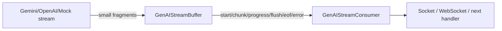
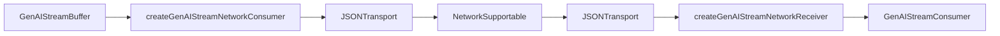

# src/buffer

`src/buffer` is a shared module for collecting AI stream fragments and emitting them as consistent stream events.

In plain terms, `GenAIStreamBuffer` briefly holds tiny pieces from an AI stream, then emits them as grouped `flush` events.

```txt
"h" + "e" + "l" + "l" + "o"
  -> GenAIStreamBuffer
  -> "hell" / "o"
```

## Files

| File | Purpose |
|---|---|
| `index.ts` | Public buffer exports |
| `token.ts` | Legacy token buffer based on strings and `null` |
| `stream.ts` | Core module: `GenAIStreamBuffer`, stream events, progress, mock helpers |
| `network.ts` | Adapter for sending and receiving `GenAIStreamEvent` over socket/json-transport |
| `testing.ts` | Diagnostic network loop helper, imported from `lemon-model/buffer/testing` |
| `*.spec.ts` | Buffer, network, tools, and sample tests |
| `MIGRATION.md` | Summary of the migration from the source project to lemon-model |

## Flow



With the network adapter included:



## Events

`GenAIStreamBuffer` emits structured events instead of raw strings only.

| Event | Meaning |
|---|---|
| `start` | Stream started |
| `chunk` | One fragment was received |
| `progress` | Progress was updated |
| `flush` | Buffered fragments were emitted as one group |
| `eof` | Stream ended normally |
| `error` | Stream failed |

The key distinction is `chunk` versus `flush`.

```txt
chunk = a small incoming fragment
flush = a grouped payload emitted to the consumer
```

## Basic Usage

```ts
import { GenAIStreamBuffer } from 'lemon-model';

const events: any[] = [];

const buffer = new GenAIStreamBuffer(event => {
    events.push(event);
}, {
    bufferSize: 2,
    flushStrategy: 'size',
});

await buffer.start();
await buffer.write('hello');
await buffer.write(' ');
await buffer.write('world');
await buffer.close();
```

With `bufferSize: 2`, every two chunks are flushed together.

```txt
write "hello"
write " "
flush "hello "
write "world"
close
flush "world"
eof
```

## Options

| Option | Default | Meaning |
|---|---:|---|
| `useBuffer` | `true` | If `false`, events are emitted without batching |
| `flushStrategy` | `hybrid` | Decides when to flush |
| `bufferSize` | `10` | Flush after this many chunks |
| `bufferBytes` | `16384` | Flush after this many bytes |
| `bufferMs` | `300` | Time-based flush interval |
| `maxWaitMs` | `300` | Maximum wait before flushing |
| `emitProgress` | `false` | Whether to emit progress events |
| `timeoutMs` | `0` | Total operation timeout. `0` disables it |

`flushStrategy` supports four modes.

| Strategy | Behavior |
|---|---|
| `size` | Flush by chunk count |
| `bytes` | Flush by byte size |
| `time` | Flush by elapsed time |
| `hybrid` | Flush when size, bytes, or time reaches its threshold first |

## Progress

Progress has two related values.

| Value | Meaning |
|---|---|
| `percent` | Progress against the total estimate, when an estimate is available |
| `bufferPercent` | How full the current buffer is |

If the total length is unknown, `percent` may be absent. `bufferPercent` can still describe the current buffer state.

## Network Adapter

`network.ts` adapts `GenAIStreamEvent` to socket/network transport.

```ts
import {
    createGenAIStreamNetworkConsumer,
    createGenAIStreamNetworkReceiver,
} from 'lemon-model';
```

Sender side:

```txt
GenAIStreamEvent
  -> compactStreamEvent
  -> JSONTransport
  -> NetworkSupportable.send()
```

Receiver side:

```txt
NetworkSupportable.onMessage()
  -> JSONTransport
  -> restoreStreamEvent
  -> GenAIStreamConsumer
```

Large payloads may be split into multiple packets by `JSONTransport`. `flush` events are compacted to avoid duplicated data.

## Testing Helper

`runGenAIStreamNetworkLoop` is a test and diagnostic helper.

```ts
import { runGenAIStreamNetworkLoop } from 'lemon-model/buffer/testing';
```

It verifies this end-to-end path:

```txt
tokens
  -> GenAIStreamBuffer
  -> JSONTransport
  -> NetworkSupportable
  -> JSONTransport
  -> GenAIStreamConsumer
```

It is exported from `lemon-model/buffer/testing`, not the root export, so test-only socket simulator code does not get mixed into the production import path.

## Probes And Samples

`tools` and `sample` provide reference material for real provider stream shapes.

```txt
tools/common.ts
tools/openai-stream-probe.ts
tools/gemini-stream-probe.ts
sample/openai
sample/gemini
sample/image
```

The lemon-model probes support `direct` mode only.

```bash
OPENAI_API_KEY=... npx ts-node tools/openai-stream-probe.ts --kind text --probeMode direct
GEMINI_API_KEY=... npx ts-node tools/gemini-stream-probe.ts --kind text --probeMode direct
```

Provider SDKs are not pinned as package dependencies. Install `openai` or `@google/genai` in the workspace where you run the probe.

```bash
npm install -D openai
npm install -D @google/genai
```

`--managerCheck`, `--probeMode manager`, and `--probeMode both` require provider manager integration outside this package.

## Differences From The Source Project

The core buffer behavior was moved with minimal changes. Only the parts that did not fit a shared package were adjusted.

| Area | Source project | lemon-model |
|---|---|---|
| Path | `src/lib/buffer` | `src/buffer` |
| Timeout type | `NodeJS.Timeout` | `ReturnType<typeof setTimeout>` |
| Byte length | `Buffer.byteLength(value, 'utf8')` | `TextEncoder().encode(value).length` |
| Network loop helper | Kept inside `network.ts` | Split into `testing.ts` |
| Manager probe | Can compare provider managers | Direct SDK stream only |

`TextEncoder` is used because `Buffer` is a Node-only API. Both calculate UTF-8 byte length, so buffer size, packet size, and progress semantics stay the same.

```txt
"abc" -> 3 bytes
"é"   -> 2 bytes
"😀"  -> 4 bytes
```

See `MIGRATION.md` for the migration rationale.

## Provider Boundary

`lemon-model` owns provider-neutral shared layers only.

```txt
Owned by lemon-model:
socket
json-transport
buffer
direct stream sample/probe

Owned by the provider application:
OpenAI manager
Gemini manager
provider-specific business logic
```

For that reason, OpenAI/Gemini manager dependencies were not moved into `lemon-model`.

## Verification

General verification:

```bash
npm test
npm run build
npm run test:package-exports
```

Fast buffer-only verification:

```bash
npm test -- src/buffer/stream.spec.ts src/buffer/network.spec.ts src/buffer/tools.spec.ts src/buffer/sample.spec.ts
```

## Reading Order

Recommended first pass:

1. `stream.ts`: `GenAIStreamBuffer` and event structure
2. `network.ts`: how events are sent over the network
3. `testing.ts`: network loop helper
4. `MIGRATION.md`: what changed during the move into lemon-model
