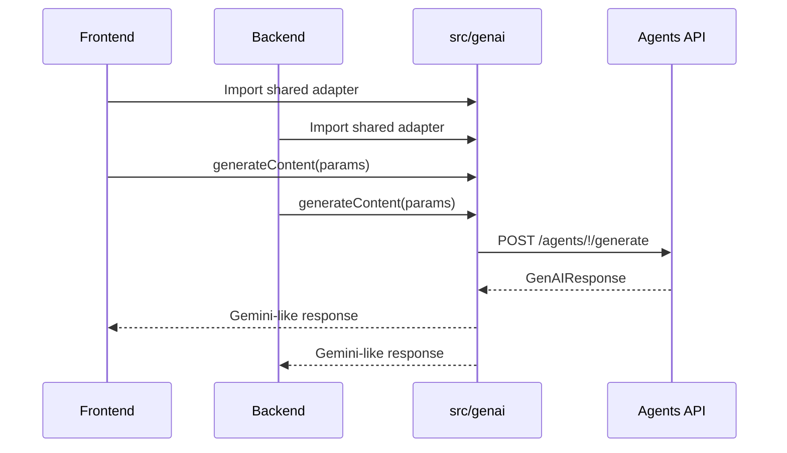
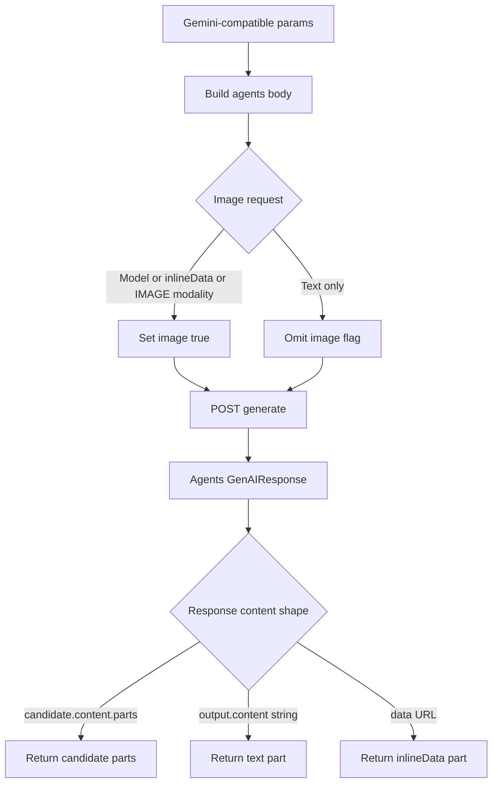
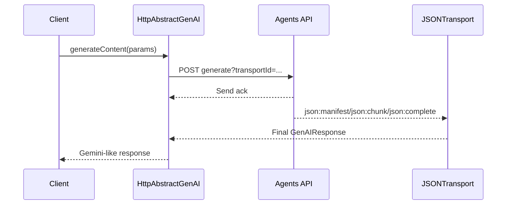

# GenAI

`src/genai` manages an adapter that uses the HTTP-based agents API through a Gemini-compatible `ai.models.generateContent()` surface.

It is provided by the `lemon-model` package so frontend code (browser/Vite) and backend code (Node) can share the same types and behavior.
The source came from the GenAI shim that `eureka-codes-api-1` used to inject into frontend code through `doPostRefactor`,
and from `eureka-agents-api / src/lib/proxy`. Both sides now import and use this module.

```ts
// Common CJS backend / frontend bundler import.
import { HttpAbstractGenAI, createProxyTransportReceiver } from 'lemon-model';
import { BrowserWebSocketNetwork, waitWebSocketConnectionId } from 'lemon-model';
```

## Table of Contents

- [Goals](#goals)
- [HttpAbstractGenAI](#httpabstractgenai)
- [Conversion Rules](#conversion-rules)
- [Tests](#tests)
- [Transport Response](#transport-response)
- [Client Transport Usage](#client-transport-usage)
- [Client Notes](#client-notes)
- [Inline Image Dump Transport Example](#inline-image-dump-transport-example)
- [Browser Dump Test](#browser-dump-test)

## Goals

- Use only standard `fetch` so the same code works on servers and browsers. No runtime or module-system dependency such as axios or `import.meta`.
- Receive the endpoint through the constructor, not through hardcoded source. Frontend callers can read it from `import.meta.env`; backend callers can read it from `process.env`.
- Prioritize Gemini `generateContent()` compatibility for now.
- Add an OpenAI-compatible proxy in the same folder later.



## HttpAbstractGenAI

`HttpAbstractGenAI` converts `AbstractGenAI`-style calls into `POST /agents/!/generate`-compatible requests.
Response restoration uses the shared `$gemini.asGenerateContentResponse()` function.

```ts
import { HttpAbstractGenAI } from 'lemon-model';

const ai = new HttpAbstractGenAI('http://localhost:8830/agents/!/generate');

const response = await ai.models.generateContent({
    model: 'gemini-2.5-flash',
    contents: 'hello',
    config: {
        systemInstruction: '/dump',
        responseMimeType: 'application/json',
    },
});
```

## Conversion Rules

| Gemini-compatible params             | `/agents/!/generate` body |
| ------------------------------------ | ------------------------- |
| `model`                              | `model`                   |
| `contents: string`                   | `prompt`                  |
| `contents.parts[].text`              | `prompt`                  |
| `contents` with `inlineData`         | `prompt.content`          |
| `config.systemInstruction`           | `system`                  |
| remaining `config` fields            | `config`                  |
| image model/inlineData/IMAGE modality | `image: true`             |

The response restores the agents API `GenAIResponse` into `ProxyGenAIGenerateContentResponse`.

- `candidate.content.parts` becomes `candidates[0].content.parts` as-is.
- `output.content` string becomes a text part.
- `output.content.data` with a normal string becomes a text part.
- `output.content.data` with `data:<mime>;base64,<bytes>` becomes an image `inlineData` part.



## Tests

- `proxy.spec.ts`: verifies `HttpAbstractGenAI` request/response conversion and `/dump` transport linking.
- `mocks.ts`: test helpers, excluded from the root barrel and imported through `lemon-model/genai/testing`.
    - `createAgentGenerateFetcher()`: calls a controller-like object as if it were `fetch`.
    - `MockAgentGenerateController`: in-memory server double that reproduces the `/dump` and transport contract of `AgentAPIController.doPostGenerate()`.
- Basic WebSocket bridge behavior is covered by `../socket/websocket.spec.ts`.

## Transport Response

When `transportId` is used, the final `GenAIResponse` can be received through WebSocket JSONTransport instead of the HTTP response body.

```ts
const ai = new HttpAbstractGenAI('/agents/!/generate', {
    transportId: 'api-gateway-connection-id',
    transport: createProxyTransportReceiver(network),
});
```

In this mode, `HttpAbstractGenAI` calls `POST /agents/!/generate?transportId=...`.
The server sends the final response through `sendTransport(transportId, finalResponse)`, and the HTTP response only returns a send ack.
The client receives the assembled final payload through `transport.wait()`, then restores it with `$gemini.asGenerateContentResponse()`.
The receiver registers a listener on the externally provided `NetworkSupportable` and passes only `json:manifest`, `json:chunk`,
`json:complete`, and `json:error` packets into JSONTransport.



## Client Transport Usage

The client first prepares a real connection such as WebSocket in `NetworkSupportable` form.
Then it creates `createProxyTransportReceiver(network)` and passes the connection id from the same connection to `HttpAbstractGenAI` as `transportId`.

```ts
import {
    BrowserWebSocketNetwork,
    HttpAbstractGenAI,
    createProxyTransportReceiver,
    waitWebSocketConnectionId,
} from 'lemon-model';
```

Use this sequence:

```ts
const ws = new WebSocket('wss://example.com/socket?v2');
const network = new BrowserWebSocketNetwork(ws);
await network.ready();

const connectionId = await waitWebSocketConnectionId(ws, {
    connectMessage: 'device.save',
    timeoutMs: 15_000,
});

const transport = createProxyTransportReceiver(network, {
    timeoutMs: 30_000,
});

const ai = new HttpAbstractGenAI('http://localhost:8830/agents/!/generate', {
    transportId: connectionId,
    transport,
});

const response = await ai.models.generateContent({
    model: 'gemini-3-flash-preview',
    contents: 'hello',
    config: {
        systemInstruction: '/dump',
    },
});
```

This call internally runs `POST /agents/!/generate?transportId=<connectionId>`.
The HTTP response is only an ack, and the real `GenAIResponse` is assembled from JSONTransport packets delivered to the same connection id.

After WSS opens, `waitWebSocketConnectionId()` sends `connectMessage` and checks the response message for these standard connection id candidates:

- `connectionId`
- `connId`
- `data.connectionId`
- `data.connId`
- `data.connId.id`
- `data.id`
- `body.connectionId`
- `body.connId`
- `body.id`
- `id`

## Client Notes

- `transportId` must be a real connection id that lets the server respond through WebSocket.
- When `transportId` is set, `transport` must also be provided.
- `NetworkSupportable.onMessage()` must deliver raw string packets as-is.
- `createProxyTransportReceiver()` uses only transport-related packets, so it ignores unrelated messages mixed into the same WebSocket.
- One `JSONProxyTransportReceiver` supports only one concurrent `wait()`. Use one receiver per request or an external queue for parallel generate calls.
- If timeout occurs while waiting for a response, the generate call fails.
- Browser `Window.fetch` may require call context, so the proxy calls it through the `globalThis` context internally.
- `BrowserWebSocketNetwork` does not own externally provided WebSocket instances. `close()` acts as `detach()` and does not close the real WebSocket.
- Call `transport.detach()` when disposing the receiver.

## Inline Image Dump Transport Example

Use the following test in `src/genai/proxy.spec.ts` as the baseline for checking whether a request with an inline image comes back through WebSocket transport as a `/dump` result.

```ts
import { createNetwork } from 'lemon-model/socket/testing';
import { createAgentGenerateFetcher, MockAgentGenerateController } from 'lemon-model/genai/testing';

const network = createNetwork();
const receiver = createProxyTransportReceiver(network, { timeoutMs: 1000 });

const controller = new MockAgentGenerateController({
    sendTransport: async (transportId, payload) => {
        const sender = createJSONTransport(network);
        sender.send(payload);
        sender.detach();
        return { result: true, packets: 1, connectionId: transportId };
    },
});

const ai = new HttpAbstractGenAI('http://localhost:8830/agents/!/generate', {
    fetch: createAgentGenerateFetcher(controller, { domain: 'localhost' }),
    transportId: 'transport-inline-dump-1',
    transport: receiver,
});

const response = await ai.models.generateContent({
    model: 'gemini-3.1-flash-image-preview',
    contents: {
        parts: [
            { inlineData: { data: imageBase64, mimeType: 'image/jpeg' } },
            { text: 'make a banner from this inline image' },
        ],
    },
    config: {
        systemInstruction: '/dump',
        responseModalities: ['IMAGE', 'TEXT'],
    },
});

const dumped = JSON.parse(response.text ?? '{}');
```

Check these points:

- The `HttpAbstractGenAI` request URL must include `transportId`.
- The HTTP response is an ack, and the final dump payload is assembled from JSONTransport packets sent by `sendTransport()`.
- `createProxyTransportReceiver()` uses only `json:manifest`, `json:chunk`, `json:complete`, and `json:error`.
- Validate only the truncated front part of `/dump` result `contents.parts[0].inlineData.data`, not the full base64.
- Check that `dumped.$param.isImage === true` and `responseModalities` are preserved.
- At the end of the test, call `receiver.detach()` and `network.close()` to clean up waiting listeners.

## Browser Dump Test

Use `browserWebSocketDumpTest()` for a quick browser UI check of the transport loop.
It is the same as upstream `BrowserWebSocketNetwork.dumpTest()`, but became a standalone function when the bridge moved into socket core.
This function performs WebSocket connection id lookup, `/agents/!/generate?transportId=...` call, JSONTransport receive, and `/dump` result validation in one pass.

```ts
import { browserWebSocketDumpTest } from 'lemon-model';

const result = await browserWebSocketDumpTest({
    ws: new WebSocket('wss://example.com/socket?v2'),
    endpoint: 'http://localhost:8830/agents/!/generate',
    connectMessage: 'device.save',
    log: entry => console.log(entry.event, entry.data),
});

console.log(result.ok, result.checks, result.dumped);
```

Main input options:

- `ws` or `wsUrl`: externally created WebSocket or connection URL
- `endpoint`: generate API endpoint
- `fetch`, `headers`: HTTP call settings for browser/test environments
- `model`, `prompt`, `imageBase64`, `imageMimeType`: dump test request data
- `timeoutMs`: wait time for connection id and transport response
- `close`: internally created WebSockets from `wsUrl` close by default; externally provided `ws` does not close by default.
- `log`: step-by-step log callback for UI display

Check `ackTransport`, `dumpParsed`, `inlineDataTruncated`, `imageRequestMarked`, and `responseModalitiesKept` in `checks`
to quickly determine the UI connection state.
