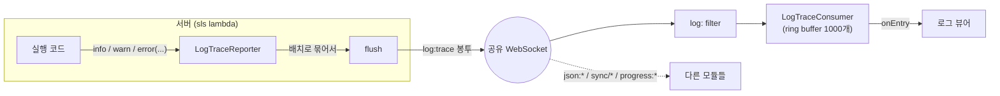
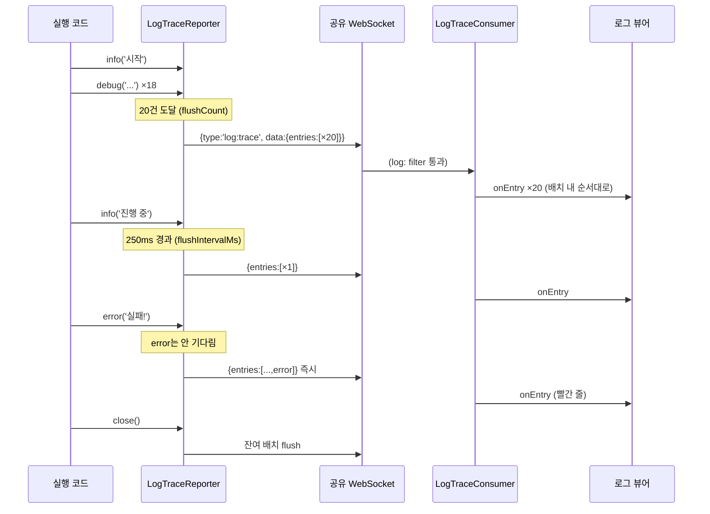

# LogTrace

서버(실행 박스)에서 발생하는 로그를 웹소켓으로 실시간 수신해 표시하는 모듈입니다. 서버 → 클라이언트 단방향이며, 하나의 웹소켓을 다른 모듈(sync, JSONTransport, Progress)과 공유합니다.

> 설계 계약(SSOT)은 [SPEC.md](./SPEC.md)를 보세요. 이 문서는 사용법 안내입니다.

## 한눈에 보기



| 구성 요소 | 위치 | 역할 |
| --- | --- | --- |
| `LogTraceReporter` | 서버 | 로그를 배치로 묶어 발신 (개수/시간/크기 조건) |
| `LogTraceConsumer` | 클라이언트 | ring buffer 보관 + 엔트리 단위 구독/조회 |
| `LogTraceEntry` | wire | 로그 1건 (level, ts, message, json) |

## 왜 배치인가?

로그는 다발로 터집니다. 루프 하나가 debug 100건을 만들면, 1건 = 봉투 1개 방식은 발신 100번 · 패킷 100개가 됩니다. Reporter는 이를 묶어서 보냅니다:

```
기록:  d d d d d ... (100건, 50ms 동안)
발신:  [배치 20건] [배치 20건] ... (5번)      ← flushCount: 20
```

flush는 세 조건 중 **먼저 도달하는 것**이 발화합니다:

| 조건 | 기본값 | 의미 |
| --- | --- | --- |
| `flushCount` | 20건 | 이만큼 쌓이면 발신 |
| `flushIntervalMs` | 250ms | 첫 로그 후 이 시간이 지나면 발신 (한가해도 로그가 늦지 않게) |
| `maxBatchBytes` | 패킷 제한의 ¾ | 이 크기를 넘기 직전에 분할 발신 |

예외 하나: **`error` level은 즉시 발신**됩니다. 오류는 기다리지 않습니다.

## 서버에서: 로그 보내기

```ts
import { createLogTraceReporter } from 'lemon-model';

// sink = 발신 함수 1개 (API GW post, Peer.post, 뭐든)
const logger = createLogTraceReporter(msg => postToClient(msg), {
    source: context.awsRequestId,  // 어느 invocation의 로그인지
    minLevel: 'info',              // debug는 wire에 안 태움
});

logger.info('이미지 생성 시작', { model: 'gemini-2.0' });
logger.debug('프롬프트 토큰 수', { tokens: 128 });   // minLevel에 걸려 발신 안 됨
logger.warn('재시도 1회', { reason: 'rate-limit' });
logger.error('생성 실패', { code: 'E_TIMEOUT' });    // 즉시 flush

logger.close();  // lambda 종료 전 필수 — 잔여 배치 flush + timer 해제
```

## 클라이언트에서: 로그 보기

```ts
import { createLogTraceConsumer } from 'lemon-model';

// network = 공유 중인 NetworkSupportable (BrowserWebSocketNetwork 등)
const trace = createLogTraceConsumer(network, { maxEntries: 500 });

trace.onEntry(entry => {
    appendLogLine(entry.level, entry.ts, entry.message, entry.json);
});

trace.list({ minLevel: 'warn', limit: 50 });  // 최근 warn 이상 50건 (seq 정렬)
trace.gapCount;                                // 유실 의심 횟수 (힌트)
trace.clear();                                 // 화면 지우기
trace.close();                                 // 구독 해제 (소켓은 닫지 않음)
```

## 전체 흐름



## `LogTraceEntry` 필드

| 필드 | 타입 | 설명 |
| --- | --- | --- |
| `level` | `'debug' \| 'info' \| 'warn' \| 'error'` | 심각도 |
| `ts` | `number` | 발생 시각 (epoch ms) |
| `message` | `string` | 사람이 읽는 메시지 |
| `json` | `object?` | 구조화 부가 데이터 |
| `seq` | `number` | 단조 시퀀스 — 정렬·유실 힌트용 (직접 쓸 일 없음) |
| `truncated` | `boolean?` | json이 크기 제한으로 제거됐으면 true |

## Progress와 뭐가 다른가요?

| | Progress | LogTrace |
| --- | --- | --- |
| 나르는 것 | 작업의 **현재 상태** (진행 바) | 실행 과정의 **서술** (로그 줄) |
| 유실되면 | 다음 스냅샷이 치유 | 그 줄은 사라짐 (`gapCount` 힌트) |
| 보관 | 작업 id별 최신 1개 | 전부 누적 (ring buffer 상한) |

같은 실행 박스가 둘 다 쓰는 게 정상입니다: 상태는 Progress로, 사연은 LogTrace로.

## 자주 묻는 것

**Q. 로그가 유실될 수 있나요?**
네, at-most-once입니다. 이 모듈은 실시간 관찰 도구이지 감사 기록이 아닙니다. 확실한 보관이 필요한 로그는 서버측 CloudWatch가 원천이고, sink를 감싸서 둘 다로 tee하면 됩니다.

**Q. 아주 큰 json을 붙이면?**
배치 예산(`maxBatchBytes`)을 넘는 엔트리는 `json`이 제거되고 `truncated: true`로 표시됩니다. 큰 데이터는 로그가 아니라 `JSONTransport`로 보내세요.

**Q. 로그 폭주로 브라우저가 무거워지지 않나요?**
Consumer는 ring buffer(기본 1,000개)라 오래된 로그부터 밀려납니다. 발신량 자체를 줄이려면 reporter의 `minLevel`을 올리세요.

**Q. 같은 소켓의 다른 메시지와 안 섞이나요?**
봉투 `type`이 `log:`로 시작하는 것만 골라 받습니다(`createFilteredNetwork`). sync(`sync/*`), JSONTransport(`json:*`), Progress(`progress:*`)와 네임스페이스가 겹치지 않습니다.
