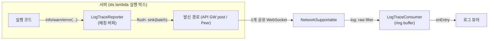

# LogTrace SPEC

> Status: Draft (SSOT) / Date: 2026-07-05 / Slug: logtrace

# 한줄 목표

서버(실행 박스)에서 발생하는 로그(level, ts, message, json)를 공유 웹소켓 1개 위에서 클라이언트로 실시간 리포팅하는 단방향(서→클) 로그 스트림 모듈을 만든다.

# High Level

- LogTrace는 서버에서 생긴 로그를 클라이언트에 실시간으로 보여주되, 받은 로그를 버리지 않고 모두 쌓는다.
- Progress는 같은 작업의 최신 상태 1개만 중요하지만, LogTrace는 과거 로그까지 전부 의미가 있다. 이 차이가 두 모듈을 나누는 기준이다.
- 서버는 로그 여러 건을 `LogTraceBatch` 하나에 담아 보낼 수 있다. 현재 배포 흐름처럼 로그가 드문드문 생기면 1건짜리 배치도 가능하다.
- 배치를 쓰는 이유는 루프 안 debug나 연쇄 오류처럼 로그가 짧은 시간에 많이 생길 때 WebSocket 발신 횟수를 줄이기 위해서다. flush 조건은 `src/buffer`의 count/time/bytes 방식과 같은 계열이지만, buffer 모듈을 재사용하지는 않는다. LogTrace reporter 내부의 entries 배열과 timer만으로 처리한다.
- 구현은 기존 `src/socket` 계약 위에 얹는다. 새 전송 계층을 만들지 않고 `SocketMessage`, `NetworkSupportable`, `createFilteredNetwork`만 사용한다.
- 같은 WebSocket을 쓰는 sync, `json:*`, `progress:*` 메시지와는 `type` prefix로 구분해서 서로 간섭하지 않는다.
- 전달 보장은 at-most-once다. 로그는 디버깅용 관찰 데이터이므로 재전송/ack 큐는 두지 않고, 유실 의심은 `seq` 간극으로만 표시한다.
- 플로우 요약: 실행 코드가 `LogTraceReporter`에 로그를 남기면, reporter가 로그를 배치로 묶어 WebSocket으로 보내고, 클라이언트의 `LogTraceConsumer`가 풀어서 로그 뷰어에 한 줄씩 알려준다.



# 시나리오

서버 로그를 클라이언트에 실시간으로 보여주는 것이 목표

1. 서버 업로드 flow를 실행한다.
2. `UploadHtmlProcessor`가 `codes-goods-api`의 doPostUpload를 호출
3. 이때 `streamTo`, `streamFlowId`, `streamNodeId`, `streamRunId`가 downstream으로 전달된다.
4. `codes-goods-api`는 autoDeploy 중 `github → refactor/build-step → build → deploy` 순서로 상태를 전이한다.
5. 각 스텝 전이와 오류 지점에서 서비스가 로그를 남긴다.

   ```ts
   reporter.info(msg, { productId, state, status });
   reporter.error(msg, { productId, state, status });
   ```

6. reporter의 sink는 `streamTo` WebSocket 연결로 배선한다.
7. 클라이언트는 `LogTraceConsumer.onEntry`로 로그를 한 줄씩 받아 플로우 UI에 표시한다.
8. 기존 `ProductModel.logEvents` 저장은 유지한다. LogTrace는 서버 영속 기록을 대체하지 않고, 실시간 wire 리포팅만 추가한다.
9. reporter는 `ProductModel`을 모른다. `productId`, `state`, `status` 같은 도메인 값은 `json` 필드에 실어 보낼 뿐이다.
10. 스텝 전이의 진행률 표시는 Progress 모듈이 맡는다. LogTrace는 로그 표시만 맡는다.

## 데이터 계약 (서버 ↔ 클라이언트)

이 섹션은 서버가 로그를 어떤 단위로 보내고, 클라이언트가 어떻게 풀어 보관·통지하는지 정한다.

### 서버 쪽

서버는 로그 1건을 `LogTraceEntry`로 만들고, 여러 엔트리를 `LogTraceBatch`로 묶어 보낼 수 있다.

| 상황 | 호출 또는 처리 | 결과 |
| --- | --- | --- |
| 로그 1건 기록 | `log(level, message, json?)` 또는 `debug/info/warn/error` | `ts`, `seq`가 붙은 `LogTraceEntry`를 내부 버퍼에 쌓는다. flush 조건에 닿으면 `SocketMessage<LogTraceBatch>`를 발신한다. |
| 강제 발신/종료 | `flush()` / `close()` | 버퍼에 남은 엔트리를 `SocketMessage<LogTraceBatch>`로 즉시 발신한다. |

### 클라이언트 쪽

클라이언트는 받은 배치를 엔트리 단위로 풀고, ring buffer에 누적한다.

| 상황 | 호출 또는 처리 | 결과 |
| --- | --- | --- |
| WebSocket 메시지 수신 | parse → `minLevel` 필터 → ring buffer 적재 | 구독자에게 `LogTraceEntry`를 한 건씩 통지한다. 배치 내부 순서는 유지한다. |
| 로그 조회 | `list(query)` | `LogTraceEntry[]`를 `(ts, seq)` 오름차순으로 반환한다. |
| 유실 의심 조회 | `gapCount` | source별 최대 seq 대비 수신 건수 차로 계수한 wire 유실 수를 반환한다. |

# 설계

## 원칙과 제약

| 항목 | 결정 |
| --- | --- |
| 방향 | 서버 → 클라이언트 단방향. fire-and-forget, mid 매칭 불필요 |
| 봉투 | 기존 `SocketMessage { type, data, mid }` 재사용. `data.entries`에 배치 배열 |
| 소켓 공유 | consumer는 `createFilteredNetwork`로 `log:` prefix만 골라 받는다 |
| 패킷 제한 | 배치 직렬화 크기가 `maxPacketBytes` 안에 들도록 reporter가 분할한다. 기본값은 모듈 내부 상수 `DEFAULT_MAX_PACKET_BYTES = 64 * 1024`(`src/socket`과 같은 계열)이며 `options.maxPacketBytes`로 재정의한다 — 예: API GW 32kb 프레임 환경이면 `{ maxPacketBytes: 32 * 1024 }`. 단일 엔트리가 초과하면 `json`을 제거하고 `truncated` 표시 |
| 전달 보장 | at-most-once. 재전송·ack 없음. `seq` 간극으로 유실 관찰만 가능 |
| 메모리 | consumer는 ring buffer(기본 1,000개)로 상한. 로그 폭주가 브라우저 메모리를 못 뚫는다 |
| timer | reporter의 flush timer는 lazy(첫 로그에 시작, flush에 정지). `close()`가 flush + 해제 — lambda invocation 종료 전 필수 호출 |
| 의존 방향 | `logtrace → socket` 단방향. `src/socket`은 `src/logtrace`를 모른다 |
| 보안 경계 | reporter는 로그 내용을 스크럽하지 않는다. 서버 내부 로그(스택 트레이스, `json`의 도메인 값)가 브라우저 클라이언트로 그대로 나가는 데이터 노출면이므로, `streamTo` 발급 = 열람 권한 부여이며 민감정보 필터링은 서비스 소관이다 |

- **Ports & Adapters (sink 주입)**: Progress와 동일. reporter는 `LogTraceSink = (message: SocketMessage) => void` 하나만 알고, 발신 경로(API GW post / Peer / 테스트 캡처)는 서비스가 배선한다.
- **Batching + Strategy**: flush 조건을 개수(`flushCount`)·시간(`flushIntervalMs`)·크기(`maxBatchBytes`) 3개의 독립 축으로 두고 먼저 도달하는 축이 flush를 발화한다. `GenAIStreamBuffer`의 hybrid flush 전략과 같은 계열이되, 로그는 순서 있는 텍스트 스트림이 아니라 독립 엔트리 집합이므로 청크 재조립 없이 단순하다.
- **Observer**: 구독은 기존 컨벤션대로 `SocketUnsubscribe` 반환.
- **Ring Buffer**: 소비자 보관은 고정 상한 원형 버퍼. 로그의 가치는 최근성에 있으므로 오래된 것부터 밀려나는 것이 올바른 기본값이다.
- **Level Gate (양단 필터)**: reporter의 `minLevel`은 wire 비용을 줄이고(발신 자체를 안 함), consumer의 `minLevel`은 표시를 줄인다. 같은 옵션이 양단에 있는 것은 중복이 아니라 관심사가 다르다 — 전자는 대역폭, 후자는 UX. **seq는 reporter의 minLevel 게이트를 통과한 엔트리에만 발급**하고, consumer의 유실 판정은 자기 minLevel 게이트 **앞에서** 수행한다 — 양쪽 게이트가 seq 간극을 만들지 않으므로 gapCount가 순수 wire 유실 지표가 된다.

## Wire 규약

```ts
/** 봉투. type prefix 'log:'가 소켓 공유의 라우팅 키다 */
{ type: 'log:trace', data: LogTraceBatch, mid: string }

/** data */
interface LogTraceBatch {
    /** 배치 내 엔트리 (reporter 발생 순서) */
    entries: LogTraceEntry[];
    /** 발신 주체 식별 — reporter 단위 고유 (필수). consumer의 dedup/유실 판정 키 */
    source: string;
}
```

- `mid`는 reporter가 단조 카운터로 채운다(`l1`, `l2`, ...).
- raw filter는 `'"type":"log:'` 부분 문자열 검사로 parse 없이 판정한다(2단 필터의 raw 단계).
- 배치 간 도착 순서는 보장되지 않는다(unordered). 배치 내부 순서는 배열이 보존한다. 전역 순서는 `(ts, seq)`로 소비자가 정렬한다 — `seq`는 source 내에서만 단조이므로 source 간 비교 키가 아니다.
- **`source`는 필수다.** 기준 시나리오처럼 여러 실행 박스(eureka-flows-api, codes-goods-api)가 같은 `streamTo` 소켓으로 발신하면 reporter마다 seq가 1부터 시작해 충돌한다. consumer는 dedup·유실 계수를 source별로 관리해 이 충돌을 흡수한다.

## Public Interface

```ts
/** 로그 심각도 — 기존 SocketLogLevel과 동일한 4단계 */
export type LogTraceLevel = 'debug' | 'info' | 'warn' | 'error';

/** 로그 엔트리 1개 — wire를 오가는 최소 단위 */
export interface LogTraceEntry {
    /** 심각도 */
    level: LogTraceLevel;
    /** 발생 시각 (epoch ms) */
    ts: number;
    /** 사람이 읽는 메시지 */
    message: string;
    /** 구조화 부가 데이터 (선택) */
    json?: Record<string, any>;
    /** source 내 단조 증가 시퀀스 — 정렬·유실 관찰용. minLevel 게이트 통과분에만 발급 */
    seq: number;
    /** 발신 주체 — wire에서는 배치에만 실리고, consumer가 적재 시 배치의 source를 채운다 */
    source?: string;
    /** 크기 제한으로 json 제거 또는 message 절단이 일어났으면 true */
    truncated?: boolean;
}

/** 서버 발신 경로 주입 (Ports & Adapters). 반환 Promise의 reject는 onError로 배선된다 */
export type LogTraceSink = (message: SocketMessage<LogTraceBatch>) => void | Promise<void>;

export interface LogTraceReporterOptions {
    /** 봉투 type (기본 'log:trace') */
    type?: string;
    /** 발신 주체 식별 — 배치의 source로 실린다. 미지정 시 랜덤 id 자동 생성 (invocation id 지정 권장) */
    source?: string;
    /** 이 level 미만은 발신하지 않는다 (기본 'debug' = 전부) */
    minLevel?: LogTraceLevel;
    /** 이 개수가 쌓이면 flush (기본 20) */
    flushCount?: number;
    /** 첫 엔트리 이후 이 시간이 지나면 flush. 0이면 개수/크기만 사용 (기본 250) */
    flushIntervalMs?: number;
    /** 배치 직렬화 크기 예산. 초과 직전에 분할 flush (기본 maxPacketBytes의 3/4) */
    maxBatchBytes?: number;
    /** 봉투 크기 상한 (기본 DEFAULT_MAX_PACKET_BYTES = 64kb). 단일 엔트리 초과 시 json 제거 + truncated 표시 */
    maxPacketBytes?: number;
    /** 발신 실패/절단 관찰 */
    onError?: (error: any, entries: LogTraceEntry[]) => void;
}

export interface LogTraceReporterSupportable {
    /** 로그 1건 기록. flush 조건 도달 시 자동 발신 */
    log(level: LogTraceLevel, message: string, json?: Record<string, any>): void;
    /** level별 축약 */
    debug(message: string, json?: Record<string, any>): void;
    info(message: string, json?: Record<string, any>): void;
    warn(message: string, json?: Record<string, any>): void;
    error(message: string, json?: Record<string, any>): void;
    /** 버퍼를 즉시 발신 */
    flush(): void;
    /** flush + timer 해제. lambda invocation 종료 전 필수 호출. 이후 log는 무시 */
    close(): void;
}

export const createLogTraceReporter: (sink: LogTraceSink, options?: LogTraceReporterOptions) => LogTraceReporterSupportable;

/** 조회 조건 */
export interface LogTraceQuery {
    /** 이 level 이상만 */
    minLevel?: LogTraceLevel;
    /** 최근 n개 (기본 전체) */
    limit?: number;
}

export interface LogTraceConsumerOptions {
    /** 수신 대상 type prefix (기본 'log:') */
    typePrefix?: string;
    /** 이 level 미만 수신분은 버린다 (기본 'debug' = 전부) */
    minLevel?: LogTraceLevel;
    /** ring buffer 보관 상한 (기본 1000) */
    maxEntries?: number;
}

export interface LogTraceConsumerSupportable {
    /** 엔트리 수신 구독 — 배치를 풀어 엔트리 단위로, 배치 내 순서대로 통지 */
    onEntry(handler: (entry: LogTraceEntry) => void): SocketUnsubscribe;
    /** 보관 중인 엔트리 조회 — (ts, seq) 오름차순 정렬 반환 */
    list(query?: LogTraceQuery): LogTraceEntry[];
    /** 관찰된 wire 유실 수 — source별 (최대 seq − 수신 건수)의 합. 도착 순서와 무관하게 정확 */
    readonly gapCount: number;
    /** 보관분 비우기 (구독은 유지) */
    clear(): void;
    /** 구독 해제. network는 닫지 않는다 (소켓 공유) */
    close(): void;
}

export const createLogTraceConsumer: (network: NetworkSupportable, options?: LogTraceConsumerOptions) => LogTraceConsumerSupportable;
```

## 의미론

### flush 규칙 (reporter)

| 트리거 | 규칙 |
| --- | --- |
| `flushCount` 도달 | 즉시 flush |
| `flushIntervalMs` 경과 | 첫 엔트리 기록 시점부터 lazy timer 시작, 만료 시 flush 후 정지 |
| `maxBatchBytes` 도달 예상 | 새 엔트리를 넣으면 예산 초과일 때, 기존 버퍼를 먼저 flush하고 새 엔트리로 새 배치 시작 |
| `error` level 기록 | 즉시 flush — 오류는 지연 없이 도착해야 한다 |
| `flush()` / `close()` | 명시 flush. close는 이후 log 무시 + timer 해제 |
| 단일 엔트리가 예산 초과 | `json` 제거, `truncated: true` 표시 후 발신. message까지 초과하면 message를 예산 내로 절단하고 역시 `truncated: true` |
| sink throw / reject | `onError`로 알리고 해당 배치는 버린다(at-most-once). sink가 Promise를 반환하면 reject도 `onError`로 배선한다(unhandled rejection 금지). 실행 코드를 절대 중단시키지 않는다 |

### 수신 규칙 (consumer)

| 상황 | 규칙 |
| --- | --- |
| 배치 수신 | source별 dedup·유실 계수를 **minLevel 게이트 앞에서** 반영한 뒤, 게이트 통과분만 source를 채워 ring buffer에 추가 + `onEntry` 통지 (배치 내 순서 유지) |
| ring buffer 초과 | 가장 오래된((ts, seq)가 작은) 엔트리부터 제거 |
| `list()` | (ts, seq) 오름차순 정렬 반환 — 배치 간 unordered 도착과 다중 source를 조회 시점에 보정 |
| 유실 계수 | source별로 최대 seq와 수신 건수를 추적하고 `gapCount = Σ(maxSeq − 수신 건수)`. seq가 1부터 단조 발급되므로 도착 순서와 무관하게 wire 유실만 계수한다 |
| 중복 seq | 같은 source의 동일 seq 재도착은 무시 (이론상 발생하지 않으나 방어) |

### Progress와의 경계

| | Progress | LogTrace |
| --- | --- | --- |
| 의미론 | 최신 스냅샷 수렴 (LWW) | 전 엔트리 누적 |
| 유실 시 | 다음 스냅샷이 치유 | 그 엔트리는 영구 유실 (seq 간극 힌트) |
| 발신 단위 | 스냅샷 1개 = 봉투 1개 | 배치 (N개 묶음) |
| 쓰임 | 진행 바, 실행 상태 | 로그 뷰어, 디버깅 |

작업 상태는 Progress로, 그 과정의 서술은 LogTrace로 보낸다. 하나의 실행 박스가 둘 다 쓰는 것이 정상이다.

## 파일 구조와 export

```
src/logtrace/
├── SPEC.md          # 이 문서 (SSOT)
├── README.md        # 사용자 가이드
├── index.ts         # public re-export
├── logtrace.ts      # 계약(interface) + reporter(배칭) + consumer(ring buffer) — 한 파일
├── testing.ts       # 검증 루프 하니스 — index 미노출, 서브패스 전용 (아래 검증 참고)
└── logtrace.spec.ts
```

- **서버/클라이언트로 파일을 가르지 않는다.** 양단은 wire 규약(봉투·배치 encode/decode)을 공유하므로 codec 옆 한 파일에 둔다 — `buffer/network.ts`(송신 consumer + 수신 receiver + codec 동거), `socket/transport.ts`(JSONTransport 단일 파일, 타입 인라인)와 같은 정책. 별도 types.ts를 두지 않고 계약을 구현 파일 상단에 둔다.
- **단, 팩토리는 2개를 유지한다.** logtrace는 단방향(서→클)이라 한 클래스로 합치면 서버에서는 ring buffer가, 브라우저에서는 배칭/flush timer가 죽은 표면이 된다 — `buffer/network.ts`가 consumer/receiver 팩토리를 나눈 것과 같은 이유.
- 루트 `src/index.ts`에 `export * from './logtrace';` 1줄 추가. 기존 export는 무변경(additive).
- 코드 스타일: `/** ... */` 한 줄 주석, `createXxx` 팩토리, `XxxSupportable` 계약, `@copyright (C) 2026 LemonCloud Co Ltd.` 헤더.

## 검증

### 도구

| 도구 | 용도 |
| --- | --- |
| `Peer` simulator (`src/socket/testing`) | 서버 대역. sink는 `msg => serverPeer.post(msg, { clientId })`로 배선 — 실서버 없이 서→클 발신 재현 |
| `configureNetwork({ unordered, jitterMs, latencyMs, maxPacketBytes })` | 순서 뒤섞임·지연·패킷 제한 등 네트워크 조건을 spec 안에서 재현 |
| jest + `expect2` | 부분 실행 `npx jest src/logtrace --config=jest.config.json`, 회귀 `npm test`. 단언은 기존 스위트처럼 `cores/index.spec`의 `expect2` 공용 헬퍼 사용 |
| 게이트 | `npm run lint` / `npm run build` / `npm run test:package-exports`(`scripts/check-package-exports.cjs` — testing.ts의 barrel 미노출 검증 포함) |
| jest fake timers | flushIntervalMs의 시간 경계 검증 (실시간 대기 없이) |
| `testing.ts` 루프 하니스 | 아래 검증 헬퍼 참고 — 메트릭 기반 e2e 검증 |

### 검증 헬퍼 (`testing.ts`)

`buffer/testing.ts`의 `runGenAIStreamNetworkLoop` 패턴을 따른다: 기록→배칭→발신→수신 전 구간 루프를 한 호출로 돌리고 **수치(메트릭)로 검증**한다. 루트 barrel에서 제외하고 `lemon-model/logtrace/testing` 서브패스로만 노출한다(socket/buffer/genai와 동일 격리 정책).

```ts
export interface LogTraceLoopOptions {
    /** 재생할 로그 시퀀스 */
    entries: Array<{ level: LogTraceLevel; message: string; json?: Record<string, any> }>;
    reporterOptions?: LogTraceReporterOptions;
    consumerOptions?: LogTraceConsumerOptions;
    /** in-memory network 조건 (unordered, jitterMs, maxPacketBytes, ...) */
    networkOptions?: SocketNetworkOptions & { id?: string };
    /** 비동기 전달 대기 시간 */
    settleMs?: number;
}

export interface LogTraceLoopMetrics {
    elapsedMs: number;
    /** raw 패킷 수 / 총 바이트 / 최대 패킷 바이트 (배칭 효율·패킷 제한 검증용) */
    packets: number;
    packetBytes: number;
    maxPacketBytes: number;
    /** 발신된 배치 수 (flush 3축 검증용) */
    batches: number;
    /** consumer에 도달한 엔트리 수 / 절단된 엔트리 수 / 관찰된 seq 간극 수 */
    delivered: number;
    truncated: number;
    gapCount: number;
    /** 종료 시점의 consumer 보관분 ((ts, seq) 정렬) */
    finalEntries: LogTraceEntry[];
}

export const runLogTraceLoop: (options: LogTraceLoopOptions) => Promise<LogTraceLoopMetrics>;
```

시나리오 spec은 이 하니스로 "100건 기록에 batches ≤ 5 (flushCount 20)", "maxPacketBytes 관측치 ≤ 제한", "unordered에서도 finalEntries가 (ts, seq) 오름차순" 같은 수치 단언을 쓴다.

### 시나리오

1. **e2e**: debug/info/warn/error 혼합 기록 → 배치 발신 → 클라이언트 onEntry 통지·list() 정렬 반환.
2. **배칭 3축**: flushCount 도달 flush, flushIntervalMs 경과 flush, maxBatchBytes 초과 직전 분할 flush가 각각 독립으로 동작. error level 즉시 flush 확인.
3. **크기 제한**: 단일 대형 엔트리의 json 제거 + truncated 표시, message 절단, onError 관찰.
4. **unordered 정렬**: `configureNetwork({ unordered: true })` 하에 배치가 뒤섞여 도착해도 list()가 (ts, seq) 순으로 반환. 유실 시 gapCount가 정확히 계수되고, 늦게 도착한 배치가 gapCount를 부풀리지 않음.
5. **level gate**: reporter minLevel이 발신 자체를 막고(seq 미발급 — 간극 없음), consumer minLevel이 보관/통지를 막되 유실 계수는 오염시키지 않음 — 양단 독립 확인.
6. **ring buffer**: maxEntries 초과 시 오래된 엔트리 제거, clear() 후 빈 상태.
7. **공존**: 한 network 위에 logtrace consumer + progress consumer + `JSONTransport` receiver + sync envelope 트래픽을 함께 올려 상호 오수신 없음.
8. **자원 해제**: reporter.close()가 잔여 버퍼 flush + timer 해제 + 이후 log 무시, consumer.close()가 수신 중단·network 미폐쇄.
9. **다중 소스**: source가 다른 reporter 2개가 한 consumer로 발신 — seq 충돌 없이 전량 보관(dedup 오작동 없음), list()가 (ts, seq)로 인터리브, gapCount는 source별 독립 계수.

### 실환경 진단 (후속)

- 실서버 대상 브라우저 진단은 `genai/dump-test.ts`(`browserWebSocketDumpTest`) 계열의 구조화 로그 진단 루프를 같은 패턴으로 추가한다 — 1차 범위 밖, in-memory 하니스로 충분해진 뒤 필요 시.
- `tools/` probe + `sample/` fixture 재검증(`buffer/sample.spec.ts`) 패턴은 채택하지 않는다: 그 패턴은 외부 provider SDK의 실 스트림 기록이 필요한 buffer 소관이고, logtrace는 자체 wire 규약이라 Peer 하니스가 원천이다.

## 비범위와 확장 지점

- **전달 보장 강화(ack/재전송)**: at-most-once가 계약이다. 감사 수준 보장이 필요해지면 서버측 영속 로그(CloudWatch)를 원천으로 하는 pull형 조회를 별도 설계한다 — 이 모듈을 at-least-once로 개조하지 않는다.
- **과거 로그 조회(replay)**: 접속 이후 수신분만. 이전 로그가 필요하면 위 pull형 조회 후속과 같은 트랙이다.
- **영속화**: consumer ring buffer는 메모리 전용.
- **로그 수집기 연동**: reporter는 wire 리포팅 전용이다. CloudWatch/console 등 서버측 로깅과의 tee 배선은 서비스 소관이다(sink를 감싸면 된다).
- **압축**: 배치 gzip 등은 1차 제외. maxBatchBytes 분할로 충분하며, 필요해지면 sink 데코레이터로 additive하게 더한다.
- **구조화 검색**: list()의 조건은 level/limit뿐이다. 텍스트 검색·json 필드 쿼리는 애플리케이션 소관.
