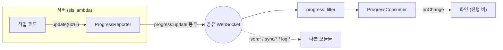
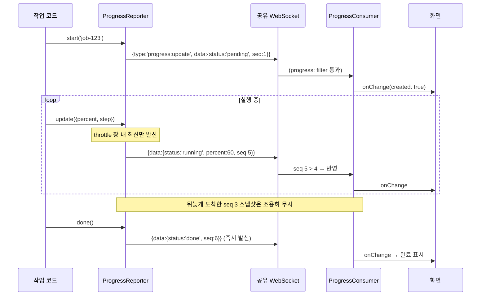
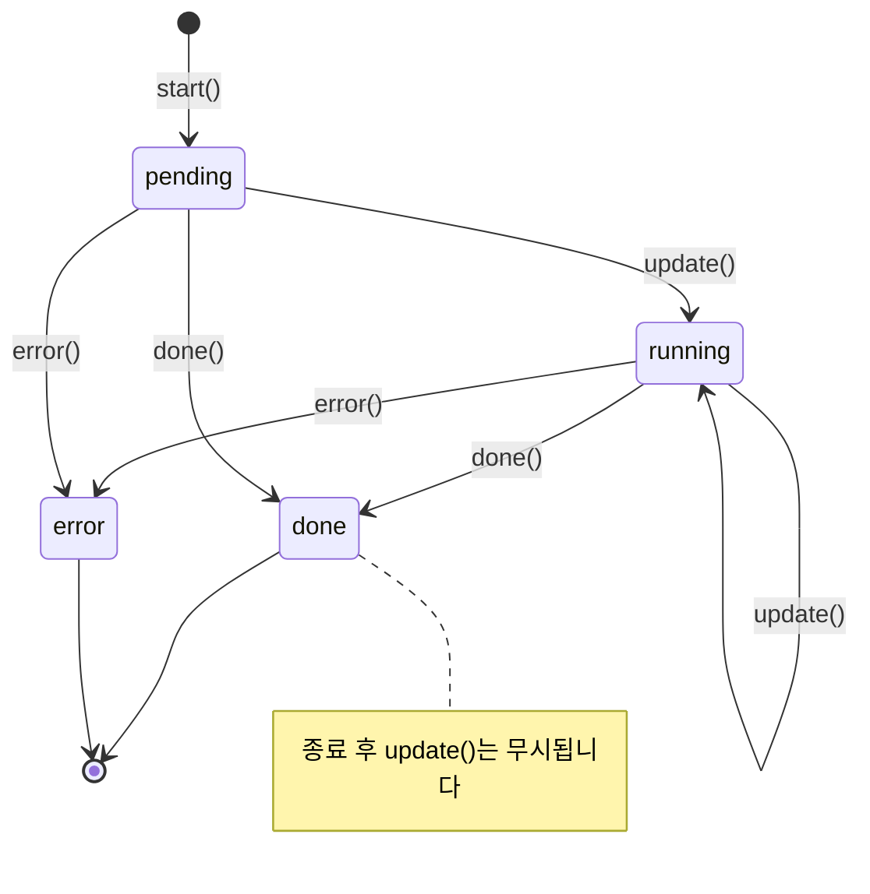

# Progress

서버(실행 박스)에서 돌아가는 작업의 진행 상태를 웹소켓으로 실시간 리포팅하는 모듈입니다. 서버 → 클라이언트 단방향이며, 하나의 웹소켓을 다른 모듈(sync, JSONTransport, LogTrace)과 공유합니다.

> 설계 계약(SSOT)은 [SPEC.md](./SPEC.md)를 보세요. 이 문서는 사용법 안내입니다.

## 한눈에 보기



| 구성 요소 | 위치 | 역할 |
| --- | --- | --- |
| `ProgressReporter` | 서버 | 작업 상태를 스냅샷으로 발신. throttle/heartbeat 내장 |
| `ProgressConsumer` | 클라이언트 | 작업 id별 최신 스냅샷 보관 + 변경 통지 |
| `ProgressState` | wire | 진행 상태 스냅샷 (status/percent/step/label/...) |

## 왜 스냅샷인가?

매 발신이 **전체 상태**를 담습니다. 중간 메시지가 유실되거나 순서가 뒤섞여도 다음 스냅샷이 도착하는 순간 화면이 올바른 상태가 됩니다. 재전송도 순서 보정도 필요 없습니다.

```
발신:  [10%] → [40%] → [70%] → [done]
유실:           ✕
수신:  [10%] ────────→ [70%] → [done]   ← 최종 상태 동일
```

## 서버에서: 리포팅하기

```ts
import { createProgressReporter } from 'lemon-model';

// sink = 발신 함수 1개만 있으면 됩니다 (API GW post, Peer.post, 뭐든)
const reporter = createProgressReporter(msg => postToClient(msg), {
    throttleMs: 300,    // update 연타를 300ms당 1회 발신으로 묶음
    heartbeatMs: 2000,  // 조용해도 2초마다 최신 상태 재발신
});

const task = reporter.start('job-123', { label: '이미지 생성', totalSteps: 3 });

task.update({ status: 'running', step: 1, percent: 10, label: '프롬프트 분석' });
task.update({ step: 2, percent: 60, label: '이미지 렌더링' });
task.done({ label: '완료' });   // 즉시 발신 (throttle 무시)

reporter.close();  // lambda 종료 전 필수 — 미발신 분 flush + timer 해제
```

오류로 끝났다면:

```ts
task.error(err, { label: '렌더링 실패' });
```

## 클라이언트에서: 받아 보기

```ts
import { createProgressConsumer } from 'lemon-model';

// network = 공유 중인 NetworkSupportable (BrowserWebSocketNetwork 등)
const progress = createProgressConsumer(network);

progress.onChange(({ state, created }) => {
    renderProgressBar(state.id, state.percent, state.label);
    if (state.status === 'done') renderComplete(state.id);
});

progress.get('job-123');  // 최신 스냅샷 조회
progress.list();          // 보관 중인 전체 작업

progress.close();  // 구독 해제 (소켓은 닫지 않음 — 공유 자원)
```

## 전체 흐름



## 상태 전이



## `ProgressState` 필드

| 필드 | 타입 | 설명 |
| --- | --- | --- |
| `id` | `string` | 작업 id (서비스가 발급) |
| `status` | `'pending' \| 'running' \| 'done' \| 'error'` | 실행 상태 |
| `percent` | `number?` | 0~100. 산정 불가 시 생략 |
| `step` / `totalSteps` | `number?` | 현재 / 전체 단계 |
| `label` | `string?` | 사람이 읽는 현재 단계 설명 |
| `error` | `string?` | `status: 'error'`일 때 오류 요약 |
| `ts` | `number` | 발신 시각 (표시용) |
| `seq` | `number` | 단조 시퀀스 (최신 판정용 — 직접 쓸 일 없음) |
| `meta` | `object?` | 서비스 부가 정보. **작게 유지** (패킷 제한 64kb) |

## 자주 묻는 것

**Q. 큰 결과물(이미지 등)도 progress로 보내나요?**
아니요. Progress는 상태만 나릅니다. 큰 payload는 `JSONTransport`(청크 분리) 소관이며, progress의 `meta`가 패킷 제한을 넘으면 meta가 제거된 채 발신되고 reporter `onError`로 알립니다.

**Q. 접속하기 전에 시작된 작업 상태도 보이나요?**
접속 이후 수신분만 보입니다. `heartbeatMs`를 켜면 running 작업 상태가 주기적으로 재발신되어 늦게 접속해도 곧 따라잡습니다.

**Q. 같은 소켓의 다른 메시지와 안 섞이나요?**
봉투 `type`이 `progress:`로 시작하는 것만 골라 받습니다(`createFilteredNetwork`). sync(`sync/*`), JSONTransport(`json:*`), LogTrace(`log:*`)와 네임스페이스가 겹치지 않습니다.

**Q. lambda에서 주의할 점은?**
invocation이 끝나기 전에 `reporter.close()`를 호출하세요. 미발신 스냅샷 flush와 timer 해제가 여기서 일어납니다.
