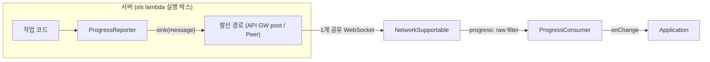

# Progress SPEC

> Status: Draft (SSOT) / Date: 2026-07-05 / Slug: progress

# 한줄 목표

서버(실행 박스)의 작업 실행 상태를 공유 웹소켓 1개 위에서 클라이언트로 실시간 리포팅하는 단방향(서→클) 진행 상태 모듈을 만든다.

# High Level

- Progress는 서버 작업의 현재 상태를 클라이언트에 실시간으로 보여준다.
- 서버는 작업마다 `ProgressState` 스냅샷을 보내고, 클라이언트는 작업 id별 최신 1개만 보관한다.
- Progress는 로그처럼 전부 누적하지 않는다. 중간 스냅샷이 빠져도 다음 스냅샷에 현재 상태가 다시 담기므로 최신 상태로 회복된다.
- 구현은 기존 `src/socket` 계약 위에 얹는다. 새 전송 계층을 만들지 않고 `SocketMessage`, `NetworkSupportable`, `createFilteredNetwork`만 사용한다.
- `src/sync`, `src/buffer`, `src/genai`는 수정하거나 의존하지 않는다. 따라서 `feat/wss-sync-machine` 머지와 독립으로 진행할 수 있다.
- 같은 WebSocket을 쓰는 sync, `json:*`, `log:*` 메시지와는 `type` prefix로 구분해서 서로 간섭하지 않는다.
- 플로우 요약: 작업 코드가 `ProgressReporter`에 상태를 넘기면, reporter가 WebSocket으로 보내고, 클라이언트의 `ProgressConsumer`가 받아 UI에 최신 상태를 알려준다.



# 시나리오

reporter는 percent가 "어떻게" 계산되는지 모른다 — 산출은 gauge 주입, 도메인 값은 서비스가 옮겨 적는다. 대표 배선 3가지:

1. **스텝 체인** (codes-goods-api 배포 흐름): `executeNextStep`이 `progress$.state`를 `github → build → deploy`로 전이시키는 체인이라면, 서비스는 전이마다 `task.update({ step: states.indexOf(state) + 1, totalSteps: states.length, label: state })`로 옮겨 적는다. percent 없이 step/totalSteps만으로 충분한 케이스 — gauge 불필요.
2. **시간 흐름 기반**: 예상 소요를 아는 작업은 `createTimeProgressGauge(expectedMs)`를 주입한다. heartbeat마다 gauge가 경과 비율 percent를 채운다 (99% 캡 — 완료 선언은 `done()`만이 한다).
3. **버퍼 충전율 기반**: GenAI 스트림 작업은 `createBufferProgressGauge(() => buffer.snapshot().progress)`를 주입한다. `src/buffer`의 `GenAIStreamProgress.percent/bufferPercent`를 구조적 타입으로 읽으므로 모듈 의존이 생기지 않는다.

## 데이터 계약 (서버 ↔ 클라이언트)

이 섹션은 서버가 어떤 상태를 보내고, 클라이언트가 무엇을 보관·통지하는지 정한다.

### 서버 쪽

서버는 작업 상태를 `ProgressState` 스냅샷으로 만들고 WebSocket으로 보낸다.

| 상황 | 호출 또는 처리 | 결과 |
| --- | --- | --- |
| 작업 상태 갱신 | `task.update(patch)` | 로컬 `ProgressState`를 갱신하고 `SocketMessage<ProgressState>`를 발신한다. `throttleMs`가 있으면 발신을 묶는다. |
| heartbeat tick | `gauge()` | `percent`, `step`, `totalSteps`, `label`을 읽어 현재 스냅샷에 병합한 뒤 새 seq로 발신한다. |
| 작업 완료/실패 | `task.done(patch?)` / `task.error(err, patch?)` | 최종 `ProgressState`를 즉시 발신한다. |

### 클라이언트 쪽

클라이언트는 작업 id별 최신 스냅샷 1개만 보관하고 구독자에게 알려준다.

| 상황 | 호출 또는 처리 | 결과 |
| --- | --- | --- |
| WebSocket 메시지 수신 | parse → 같은 id의 최신 `seq`인지 확인 → 스토어 반영 | 구독자에게 `ProgressChangeEvent { state, created }`를 통지한다. |
| 작업 1개 조회 | `get(id)` | `ProgressState \| undefined` |
| 전체 조회 | `list()` | `ProgressState[]` |

# 설계

## 원칙과 제약

| 항목 | 결정 |
| --- | --- |
| 방향 | 서버 → 클라이언트 단방향. 요청-응답 없음(fire-and-forget), mid 매칭 불필요 |
| 봉투 | 기존 `SocketMessage { type, data, mid }` 재사용. 새 wire 형식 금지 |
| 소켓 공유 | consumer는 `createFilteredNetwork`로 자기 type prefix만 골라 받는다 |
| 패킷 제한 | 스냅샷 1개 = 봉투 1개. `meta` 포함 직렬화 크기가 `maxPacketBytes` 안에 들어야 한다. 기본값은 모듈 내부 상수 `DEFAULT_MAX_PACKET_BYTES = 64 * 1024`(`src/socket`과 같은 계열)이며 `options.maxPacketBytes`로 재정의한다 — 예: API GW 32kb 프레임 환경이면 `{ maxPacketBytes: 32 * 1024 }`. chunking 없음 — 큰 데이터는 Progress의 대상이 아니다(JSONTransport 소관) |
| timer | reporter가 소유하되 opt-in(`heartbeatMs`, 기본 0 = 비활성). `close()`가 반드시 해제한다 — lambda invocation 종료 전에 close 호출이 서비스 계약 |
| 의존 방향 | `progress → socket` 단방향. `src/socket`은 `src/progress`를 모른다 |

- **Ports & Adapters (sink 주입)**: 서버 발신 경로는 환경마다 다르다(API Gateway management post, Peer simulator, 테스트 캡처). reporter는 `ProgressSink = (message: SocketMessage) => void` 함수 하나만 알고, 환경별 배선은 서비스가 한다. 서버 런타임 의존이 0이 되어 lambda/Node/테스트 어디서나 동일하다.
- **Observer**: 구독은 기존 컨벤션대로 `SocketUnsubscribe`를 반환한다.
- **Snapshot Coalescing (Last-Write-Wins)**: 소비자는 작업 id별로 `seq`가 큰 스냅샷만 반영한다. sync machine의 updatedAt 판정과 같은 계열이되, 단일 reporter가 seq를 단조 발급하므로 시계 동기화 문제가 없다.
- **Throttle (발신 억제, leading + trailing)**: 창이 열려 있지 않을 때의 `update()`는 즉시 발신하고 창을 연다(leading — 첫 반응이 늦지 않게). 창 내 추가 `update()`는 로컬만 갱신하고, 창 마감 시 미발신 변경이 있으면 **최신** 스냅샷 1개를 발신한다(trailing). 최종 스냅샷 수렴 의미론 덕에 중간 발신 생략이 정확성에 영향을 주지 않는다.
- **Strategy via 함수 주입 (Gauge)**: percent 산출 방식은 작업마다 다르다 — 시간 흐름, 버퍼 충전율, 스텝 카운트. `ProgressGauge = () => ProgressMeasure` 함수 하나로 산출 전략을 주입하고, reporter는 산출 방식을 모른다. sink를 함수 하나로 받는 것과 같은 스타일이며(메서드 1개짜리 추상 클래스는 표면적만 늘린다), 새 산출 방식 추가에 이 모듈 수정이 필요 없다.

## Wire 규약

```ts
/** 봉투. type prefix 'progress:'가 소켓 공유의 라우팅 키다 */
{ type: 'progress:update', data: ProgressState, mid: string }
```

- `mid`는 reporter가 단조 카운터로 채운다(`p1`, `p2`, ...). 응답을 기다리지 않으므로 매칭 용도가 아니라 봉투 계약 충족 용도다.
- raw filter는 `'"type":"progress:'` 부분 문자열 검사로 parse 없이 판정한다(2단 필터의 raw 단계). parse 후 `type` 재확인이 parsed 단계다.
- 소비자는 `result`/`error`/`ping`/`pong` type을 받지 않는다(prefix가 다르므로 자연 배제).

## Public Interface

```ts
/** 작업 실행 상태 */
export type ProgressStatus = 'pending' | 'running' | 'done' | 'error';

/** 작업 1개의 진행 상태 스냅샷 — wire를 오가는 단위 */
export interface ProgressState {
    /** 작업 id (서비스가 정한다) */
    id: string;
    /** 실행 상태 */
    status: ProgressStatus;
    /** 0~100 진행률 (산정 불가면 생략) */
    percent?: number;
    /** 현재 단계 / 전체 단계 */
    step?: number;
    totalSteps?: number;
    /** 사람이 읽는 현재 단계 설명 */
    label?: string;
    /** status가 error일 때 오류 요약 */
    error?: string;
    /** 발신 시각 (epoch ms) — 표시용 */
    ts: number;
    /** reporter 단조 증가 시퀀스 — 최신 판정용 */
    seq: number;
    /** 서비스 정의 부가 정보. 작게 유지한다 (패킷 제한 참고) */
    meta?: Record<string, any>;
}

/** gauge가 산출하는 측정치 — 스냅샷에 병합되는 부분집합 */
export type ProgressMeasure = Partial<Pick<ProgressState, 'percent' | 'step' | 'totalSteps' | 'label'>>;

/**
 * 진행률 산출 전략 — percent가 "어떻게" 계산되는지를 reporter에서 분리한다.
 * 순수 조회여야 하며 부수효과 금지. 함수 하나면 어떤 산출 방식이든 주입된다.
 */
export type ProgressGauge = () => ProgressMeasure;

/** 시간 흐름 기반 gauge — 예상 소요(expectedMs) 대비 경과 비율. 99%에서 캡 (완료 선언은 done()만이 한다) */
export const createTimeProgressGauge: (expectedMs: number, now?: () => number) => ProgressGauge;

/** 버퍼 충전율 기반 gauge — GenAIStreamProgress 호환 소스의 percent/bufferPercent를 읽는다 (구조적 타입, src/buffer 의존 없음) */
export const createBufferProgressGauge: (
    source: () => { percent?: number; bufferPercent?: number } | undefined,
) => ProgressGauge;

/** 서버 발신 경로 주입 (Ports & Adapters). 반환 Promise의 reject는 onError로 배선된다 */
export type ProgressSink = (message: SocketMessage<ProgressState>) => void | Promise<void>;

export interface ProgressReporterOptions {
    /** 봉투 type (기본 'progress:update') */
    type?: string;
    /** update() 발신 억제 간격. 0이면 매 update 즉시 발신 (기본 0) */
    throttleMs?: number;
    /** running 중 최신 스냅샷 재발신 주기. 0이면 비활성 (기본 0) */
    heartbeatMs?: number;
    /** 직렬화 크기 상한. 초과 스냅샷은 meta를 제거하고 발신하며 onError로 알린다 (기본 DEFAULT_MAX_PACKET_BYTES = 64kb) */
    maxPacketBytes?: number;
    /** 발신 실패/크기 초과 관찰 */
    onError?: (error: any, state: ProgressState) => void;
}

/** 작업 1개의 리포팅 핸들 */
export interface ProgressTaskSupportable {
    readonly id: string;
    /** 현재 로컬 스냅샷 */
    readonly state: ProgressState;
    /** 부분 갱신 후 발신(throttle 적용). 종료된 작업이면 무시. status 역행(running → pending)은 status만 무시하고 나머지 patch는 반영 */
    update(patch: Partial<Omit<ProgressState, 'id' | 'ts' | 'seq' | 'status'>> & { status?: 'pending' | 'running' }): void;
    /** 종료 상태로 전이하고 즉시 발신(throttle 무시). 이후 update는 무시 */
    done(patch?: Partial<Pick<ProgressState, 'label' | 'meta'>>): void;
    error(error: string | Error, patch?: Partial<Pick<ProgressState, 'label' | 'meta'>>): void;
}

/** 작업 1개의 시작 옵션 */
export interface ProgressTaskOptions {
    /** percent 자동 산출 전략. update/heartbeat 발신 직전 gauge() 결과를 스냅샷에 병합한다. 명시 update 값이 gauge보다 우선 */
    gauge?: ProgressGauge;
}

export interface ProgressReporterSupportable {
    /** 작업 시작을 선언하고 핸들을 얻는다. 같은 id 재호출은 기존 핸들 반환 */
    start(
        id: string,
        initial?: Partial<Pick<ProgressState, 'label' | 'percent' | 'step' | 'totalSteps' | 'meta'>>,
        options?: ProgressTaskOptions,
    ): ProgressTaskSupportable;
    /** 미발신 스냅샷 즉시 발신 + timer 해제. lambda invocation 종료 전 필수 호출 */
    close(): void;
}

export const createProgressReporter: (sink: ProgressSink, options?: ProgressReporterOptions) => ProgressReporterSupportable;

/** 변경 통지 */
export interface ProgressChangeEvent {
    state: ProgressState;
    /** 이 소비자가 처음 보는 작업이면 true */
    created: boolean;
}

export interface ProgressConsumerOptions {
    /** 수신 대상 type prefix (기본 'progress:') */
    typePrefix?: string;
    /** 보관 작업 수 상한. 초과 시 종료(done/error)된 오래된 작업부터 제거 (기본 100) */
    maxTasks?: number;
}

export interface ProgressConsumerSupportable {
    /** 작업 id로 최신 스냅샷 조회 */
    get(id: string): ProgressState | undefined;
    /** 보관 중인 전체 스냅샷 — 작업이 처음 반영된 순서 (seq는 reporter 단위라 작업 간 정렬 키가 아니다) */
    list(): ProgressState[];
    /** 반영된 변경 구독 (stale 드랍은 통지하지 않음) */
    onChange(handler: (event: ProgressChangeEvent) => void): SocketUnsubscribe;
    /** 구독 해제. network는 닫지 않는다 (소켓 공유) */
    close(): void;
}

export const createProgressConsumer: (network: NetworkSupportable, options?: ProgressConsumerOptions) => ProgressConsumerSupportable;
```

## 의미론

### 최신 판정 (소비자)

| 상황 | 규칙 |
| --- | --- |
| 처음 보는 id 수신 | 반영, `created: true`로 통지 |
| `incoming.seq > local.seq` | 반영, 통지 |
| `incoming.seq <= local.seq` | 무시 (unordered 도착의 stale 스냅샷). 통지 없음 |
| `maxTasks` 초과 | 종료 상태(done/error)의 가장 오래된 작업부터 제거. 전부 running이면 running 중 가장 오래된 것 제거 |

- seq는 작업 id가 아니라 **reporter 단위** 단조 카운터다. 한 작업의 스냅샷은 항상 같은 reporter가 만들므로 id 내 비교로 충분하다. 서로 다른 invocation(=새 reporter)이 같은 id를 이어 쓰는 경우는 지원하지 않는다 — 그 경우 id를 새로 발급하는 것이 서비스 계약이다.
- done/error는 종료 상태다. 종료 후 도착한 stale running 스냅샷은 seq 판정에서 자연히 무시된다.

### 발신 규칙 (reporter)

| 상황 | 규칙 |
| --- | --- |
| `start()` | 초기 스냅샷(`pending` 또는 initial 지정값) 즉시 발신 |
| `update()` | 로컬 상태 갱신 후 leading + trailing throttle: 창이 닫혀 있으면 즉시 발신 + 창 열기, 창 내면 로컬만 갱신하고 창 마감 시 **최신** 스냅샷만 발신. status 역행(running → pending)은 status만 무시하고 나머지 patch는 반영 |
| gauge 병합 | gauge가 있으면 update/heartbeat 발신 직전 `gauge()` 결과를 스냅샷에 병합한다. 같은 필드는 명시 update 값이 우선. `gauge()` throw는 `onError`로 알리고 gauge 없이 발신 |
| heartbeat | running 작업의 최신 스냅샷을 `heartbeatMs`마다 **새 seq로** 재발신 (이벤트 유실 안전망). 같은 seq로 재발신하면 기존 consumer가 `seq <= local.seq`로 버려 gauge 갱신분이 반영되지 않으므로, heartbeat 발신도 seq를 증가시킨다 |
| `done()` / `error()` | throttle을 무시하고 즉시 발신. 대기 중이던 throttle 발신은 취소(종료 스냅샷이 대체) |
| `close()` | 미발신 throttle 스냅샷 발신, 전 timer 해제 |
| sink throw / reject / 크기 초과 | `onError`로 알리고 계속 진행. sink가 Promise를 반환하면 reject도 `onError`로 배선한다(unhandled rejection 금지). reporter는 작업 코드를 절대 중단시키지 않는다 |

## 파일 구조와 export

```
src/progress/
├── SPEC.md          # 이 문서 (SSOT)
├── README.md        # 사용자 가이드
├── index.ts         # public re-export
├── progress.ts      # 계약(interface) + reporter + gauge + consumer — 한 파일
├── testing.ts       # 검증 루프 하니스 — index 미노출, 서브패스 전용 (아래 검증 참고)
└── progress.spec.ts
```

- **서버/클라이언트로 파일을 가르지 않는다.** 양단은 wire 규약(봉투 encode/decode)을 공유하므로 codec 옆 한 파일에 둔다 — `buffer/network.ts`(송신 consumer + 수신 receiver + codec 동거), `socket/transport.ts`(JSONTransport 단일 파일, 타입 인라인)와 같은 정책. 별도 types.ts를 두지 않고 계약을 구현 파일 상단에 둔다.
- **단, 팩토리는 2개를 유지한다.** `JSONTransport`가 대칭 1클래스인 것은 소켓 양단이 모두 송·수신하기 때문이다. progress는 단방향(서→클)이라 한 클래스로 합치면 서버에서는 스토어/판정이, 브라우저에서는 throttle/heartbeat가 죽은 표면이 된다 — `buffer/network.ts`가 consumer/receiver 팩토리를 나눈 것과 같은 이유.
- 루트 `src/index.ts`에 `export * from './progress';` 1줄 추가. 기존 export는 무변경(additive).
- 코드 스타일: `/** ... */` 한 줄 주석, `createXxx` 팩토리, `XxxSupportable` 계약, `@copyright (C) 2026 LemonCloud Co Ltd.` 헤더.

## 검증

### 도구

| 도구 | 용도 |
| --- | --- |
| `Peer` simulator (`src/socket/testing`) | 서버 대역. sink는 `msg => serverPeer.post(msg, { clientId })`로 배선 — 실서버 없이 서→클 발신 재현 |
| `configureNetwork({ unordered, jitterMs, latencyMs, maxPacketBytes })` | 순서 뒤섞임·지연·패킷 제한 등 네트워크 조건을 spec 안에서 재현 |
| jest + `expect2` | 부분 실행 `npx jest src/progress --config=jest.config.json`, 회귀 `npm test`. 단언은 기존 스위트처럼 `cores/index.spec`의 `expect2` 공용 헬퍼 사용 |
| 게이트 | `npm run lint` / `npm run build` / `npm run test:package-exports`(`scripts/check-package-exports.cjs` — testing.ts의 barrel 미노출 검증 포함) |
| jest fake timers | throttle/heartbeat의 시간 경계 검증 (실시간 대기 없이) |
| `testing.ts` 루프 하니스 | 아래 검증 헬퍼 참고 — 메트릭 기반 e2e 검증 |

### 검증 헬퍼 (`testing.ts`)

`buffer/testing.ts`의 `runGenAIStreamNetworkLoop` 패턴을 따른다: 발신→수신 전 구간 루프를 한 호출로 돌리고 **수치(메트릭)로 검증**한다. 루트 barrel에서 제외하고 `lemon-model/progress/testing` 서브패스로만 노출한다(socket/buffer/genai와 동일 격리 정책).

```ts
export interface ProgressLoopOptions {
    /** 재생할 update patch 시퀀스 (start → patches → done/error) */
    script: Array<Partial<ProgressState>>;
    reporterOptions?: ProgressReporterOptions;
    consumerOptions?: ProgressConsumerOptions;
    /** in-memory network 조건 (unordered, jitterMs, maxPacketBytes, ...) */
    networkOptions?: SocketNetworkOptions & { id?: string };
    /** 비동기 전달 대기 시간 */
    settleMs?: number;
}

export interface ProgressLoopMetrics {
    elapsedMs: number;
    /** raw 패킷 수 / 총 바이트 / 최대 패킷 바이트 (throttle·패킷 제한 검증용) */
    packets: number;
    packetBytes: number;
    maxPacketBytes: number;
    /** reporter가 발신한 스냅샷 수 (throttle 억제 확인) */
    emitted: number;
    /** consumer가 반영한 수 / seq 판정으로 버린 수 */
    applied: number;
    staleDropped: number;
    /** 종료 시점의 consumer 최종 상태 */
    finalStates: ProgressState[];
}

export const runProgressLoop: (options: ProgressLoopOptions) => Promise<ProgressLoopMetrics>;
```

시나리오 spec은 이 하니스로 "unordered에서 staleDropped > 0이어도 finalStates가 수렴", "throttleMs 하에 emitted ≤ 예상 창 수", "maxPacketBytes 하에 maxPacketBytes 관측치 ≤ 제한" 같은 수치 단언을 쓴다.

### 시나리오

1. **e2e**: start→update×N→done이 클라이언트에서 최종 상태로 수렴. percent/step 반영 확인.
2. **unordered 수렴**: `configureNetwork({ unordered: true, jitterMs })` 하에 스냅샷이 뒤섞여 도착해도 seq 판정으로 최종 상태가 수렴하고 stale이 통지되지 않음.
3. **throttle/heartbeat**: 첫 update는 즉시 발신(leading), 창 내 연타는 창 마감 시 최신 1회(trailing) — 발신 횟수가 창 수 + 1과 일치. heartbeat가 무변경 구간에서 최신 스냅샷을 새 seq로 재발신하고 consumer에 반영됨.
4. **종료 의미론**: done 이후 update 무시, done 즉시 발신이 throttle 대기분을 대체.
5. **패킷 제한**: `maxPacketBytes` 초과 meta가 제거되어 발신되고 onError가 관찰됨.
6. **공존**: 한 network 위에 progress consumer + `JSONTransport` receiver + sync envelope 트래픽을 함께 올려 상호 오수신 없음(01-design 공존 시나리오의 progress 축 담당).
7. **자원 해제**: consumer.close() 후 수신 중단·network 미폐쇄, reporter.close() 후 timer 잔존 없음, maxTasks 초과 제거 순서.
8. **gauge**: `createTimeProgressGauge`가 경과 비율을 99 캡으로 산출(fake timers), `createBufferProgressGauge`가 소스 percent를 병합, 명시 update 값이 gauge보다 우선, `gauge()` throw 시 onError + gauge 없이 발신.

### 실환경 진단 (후속)

- 실서버 대상 브라우저 진단은 `genai/dump-test.ts`(`browserWebSocketDumpTest`) 계열의 구조화 로그 진단 루프를 같은 패턴으로 추가한다 — 1차 범위 밖, in-memory 하니스로 충분해진 뒤 필요 시.
- `tools/` probe + `sample/` fixture 재검증(`buffer/sample.spec.ts`) 패턴은 채택하지 않는다: 그 패턴은 외부 provider SDK의 실 스트림 기록이 필요한 buffer 소관이고, progress는 자체 wire 규약이라 Peer 하니스가 원천이다.

## 비범위와 확장 지점

- **과거 이력 조회(replay)**: 소비자는 접속 이후 수신분만 안다. 접속 시점 이전 상태가 필요하면 후속에서 pull형 조회(sync machine의 어댑터 패턴)를 additive로 더한다. heartbeat가 1차 완화책이다.
- **다중 reporter가 같은 작업 id를 공유**: 지원하지 않음(위 seq 계약). 필요해지면 seq를 `(epoch, seq)` 복합 판정으로 확장한다.
- **영속화**: 소비자 스토어는 메모리 전용.
- **집계**: 여러 작업의 롤업(전체 %) 계산은 애플리케이션 소관. 소비자는 원본 스냅샷만 보관한다.
- **GenAI 스트림 진행률**: `src/buffer`의 `GenAIStreamProgress`(청크 스트림 내부 진행률)는 이 모듈과 별개다. 스트림에서 파생된 작업 상태를 Progress로 올리려면 `createBufferProgressGauge`(구조적 타입 소스)를 주입하거나 서비스가 reporter.update()로 옮겨 적는다 — 두 모듈은 import로 엮이지 않는다.

## 제약사항

현재 구현이 의도적으로 감수하는 한계다. 계약(비범위)과 달리, 운영 중 체감될 수 있는 지점들을 명시한다.

| 제약 | 내용 | 영향 |
| --- | --- | --- |
| 접속 이후 스냅샷만 | consumer는 구독 시점 이후 수신분만 안다. replay 없음 | 새로고침·늦은 접속 시 진행 중 작업이 안 보인다. `heartbeatMs`를 켜면 다음 tick에 회복되지만, heartbeat가 꺼져 있고 update도 없으면 종료 스냅샷까지 공백 |
| gauge는 pull 방식 | `gauge()`는 update/heartbeat **발신 직전에만** 평가된다 | `heartbeatMs: 0`(기본)이면 update가 없는 구간에서 time gauge percent가 멈춰 보인다 — 시간 흐름 gauge는 사실상 heartbeat와 세트 |
| heartbeat는 reporter 전역 | `heartbeatMs`는 작업별이 아니라 reporter 단위 interval이다. reporter 생성 시 시작되어 running 작업이 없어도 tick이 돈다 | 작업마다 다른 주기가 필요하면 reporter를 분리해야 한다 |
| meta 제거는 all-or-nothing | `maxPacketBytes` 초과 시 `meta` 전체를 제거하고 발신한다. 부분 축소 없음 | 큰 meta 하나가 통째로 사라진다 — meta는 작게 유지하는 것이 계약 |
| 유실 관찰 지표 없음 | stale 드랍은 통지되지 않고, logtrace의 `gapCount` 같은 wire 유실 계수가 없다 | 스냅샷 유실은 다음 발신이 치유하므로 설계상 무해하지만, "얼마나 유실됐는지"는 알 수 없다 |
| invocation 재시작 미지원 | seq가 reporter 단위라 같은 작업 id를 새 reporter(재시도 invocation)가 이어 쓰면 seq가 1부터 다시 시작해 stale로 버려진다 | 재시도 시 작업 id 재발급이 서비스 계약 (비범위 참고) |
| close() 의존 | lambda freeze 전에 `close()`를 안 부르면 trailing throttle 대기분이 유실되고 heartbeat timer가 잔존한다 | 서비스 배선 계약 — 모듈이 강제할 수 없다 |
| 완료 이력 소실 | consumer 스토어는 메모리 전용 + `maxTasks` 초과 시 종료 작업부터 제거 | 오래 열린 대시보드에서 과거 완료 작업이 사라질 수 있다 |

## 개선 필요

우선순위 순. 각 항목은 additive로 더할 수 있어 wire 규약 변경이 없다.

1. **pull형 이력 조회**: 접속 시점 이전 상태 공백의 근본 해소. sync machine의 어댑터 패턴으로 초기 상태를 당겨온 뒤 wire 수신으로 이어붙인다 — 비범위 섹션의 1순위 확장 지점.
2. **(epoch, seq) 복합 판정**: reporter 생성 시각을 epoch로 실어 invocation 재시작·다중 reporter의 같은 id 이어쓰기를 지원한다. 위 "invocation 재시작 미지원" 제약의 해소책.
3. **gauge 전용 tick**: heartbeat와 독립적으로 gauge만 재평가·발신하는 경량 주기를 검토한다 — time gauge가 heartbeat 없이도 진행돼 보이게. 단, heartbeat가 이미 이 역할을 겸하므로 실측 수요 확인 후.
4. **meta 우선순위 축소**: all-or-nothing 제거 대신 서비스가 지정한 키 순서로 부분 축소하는 옵션 — 큰 meta 수요가 실제로 생기면.
5. **실환경 진단 루프**: `genai/dump-test.ts` 계열의 브라우저 진단 하니스 — "실환경 진단 (후속)" 섹션 참고.
