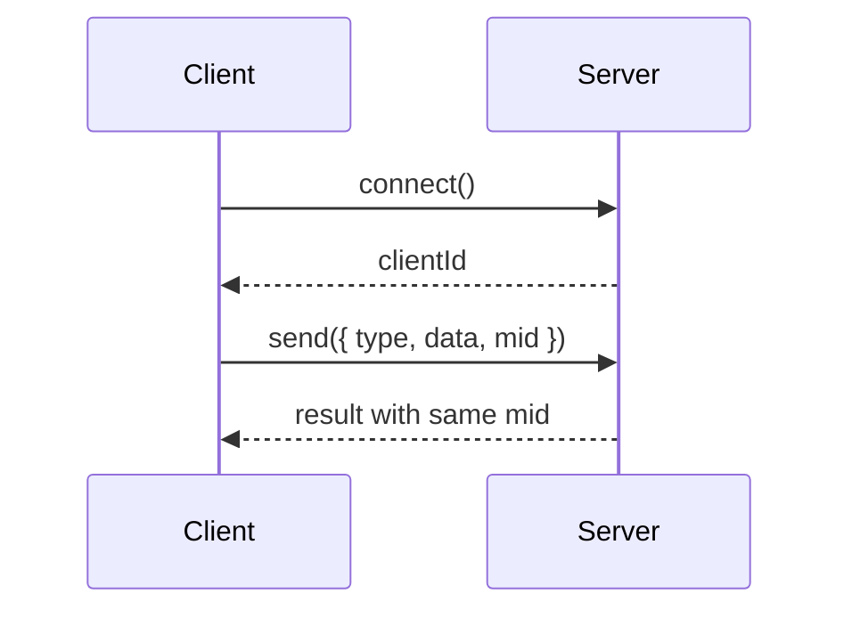
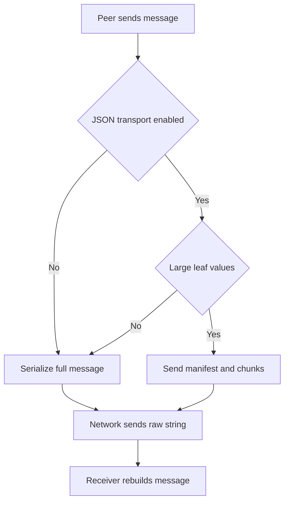

# lib/socket

Runtime-neutral peer socket and JSON transport utilities for tests and mock flows.

This module models WebSocket-like behavior without opening a real network socket. It is intentionally small and focuses on the behavior needed by agent streaming and request/result style tests.

`lib/socket` is shared core code. It must stay independent from server-only modules such as Node filesystem, AWS SDK, Lambda, or API Gateway, and from browser-only modules such as React, DOM, or `window`. Runtime-specific adapters should live outside this folder and implement `NetworkSupportable`.

## Message Shape

Every message uses the same envelope:

```ts
type SocketMessage<T = any> = {
    type: string;
    data: T;
    mid: string;
};
```

- `type` is the message kind, such as `message`, `result`, `error`, `ping`, or `pong`.
- `data` is the typed payload.
- `mid` is the message id used to correlate a request with its response.

## Peer Model

`Peer` is the only socket actor.

- A peer can stand alone.
- A peer can connect to one upstream peer as a client.
- A peer can accept many downstream peers as clients.
- The peer that connects receives a generated `clientId`.
- The accepting/server peer can find a connected client with `findPeer(clientId)`.

```ts
const server = createPeer();
const client = createPeer();

const clientId = client.connect(server);
const sameClient = server.findPeer(clientId);
```



## Network Model

`Network` is the minimal transport used between connected peers.

The public transport contract is intentionally tiny:

```ts
interface NetworkSupportable {
    readonly readyState: SocketReadyState;
    ready?(): Promise<void>;
    send(data: string): void;
    onMessage(handler: (data: string) => void): SocketUnsubscribe;
    configure?(options: SocketNetworkOptions): void;
    onError(handler: SocketErrorHandler): SocketUnsubscribe;
    close(): void;
}
```

- `send(data)` accepts only raw strings.
- `send(data)` checks raw packet size before delivery.
- `send(data)` returns immediately; actual delivery happens asynchronously through the network scheduler.
- `onMessage(handler)` subscribes to raw string data delivered by the network.
- Peer-to-peer delivery serializes socket messages into strings and sends them through `Network`.
- If a packet is larger than `maxPacketBytes`, `send()` throws `1009: message too big`.
- `configure(options)` is optional; when present, it updates network conditions while the transport is still open.
- `onError(handler)` observes asynchronous delivery errors, such as receiver failures.
- `close()` permanently closes the network.
- Calling `send()` after `close()` throws a connection error.
- A `Network` is one-shot: after it has been attached to one connection, it cannot be attached again.

```ts
const network = createNetwork();
network.onMessage(data => {
    // receive raw string data
});

network.onError((error, context) => {
    // observe async delivery errors
});

network.send('hello');
network.configure({ maxPacketBytes: 1024 });
network.close();
```

When `client.connect(server)` is called, the peer runtime creates one upstream network and one downstream network.
The client's upstream network is exposed as `client.network`.

## Runtime Adapters

`NetworkSupportable` is the boundary for real transports.

Runtime-specific adapters should be implemented outside `lib/socket`, then passed into peers with `networkFactory` or used directly by `JSONTransport`.

Examples:

- AWS API Gateway WebSocket adapters belong under `src/lib/tools`.
- Browser WebSocket adapters should live outside `lib/socket` and depend only on browser APIs there.
- Test/in-memory transports can use `createNetwork()` from this module.

## Owned WebSocket Network

`createOwnedWebSocketNetwork` is the ready-made `NetworkSupportable` adapter for services that need to own a real WebSocket. Unlike `BrowserWebSocketNetwork` (whose `close()` only detaches listeners), the owned adapter creates the socket and its `close()` performs an actual socket close.

It handles only raw string send/receive, the open wait, error/close mapping, and the actual close. Message parsing, request/response matching, reconnect, and keep-alive stay in the consuming service.

Connect once and exchange (the `ready()` model):

```ts
import { createOwnedWebSocketNetwork } from 'lemon-model';

const net = createOwnedWebSocketNetwork({ url: 'wss://api/ws', connectTimeoutMs: 10000 });
net.onMessage(raw => handle(raw));
net.onError((err, ctx) => log(ctx.scope, err));

await net.ready(); // waits for open; resolves immediately if already open
net.send(JSON.stringify({ type: 'hello' }));
net.close(1000, 'bye');
```

Drive your own lifecycle (the `onOpen` model — reconnect/keep-alive owned by you):

```ts
const net = createOwnedWebSocketNetwork({ url, connectTimeoutMs: 0 }); // own the timeout yourself
net.onOpen(() => { state = 'connected'; });
net.onError((event, ctx) => {
    if (ctx.scope === 'ownedWebSocket.close') onClosed(event);
    else onError(event);
});
net.onMessage(raw => dispatch(raw));
```

`ready()` and `onOpen()` are both latched: subscribing after the socket is already open still resolves/fires once, so a late subscriber never misses the open. Use `ready()` for a simple await-then-send flow, and `onOpen()` when synchronous state transitions or a close-before-open path matter.

Inject a non-browser or custom socket via `socketFactory` (defaults to the global `WebSocket`):

```ts
import WS from 'ws';
const net = createOwnedWebSocketNetwork({
    url,
    socketFactory: ({ url, protocols }) => new WS(url, protocols) as unknown as WebSocketClosable,
});
```

Filter to only the raw messages you own with `createFilteredNetwork`. Both chatic and proxy share this single decorator instead of re-implementing ownership:

```ts
import { createFilteredNetwork } from 'lemon-model';

const owned = createOwnedWebSocketNetwork({ url });
const mine = createFilteredNetwork(owned, raw => raw.startsWith('myservice:'));
mine.onMessage(raw => { /* only 'myservice:' frames arrive */ });
mine.send('myservice:ping'); // send/close/onError/ready/onOpen delegate to the source unchanged
```

The predicate filters inbound `onMessage` only; outbound `send` is never filtered.

## Sending

`post(message)` sends a message without waiting for a response.

```ts
client.post({
    type: 'chunk',
    data: { text: 'hello' },
    mid: nextMessageId(),
});
```

`send(message)` sends a message and resolves when a response with the same `mid` arrives.

```ts
server.onMessage<{ a: number; b: number }, { value: number }>(message => {
    return { value: message.data.a + message.data.b };
});

const result = await client.send<{ value: number }>({
    type: 'sum',
    data: { a: 2, b: 3 },
});
```

Handler return values are sent back as:

```ts
{ type: 'result', data: returnValue, mid: request.mid }
```

A handler can also call `context.reply(data)` explicitly.

## Ping/Pong

`ping` is handled by the peer runtime and is not delivered to `onMessage` handlers.

When a connected client sends:

```ts
{ type: 'ping', data: null, mid }
```

the server replies:

```ts
{ type: 'pong', data: { clientId }, mid }
```

The `clientId` is the id assigned when the client connected to the server.

## Delivery Order

Delivery order is not guaranteed by default.

Back-to-back sends can arrive out of order to better simulate network behavior. The delay, jitter, and ordering behavior are applied by `Network.send()`. Peers only serialize and route messages into a `Network`.

This is configured through `SocketNetworkOptions`. `unordered` defaults to `true`, and `jitterMs` defaults to `1`.

```ts
const peer = createPeer({ unordered: false });
```

Use `unordered: false` only when a test needs deterministic FIFO delivery.

## Packet Size

Each raw `Network.send()` has a maximum packet size.

The default is `64 * 1024` bytes. The size is measured as UTF-8 byte length after a peer serializes `{ type, data, mid }` into JSON.

```ts
const client = createPeer({
    maxPacketBytes: 1024,
});
```

If a serialized packet is too large, `send()` rejects with:

```txt
1009: message too big
```

For `post()`, the same network error occurs in the delivery task. Since `post()` is fire-and-forget, callers should use `send()` when they need to observe transport errors.

`post()` transport errors can still be observed with `peer.onError()`:

```ts
client.onError((error, context) => {
    console.log(context.scope, context.mid, error);
});

client.post({
    type: 'large',
    data: hugePayload,
    mid: nextMessageId(),
});
```

## JSON Transport

Peers can optionally chunk full `{ type, data, mid }` message envelopes with JSON transport. This is useful for GenAI responses with large string fields such as `data.text`, `data.output`, or `data.inlineData`.

```ts
const client = createPeer({
    maxPacketBytes: 256,
    jsonTransport: {
        largeValueBytes: 24,
    },
});

client.connect(server);

await client.send({
    type: 'image',
    data: {
        mimeType: 'image/png',
        inlineData: largeBase64,
    },
});
```

`jsonTransport` is directional. It affects messages sent by the peer that enabled it. To chunk large server results, enable `jsonTransport` on the server peer.

Peer `maxPacketBytes` is the actual network packet limit. When peer `jsonTransport` is enabled and `chunkBytes` is not provided, the peer derives a safe `chunkBytes` value from its own `maxPacketBytes`. Standalone JSON transports can pass `chunkBytes` directly when exact control is needed.



JSON transport removes completed receive state immediately. Incomplete receive state is cleaned opportunistically as packets arrive, manually with `cleanup(now?)`, or automatically when `cleanupIntervalMs` is configured.

TODO: manifest paging is not implemented yet. If the manifest itself exceeds `maxPacketBytes` after large leaf values are split out, the underlying network still throws `1009: message too big`.

When a peer is closed or detached from a connected peer, any JSON transport decoder attached to that peer link is detached as well. This clears transport listeners and buffered partial messages.

## Reliable Delivery

JSON transport can add exactly-once completion on top of its chunking. The receiver acks a fully assembled transmission, nacks a stalled one with a diff of what's still missing, and the sender blind-resends when neither an ack nor a nack arrives in time.

Enable it directly on a `JSONTransport`:

```ts
import { createJSONTransport } from 'lemon-model';

const transport = createJSONTransport(network, { reliable: true });
await transport.send({ type: 'text', data: { text: 'hello' } }); // resolves once the receiver acks
```

Or through a `Peer`, using the top-level `reliable` shortcut (the recommended entry point):

```ts
const client = createPeer({ id: 'client', reliable: true });
```

This is equivalent to the more explicit nested form, `createPeer({ id: 'client', jsonTransport: { reliable: true } })` — use the nested form when other `jsonTransport` options (e.g. `chunkBytes`) also need to be set alongside it.

**Both ends must opt in at the same time.** An asymmetric setup surfaces as `json.reliable.mismatch` on the non-reliable side, and the reliable side's `send()` eventually rejects because no ack ever arrives.

The shortest way to observe reliable-mode failures out-of-band is `onReliableError` — it filters `onError` down to reliable-mode scopes and narrows the error to `JSONTransportReliableError`, so `error.tid` is available with no extra type check. It works the same way on a direct `JSONTransport` and on a `Peer` (both expose `onError`), since `Peer` forwards the same error instance, just with its scope re-published under a `peer.transport.` prefix:

```ts
import { JSONTransportReliableError, onReliableError } from 'lemon-model';

transport.send(data).catch(error => {
    if (error instanceof JSONTransportReliableError) console.error(error.tid, error.message);
});

onReliableError(transport, (error, context) => {
    console.error(error.tid, error.message, context.scope); // 'json.reliable.failed' or 'json.reliable.detached'
});
```

```ts
client.send(data).catch(error => {
    if (error instanceof JSONTransportReliableError) console.error(error.tid, error.message);
});

onReliableError(client, (error, context) => {
    console.error(error.tid, error.message, context.scope); // e.g. 'peer.transport.json.reliable.failed'
});
```

`onReliableError` combines two lower-level checks — `isJSONReliableScope(context.scope)` and `error instanceof JSONTransportReliableError`. Reach for them directly for scopes it doesn't cover, e.g. detecting an asymmetric reliable setup, which surfaces as `json.reliable.mismatch` (or its `peer.transport.` re-published form) on a plain `Error`, not a `JSONTransportReliableError` — there's no `send()` in flight yet to attach a `tid` to:

```ts
import { isJSONReliableScope, JSON_RELIABLE_SCOPE } from 'lemon-model';

transport.onError((error, context) => {
    if (context.scope === JSON_RELIABLE_SCOPE.mismatch) {
        // this side is not reliable, but the peer is
    }
});

client.onError((error, context) => {
    if (isJSONReliableScope(context.scope)) {
        // matches both `json.reliable.mismatch` and `peer.transport.json.reliable.mismatch`
    }
});
```

| Option | Default | Meaning |
|---|---|---|
| `nackDebounceMs` | 150 | quiet time after the last packet before the receiver sends a nack |
| `resendIntervalMs` | 2,000 | blind full-resend interval when neither ack nor nack arrives |
| `maxAttempts` | 6 | retry budget before `send()` rejects; ticks while `readyState !== 'open'` don't count |
| `deadlineMs` | 60,000 | wall-clock cap on one `send()` unit from its start; keeps counting even while `readyState` stays non-open |
| `settledTtlMs` | 5 minutes | how long a completed/failed tid is remembered, to absorb late duplicate retransmits |
| `settledMaxEntries` | 10,000 | hard cap on settled memory size; oldest entries are evicted first |

Reliable mode assumes a unicast relay between exactly two reliable endpoints. It cannot terminate at a stateless server (e.g. Lambda) that only relays between other endpoints, since ack/nack bookkeeping lives in one `JSONTransport` instance's in-memory state, which does not survive past a single invocation.

## Dynamic Network Configuration

Network behavior can be changed after peers are created.

```ts
const client = createPeer({ maxPacketBytes: 64 });
client.connect(server);

client.configureNetwork({
    maxPacketBytes: 4096,
    latencyMs: 2,
    jitterMs: 3,
    unordered: true,
});
```

`configureNetwork()` updates the peer defaults used for future connections and applies compatible options to already connected `Network` instances.

Peers create link networks through a peer-independent `networkFactory`. The factory receives ids and resolved network options, not peer instances.

```ts
const networkFactory = context =>
    createNetwork({
        id: `custom-${context.id}`,
        ...context.options,
    });

const client = createPeer({ networkFactory });
const server = createPeer({ networkFactory });
```

The same factory is used by both `connect()` and `reconnect()`. `SocketFactory` can inherit it for all created peers.

If `networkFactory` throws, `connect()` or `reconnect()` throws the same error and stops. During reconnect, replacement networks are created before old networks are closed, so a failed factory does not replace a working link.

## Ready

Custom networks can expose `ready()` when creation and usable connection are separate steps, such as real WebSocket open/handshake flows. The built-in in-memory `Network.ready()` resolves immediately.

```ts
client.connect(server);
await client.ready();

await client.send({ type: 'hello', data: null });
```

`Peer.ready()` waits only for the peer's upstream network. After `reconnect()`, call `ready()` again before sending when the replacement network performs asynchronous initialization.

## Logger

Peers can emit structured logs for lifecycle, network replacement, message delivery, dispatch, replies, transport errors, raw network packets, and JSON transport packet handling.

```ts
const logger = {
    log(entry) {
        console.log(entry.time, entry.level, entry.location, entry.message);
    },
};

const client = createPeer({ logger });
```

Every log entry includes:

- `time`: epoch timestamp in milliseconds
- `level`: `debug`, `info`, `warn`, or `error`
- `message`: human-readable event summary
- `location`: stable source location such as `peer.connect`, `peer.publish`, or `peer.reconnectPair`

Logs may also include `peerId`, `remotePeerId`, `clientId`, `mid`, `type`, `networkId`, `error`, and structured `data`. The same logger is propagated to default peer networks and peer-created JSON transports. Logger failures are ignored so diagnostics cannot break socket behavior.

## Network Recovery

If a connected `Network` is closed, the peer relationship remains but that network instance cannot be reused. Call `reconnect()` to replace the connected network pair while keeping the same peers and client id.

```ts
const clientId = client.connect(server);

client.network?.close();
await client.send({ type: 'x', data: null }).catch(console.error);

client.reconnect();
```

Or from the server side:

```ts
server.reconnect({ clientId });
```

Call only one side. For a client peer, `reconnect()` targets its upstream server. For a server peer, pass `clientId` when multiple clients are connected. In-flight requests are not replayed; send again after reconnect.

## Routing

When a peer has an upstream connection, `post()` and `send()` target the upstream peer by default.

When a peer has exactly one connected client and no upstream, messages target that client by default.

When a peer has multiple connected clients, pass `clientId`:

```ts
server.post({ type: 'notice', data: { ok: true }, mid: nextMessageId() }, { clientId });
```

## SocketFactory

`SocketFactory` creates and tracks peers for tests.

```ts
const factory = createSocketFactory({ idPrefix: 'sock' });

const server = factory.peer();
const client = factory.peer({ id: 'client-a' });
const clientId = factory.connect(client, server);

factory.find(server.id);
factory.findPeer(server, clientId);
```

Factory options are inherited by created peers unless overridden per peer:

```ts
const factory = createSocketFactory({
    latencyMs: 2,
    jitterMs: 1,
    unordered: true,
    maxPacketBytes: 64 * 1024,
    networkFactory,
    logger,
    idPrefix: 'peer',
});
```

## Identity Provider

Peer ids, client ids, auto message ids, and peer link network ids can be supplied by an identity provider.

```ts
const identityProvider = {
    nextPeerId: () => 'peer-a',
    nextClientId: () => 'client-a',
    nextMessageId: () => 'message-a',
    nextNetworkId: (from?: string, to?: string) => (from && to ? `${from}->${to}` : 'network-a'),
};

const client = createPeer({ identityProvider });
```

`SocketFactory` can inherit the same provider. If `idPrefix` is provided, factory-generated peer ids still use the prefix.

## Tested Behaviors

- Network supports `send(data: string)` and `close()`
- Network delivery is asynchronous even though `send(data)` returns `void`
- Network may support dynamic `configure()`
- Network supports `onError()` for asynchronous delivery failures
- Network enforces `maxPacketBytes`
- oversized `send()` rejects with `1009: message too big`
- `post()` transport errors can be observed with `Peer.onError()`
- Network `send()` after `close()` throws a connection error
- a once-attached Network cannot be reused
- connected peers deliver messages through Network
- connected peers can replace closed networks with `reconnect()`
- peers and networks expose `ready()` for asynchronous network initialization
- typed `send<R>()` resolves from matching `result.mid`
- `post()` does not wait for responses
- peer network conditions can be dynamically changed with `configureNetwork()`
- peers can use a custom peer-independent `networkFactory`
- peers can emit structured logs through `logger`
- all messages use `{ type, data, mid }`
- `ping` produces `pong` with the same `mid`
- `pong.data.clientId` matches the assigned client id
- delivery order is not guaranteed by default
- a peer can have one upstream and many clients
- connected clients can be found by `clientId`
- `SocketFactory` creates, tracks, connects, and looks up peers
